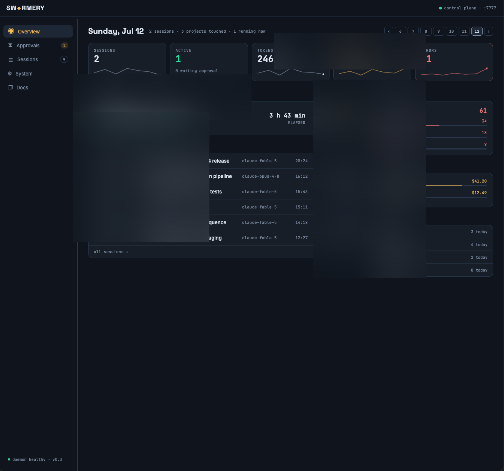
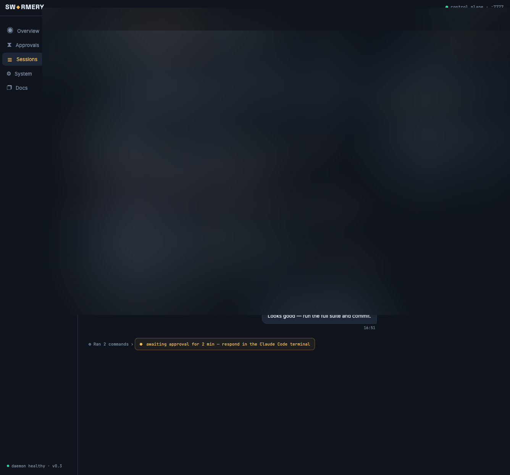

# SW◆RMERY

> **A vendor-neutral Claude Code agent framework + session-monitoring control plane.**
> One shared plugin marketplace for every project. One dashboard to watch them all.

Swarmery is two things in one repo:

1. **Plugin marketplace** — a versioned, namespaced Claude Code agent framework (`core` + domain packs) that any project enables in a single `settings.json` line and updates with `/plugin update`.
2. **Control plane** (`tools/swarmery`) — a Go + React web dashboard that streams every Claude Code session in real time: tool calls, cost, approvals, diffs, and the full Claude config graph.

---

## Control plane

`swarmery serve` runs a lightweight daemon on `:7777` that indexes Claude Code sessions from their `.jsonl` transcripts and exposes a live web UI.

### Overview

At-a-glance summary across all monitored projects: active sessions with their current action, cost breakdown by model, and session history by day.



### Sessions

All Claude Code sessions across every project — searchable by name, filterable by project (colored dots) and status. Each row shows the model, cost, tool-call count, and elapsed time.


### Session detail — Approvals

When a session contains a `AskUserQuestion` tool call, the dashboard shows the full context: what Claude is proposing, the diff it produced, and the question it is waiting on.



### Session detail — Timeline

Every tool call is logged to a timeline: file reads, writes, bash commands, API calls — with precise durations, so you can see where time actually goes.


### Approvals queue

All pending `AskUserQuestion` calls across every session in one place — with the full conversation context and the proposed change already expanded.


### System — Agents

The System tab maps the entire Claude config graph: every agent, skill, hook, command, and template across global (`~/.claude`) and project-level (`.claude/`) config, with origin badges (`plugin · core`, `local`) and scope badges (`global`, `project · Name`).

Each agent shows its name, description, identity, usage stats (tasks, last used), and a full version history with content-addressed diffs between any two versions.


### System — Skills

Skills tab with the same search + project dropdown filter. Select a skill to see its body, notes, versions, and a compare tool to diff any two versions side-by-side.


### System — Hooks

Hooks are grouped by lifecycle event (`SessionStart`, `UserPromptSubmit`, `PreToolUse`, `PostToolUse`, `Stop`, …) with inline toggle switches. Swarmery-managed hooks show a `managed · swarmery` badge and cannot be edited from the UI. Project-level hooks show the source settings file path and timeout.


### System — Commands

All slash commands from global and project-level config, with scope and origin badges.


### System — Templates

Project overlays (`project.json`) summarised: main app, repos, packs enabled, and a parse-error badge for any overlay that has a schema violation.


### Running the control plane

```bash
cd tools/swarmery
make build
./swarmery serve                 # listens on :7777
# or: SWARMERY_PORT=9999 ./swarmery serve
```

Read-only kill-switch (safe for shared machines):

```bash
SWARMERY_SYSTEM_READONLY=1 ./swarmery serve
```

Exclude throwaway projects:

```bash
SWARMERY_EXCLUDE="-Volumes-Work-scratch,-Volumes-Work-tmp" ./swarmery serve
# or: --exclude-projects flag
```

---

## Plugin marketplace

The other half of this repo: a versioned, vendor-neutral Claude Code plugin framework.

### Why this exists

Copying an agent system between projects rots fast: mis-substitutions pile up, files drift, and every improvement has to be ported N times. Swarmery replaces that with the native Claude Code plugin/marketplace mechanism — **semver-versioned**, **namespaced** (`core:tech-lead`), and **updatable** (`/plugin update`). Projects pin a known-good version and adopt on bump.

### Layout

```
.claude-plugin/marketplace.json   # this repo is a marketplace
plugins/
  core/                           # vendor-neutral: generic agents, skills, commands, hooks, CLI
  uav-pack/                       # UAV/drone domain: telemetry protocols, mission planning
  iot-pack/                       # IoT domain: BLE, device telemetry, health metrics
  web-pack/                       # marketing: SEO, i18n, landing CRO
overlays/
  _schema/project.schema.json     # per-project flavor config schema
  example/                        # sample overlay (project.json + settings snippet)
docs/                             # NEUTRALITY.md, EXTENDING.md, ONBOARDING.md
tools/
  swarmery/                       # Go + React control plane (own module, own CI)
```

Each plugin holds its components (`agents/`, `skills/`, `commands/`, `hooks/`, `bin/`, `templates/`) at its **root**; only `plugin.json` lives under `.claude-plugin/`.

### Consuming it

**One command** from the new project's root (see `docs/ONBOARDING.md`):

```bash
bash <swarmery-repo>/scripts/init.sh <project-slug> [pack ...]
```

Or manually — in the project's `.claude/settings.json`:

```jsonc
{
  "extraKnownMarketplaces": {
    "swarmery": { "source": { "source": "github", "repo": "atretyak1985/swarmery" } }
  },
  "enabledPlugins": {
    "core@swarmery": true,
    "web-pack@swarmery": true
  },
  "env": { "AGENT_PROJECT": "your-project" }
}
```

Then deploy your flavor config to `.claude/project.json` (schema in `overlays/_schema/`). Project-specific agents in the project's `.claude/agents/` override plugin agents by name — native base + overlay.

Core agents, skills, and hooks read `project.json` at runtime for repos, the main app, device/edge repo, cloud settings, and domain terms — nothing is baked in (policy: `docs/NEUTRALITY.md`, checker: `scripts/scan-flavor.sh`).

### Design decisions

- **Framework ≠ workspace.** Work artifacts (plans/sessions/wiki) live in a separate private workspace repo, never here. The CLI (`plugins/core/bin/agent-work.sh`) resolves the workspace via `AGENT_PROJECT` + `AGENT_WORKSPACE_ROOT`.
- **Vendor-neutral core.** No consumer project is privileged; flavor is runtime config.
- **Explicit semver** in each `plugin.json`; consumers adopt on bump.
- **`core` + opt-in domain packs**; projects enable only the packs they need.
- **Graduation rule** (`docs/EXTENDING.md`): components are born project-local, promoted to a domain pack when a second project needs them, then to `core` when every project does. Flow goes up only.

## License

[PolyForm Noncommercial 1.0.0](LICENSE) — free for personal, educational, and open-source use; commercial use prohibited.
