# SW◆RMERY

> **A vendor-neutral Claude Code agent framework + session-monitoring control plane.**
> One shared plugin marketplace for every project. One dashboard to watch them all.
> **Fully local — your transcripts, cost, and config never leave the machine.**

Swarmery is two things in one repo:

1. **Plugin marketplace** — a versioned, namespaced Claude Code agent framework (`core` + domain packs) that any project enables in a single `settings.json` line and updates with `/plugin update`. Stop copying agents between projects; ship the fix once and every project adopts it on bump.
2. **Control plane** (`tools/swarmery`) — a Go + React web dashboard that streams every Claude Code session in real time: tool calls, cost, approvals, diffs, and the full Claude config graph.

It's built for people who run **many projects — often for different clients — on one machine**: each project keeps its own isolated workspace and config, while shared agents live in one place. Everything is local: a single Go daemon, an embedded SPA, and a local SQLite index — no cloud, no account, no telemetry.

---

## Quickstart

**Prerequisites:** git, Go ≥ 1.25 (older Go auto-downloads the pinned toolchain), Node ≥ 22.

**1 — install & run the control plane.** One command clones (if needed), builds the single embedded binary, and prints how to serve it:

```bash
git clone https://github.com/atretyak1985/swarmery.git
cd swarmery
bash scripts/install-swarmery.sh          # build only — prints next steps
# or: bash scripts/install-swarmery.sh --serve   # build + serve in the foreground
```

Then serve it and open the dashboard:

```bash
./tools/swarmery/swarmery serve                     # listens on :7777
curl -s http://localhost:7777/api/health            # → {"status":"ok",…}
open http://localhost:7777
```

**2 — onboard a project.** From any project's root, one command writes its `.claude/` config and carves the workspace namespace (idempotent — safe to re-run):

```bash
cd /path/to/your/project
swarmery onboard <project-slug> [pack ...]          # packs: web-pack | iot-pack | uav-pack | infra-pack | lsp-pack
```

`swarmery onboard` is the binary twin of `scripts/init.sh` (the script delegates to it when the binary is on `PATH`, and falls back to pure bash otherwise). Open a fresh Claude Code session in the project, accept the `swarmery` marketplace trust prompt, and the project shows up in the dashboard as soon as its first session runs.

---

## Control plane

`swarmery serve` runs a lightweight daemon on `:7777` that indexes Claude Code sessions from their `.jsonl` transcripts into local SQLite and exposes a live web UI.

### Command deck

The landing view — a triage-first read on everything running right now: a one-line status of what's working versus waiting, headline **availability / cost / quality** metrics, a live feed of today's session activity ("the spike"), plus side rails for approvals *waiting on you* and the noisiest error threads by project.

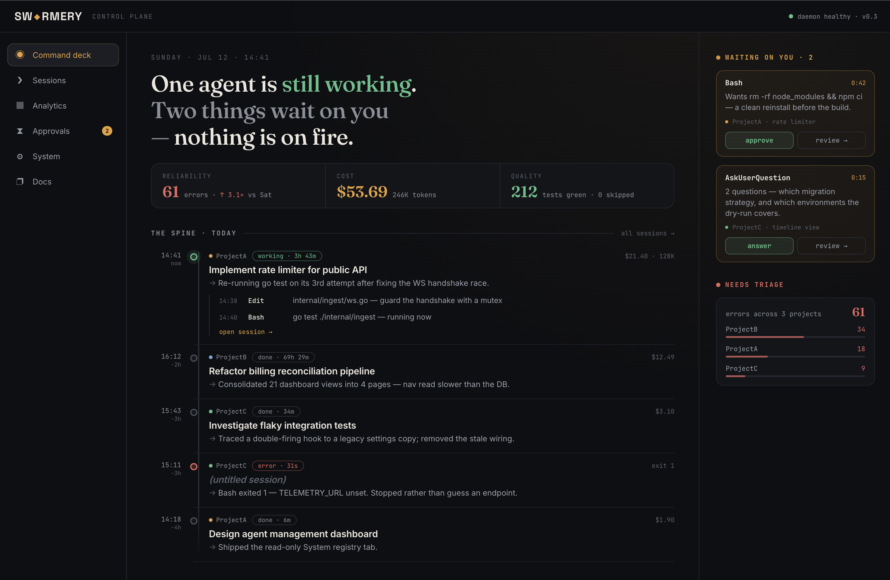

### Sessions

All Claude Code sessions across every project — searchable by name, filterable by project (colored dots) and status (`working` / `done` / `error`). Each row shows the model, status, and elapsed time.

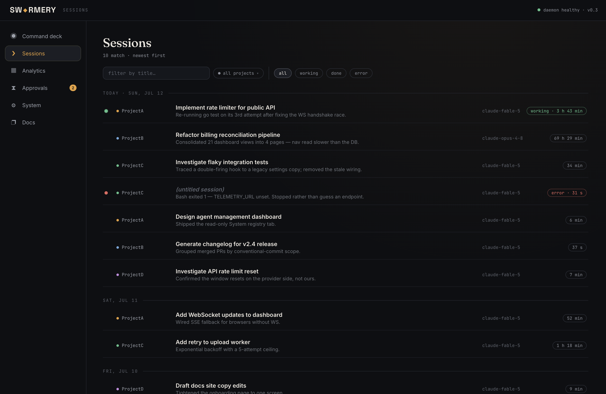

### Session detail — Chat · Timeline · Diffs

Every session opens to three views. **Chat** replays the conversation with inline tool-call summaries and any pending approval banner. **Timeline** logs each tool call — reads, writes, bash, API calls, sub-agents — with durations and pass/fail status, so you see where time actually goes. **Diffs** aggregates every file change in the session as unified diffs with per-file create/edit badges and line counts. The header carries live token, cost, and approvals-resolved totals.

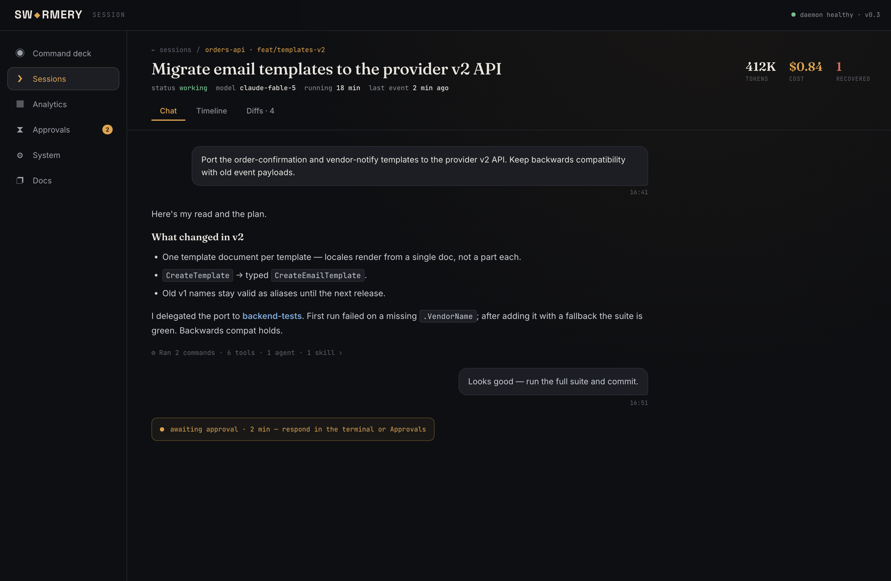
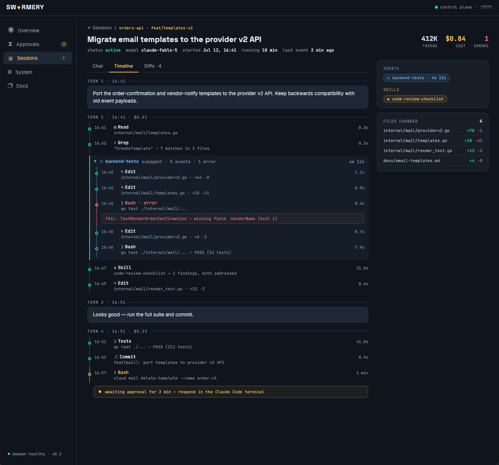
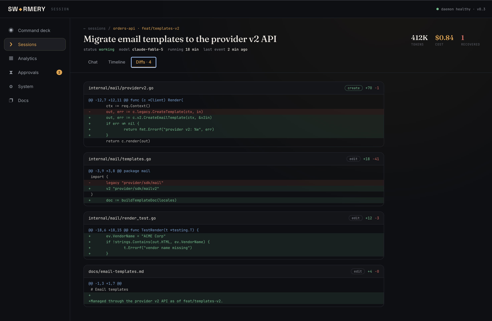

### Analytics

Cost, tokens, and runs over time, grouped by project or model across selectable ranges (7d–90d): a headline summary with top driver and projection, a stacked-area trend, a per-project breakdown, and an agent × project (or skill × project) cross-tab heatmap.

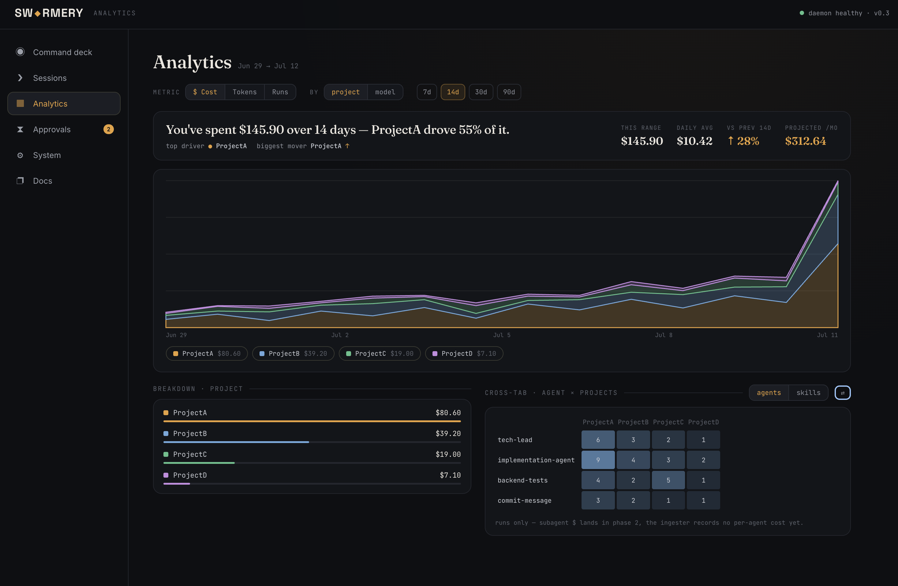

### Approvals queue

All pending `AskUserQuestion` and permission requests across every session in one place — with the full context expanded, per-request expiry timers, and inline approve / deny / open-session actions. Multi-question and multi-select prompts render as native option groups; resolved requests drop into a history log.

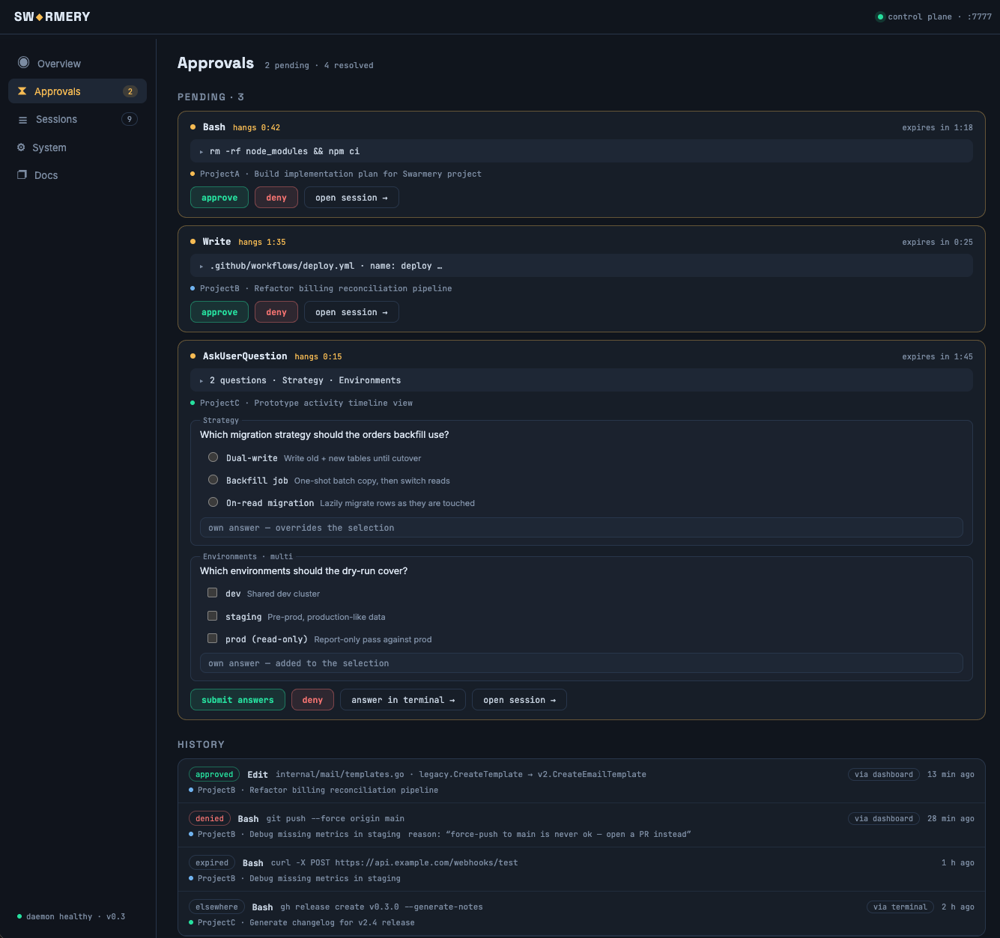

### System — Agents

The System tab maps the entire Claude config graph: every agent, skill, hook, command, and template across global (`~/.claude`) and project-level (`.claude/`) config, with origin badges (`plugin · core`, `local`) and scope badges (`global`, `project · Name`).

Each agent shows its name, description, identity, usage stats (tasks, last used), and a full version history with content-addressed diffs between any two versions.

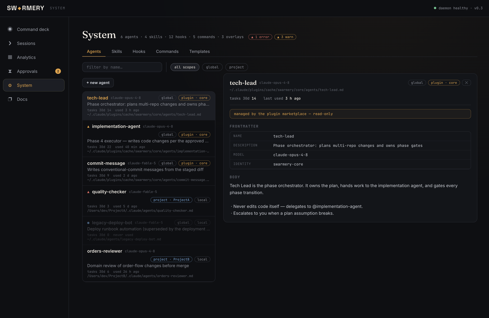

### System — Skills

Skills tab with the same search + project dropdown filter. Select a skill to see its body, notes, versions, and a compare tool to diff any two versions side-by-side.

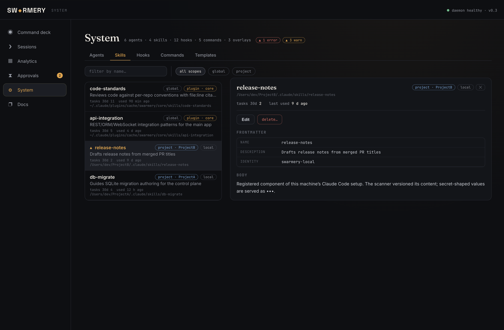

### System — Hooks

Hooks are grouped by lifecycle event (`SessionStart`, `UserPromptSubmit`, `PreToolUse`, `PostToolUse`, `Stop`, …) with inline toggle switches. Swarmery-managed hooks show a `managed · swarmery` badge and cannot be edited from the UI. Project-level hooks show the source settings file path and timeout.

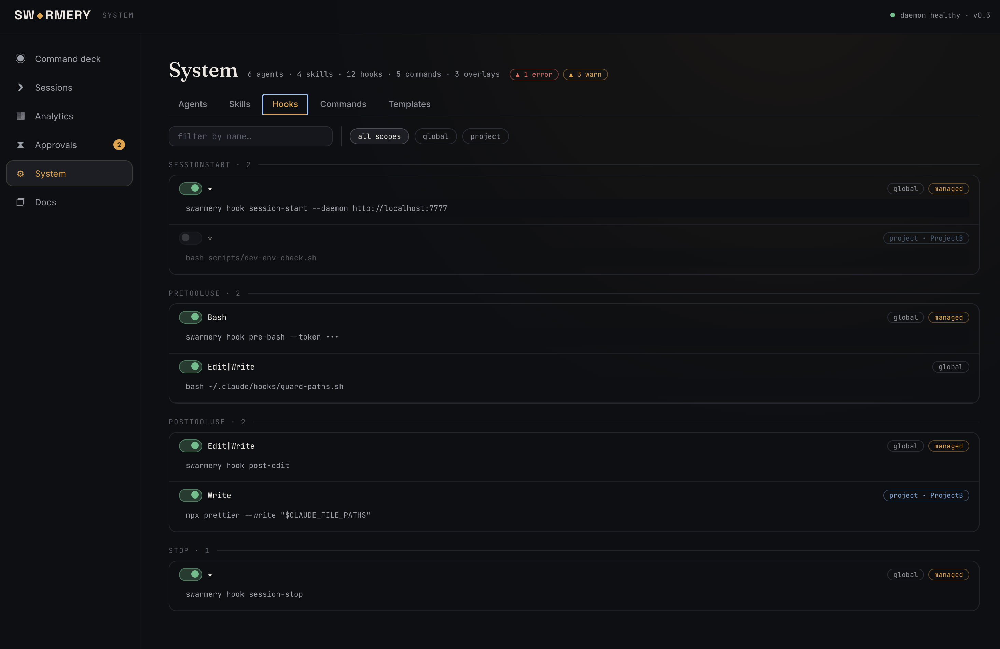

### System — Commands

All slash commands from global and project-level config, with scope and origin badges.

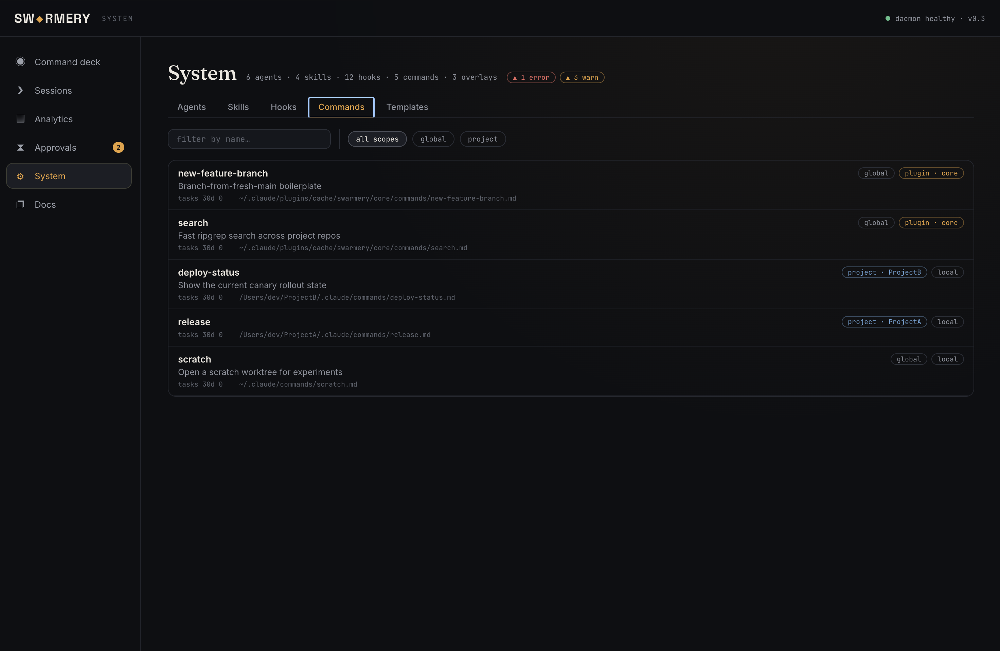

### System — Templates

Project overlays (`project.json`) summarised: main app, repos, packs enabled, and a parse-error badge for any overlay that has a schema violation.

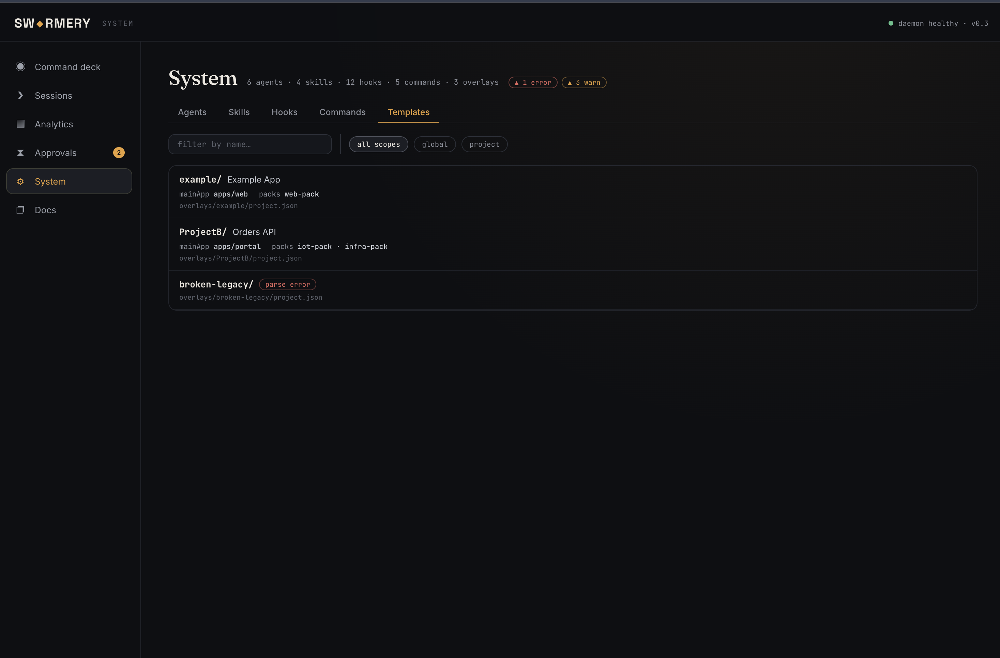

### Running the control plane

```bash
cd tools/swarmery
make build
./swarmery serve                 # listens on :7777
# or: SWARMERY_PORT=9999 ./swarmery serve
```

Read-only kill-switch (safe for shared machines):

```bash
SWARMERY_SYSTEM_READONLY=1 ./swarmery serve
```

Exclude throwaway projects:

```bash
SWARMERY_EXCLUDE="-Volumes-Work-scratch,-Volumes-Work-tmp" ./swarmery serve
# or: --exclude-projects flag
```

---

## Plugin marketplace

The other half of this repo: a versioned, vendor-neutral Claude Code plugin framework.

### Why this exists

Copying an agent system between projects rots fast: mis-substitutions pile up, files drift, and every improvement has to be ported N times. Swarmery replaces that with the native Claude Code plugin/marketplace mechanism — **semver-versioned**, **namespaced** (`core:tech-lead`), and **updatable** (`/plugin update`). Projects pin a known-good version and adopt on bump.

### Layout

```
.claude-plugin/marketplace.json   # this repo is a marketplace
plugins/
  core/                           # vendor-neutral: generic agents, skills, commands, hooks, CLI
  uav-pack/                       # UAV/drone domain: telemetry protocols, mission planning
  iot-pack/                       # IoT domain: BLE, device telemetry, health metrics
  web-pack/                       # marketing: SEO, i18n, landing CRO
  infra-pack/                     # k8s/Helm, GitOps, CI/CD, cloud auth, Keycloak
  lsp-pack/                       # Serena LSP: semantic code navigation (needs serena binary)
overlays/
  _schema/project.schema.json     # per-project flavor config schema
  example/                        # sample overlay (project.json + settings snippet)
docs/                             # NEUTRALITY.md, EXTENDING.md, ONBOARDING.md
tools/
  swarmery/                       # Go + React control plane (own module, own CI)
```

Each plugin holds its components (`agents/`, `skills/`, `commands/`, `hooks/`, `bin/`, `templates/`) at its **root**; only `plugin.json` lives under `.claude-plugin/`.

### Consuming it

**One command** from the new project's root (see `docs/ONBOARDING.md`):

```bash
bash <swarmery-repo>/scripts/init.sh <project-slug> [pack ...]
```

Or manually — in the project's `.claude/settings.json`:

```jsonc
{
  "extraKnownMarketplaces": {
    "swarmery": { "source": { "source": "github", "repo": "atretyak1985/swarmery" } }
  },
  "enabledPlugins": {
    "core@swarmery": true,
    "web-pack@swarmery": true
  },
  "env": { "AGENT_PROJECT": "your-project" }
}
```

Then deploy your flavor config to `.claude/project.json` (schema in `overlays/_schema/`). Project-specific agents in the project's `.claude/agents/` override plugin agents by name — native base + overlay.

Core agents, skills, and hooks read `project.json` at runtime for repos, the main app, device/edge repo, cloud settings, and domain terms — nothing is baked in (policy: `docs/NEUTRALITY.md`, checker: `scripts/scan-flavor.sh`).

### Cross-project isolation (built for multi-client machines)

One machine, many clients — without leaking one project's context into another. Enabling swarmery on a project is additive: your existing project-local `.claude/agents` still win by name, and each project picks only the packs it needs. Shared agents are maintained once in the marketplace; per-project specifics stay in that project's `project.json` and workspace.

- **Global vs project-local agents.** Plugins supply global agents (`plugin · core`); a project's own `.claude/agents/` supplies local ones. On a name collision the **local one wins in that project only** — the intended override mechanism, not a fork.
- **Isolated workspaces.** Work artifacts (plans/sessions/wiki) live in a per-project namespace under a shared workspace root (`AGENT_WORKSPACE_ROOT` + `AGENT_PROJECT`), so clients never share context.
- **Local-first.** The control plane indexes transcripts into local SQLite and serves them from a local daemon — nothing is uploaded.

### Design decisions

- **Framework ≠ workspace.** Work artifacts live in a separate private workspace repo, never here. The CLI (`plugins/core/bin/agent-work.sh`) resolves the workspace via `AGENT_PROJECT` + `AGENT_WORKSPACE_ROOT`.
- **Vendor-neutral core.** No consumer project is privileged; flavor is runtime config.
- **Explicit semver** in each `plugin.json`; consumers adopt on bump.
- **`core` + opt-in domain packs**; projects enable only the packs they need.
- **Graduation rule** (`docs/EXTENDING.md`): components are born project-local, promoted to a domain pack when a second project needs them, then to `core` when every project does. Flow goes up only.

## License

[PolyForm Noncommercial 1.0.0](LICENSE) — free for personal, educational, and open-source use; commercial use prohibited.
