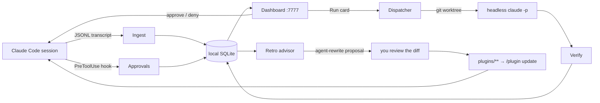

<div align="center">

# SW◆RMERY

**Run your Claude Code agents like a fleet — not like a pile of terminal tabs.**

A local-first control plane for Claude Code sessions. One Go binary, no cloud, no account. Ships with
a versioned plugin marketplace so your agents live in one place and every project pulls them with `/plugin update`.

[](LICENSE) [](tools/swarmery/LICENSE) [](https://github.com/atretyak1985/swarmery/actions/workflows/ci.yml) [](https://github.com/atretyak1985/swarmery/actions/workflows/swarmery-ci.yml)   

</div>

```bash
curl -fsSL https://raw.githubusercontent.com/atretyak1985/swarmery/main/scripts/install.sh | bash
swarmery serve                            # listens on :7777
```

<div align="center">


</div>

## Install

```bash
curl -fsSL https://raw.githubusercontent.com/atretyak1985/swarmery/main/scripts/install.sh | bash
swarmery serve                            # listens on :7777
```

Prefer to read what you run (recommended — a piped script executes whatever the server returns):

```bash
url=https://raw.githubusercontent.com/atretyak1985/swarmery/main/scripts/install.sh
curl -fsSL "$url" -o install.sh && less install.sh && bash install.sh
```

```bash
curl -s http://localhost:7777/api/health  # → {"status":"ok",…}
open http://localhost:7777
```

## What it does

- **See everything** — every session across every project, live: tool calls, diffs, cost, sub-agents, errors.
- **Stop being the bottleneck** — approve or deny permission prompts from one queue; turn a recurring prompt into an auto-approve rule.
- **Delegate, don't babysit** — run a card from Inbox; a headless agent moves it through Working to Review in its own git worktree, and a verifier grades the result.
- **Improve the system, not the prompt** — per-agent scorecards, a rule-based advisor, and agent-rewrite proposals you review as a diff.
- **Ship agents once** — a real Claude Code plugin marketplace: `core` + opt-in domain packs, semver'd, adopted with `/plugin update`.

Full tour of every screen: [docs/TOUR.md](docs/TOUR.md)

## Follow the build

Build-in-public series on [Substack](https://swarmery.substack.com) · updates on [X @SwarmeryDev](https://x.com/SwarmeryDev)

If Swarmery is useful to you, a ⭐ helps other people find it.

## Why

You open five Claude Code sessions across three repos. One is waiting on a permission prompt
you never saw. One burned $20 re-running the same failing test. One finished an hour ago.
You find out by cycling through terminal tabs.

Swarmery gives that fleet a single window — and then closes the loop.

---

## Quickstart

Sessions you have already run show up immediately — the daemon backfills from the JSONL
transcripts Claude Code already writes under `~/.claude/projects/`. Nothing to instrument,
no account, nothing leaves the machine.

The installer downloads the release binary for your platform (macOS and Linux, amd64 and
arm64), verifies it against `SHA256SUMS`, and drops it in `~/.local/bin`
(`SWARMERY_INSTALL_DIR` to change that, `SWARMERY_VERSION` to pin a release). Prebuilt
binaries are on the [Releases](https://github.com/atretyak1985/swarmery/releases) page;
building from source is under [Working on swarmery itself](#working-on-swarmery-itself).

On macOS, `swarmery install` registers a launchd service so the daemon starts with your machine.

The `claude` CLI is what swarmery watches — install it separately if you have not already.

### 1 — Onboard a project

From any repo, one idempotent command writes its `.claude/` config and carves a workspace
namespace:

```bash
cd /path/to/your/project
swarmery onboard <project-slug> [pack ...]
#   packs: web-pack | iot-pack | uav-pack | infra-pack | lsp-pack
#          claude-eng-pack | graphify-pack | architecture-pack | jira-pack
```

Then open a fresh Claude Code session, accept the `swarmery` marketplace trust prompt,
and the project is live in the dashboard.
(`scripts/init.sh` is the pure-bash twin of this command.)

Work artifacts — plans, task dirs, retrospectives — land under `$HOME/swarmery-workspace`
by default; point it anywhere with `SWARMERY_WORKSPACE_ROOT` (daemon) / `AGENT_WORKSPACE_ROOT`
(plugins).

### 2 — Route permission prompts to the dashboard (optional)

```bash
swarmery hooks install       # installs the PreToolUse / Stop hook shim
```

Now every permission request and `AskUserQuestion` appears in the **Approvals** queue with the
full context, wherever you are. The shim is **fail-open**: if the daemon is down it exits
silently and Claude Code prompts you in the terminal as usual.

<details>
<summary><b>Enable the in-dashboard “＋ new project” button</b></summary>

Writing `.claude/` into an arbitrary path is opt-in, so the onboarding endpoint stays disabled
until you allow-list the parent directories it may write under:

```bash
SWARMERY_ONBOARD_ROOTS="$HOME/projects" ./tools/swarmery/swarmery serve
# persist it into the launchd service (macOS):
./tools/swarmery/swarmery install --onboard-roots "$HOME/projects"
```

Without it the button (and `POST /api/projects/onboard`) return `403 onboarding is disabled`.
The CLI `swarmery onboard` always works.

</details>

---

**A screen-by-screen tour of every view — Command deck, Sessions, Approvals,
Analytics, Retro, Board, Planning, Plans, Architecture, Memory, Terminal —
lives in [docs/TOUR.md](docs/TOUR.md).**

---

## How the loop closes


```mermaid
flowchart LR
    CC["Claude Code session"] -->|JSONL transcript| ING[Ingest]
    CC -->|PreToolUse hook| APPR[Approvals]
    ING --> DB[(local SQLite)]
    APPR --> DB
    DB --> UI["Dashboard :7777"]
    UI -->|approve / deny| CC
    UI -->|Run card| DISP[Dispatcher]
    DISP -->|git worktree| AGENT["headless claude -p"]
    AGENT --> VER[Verify]
    VER --> DB
    DB --> ADV[Retro advisor]
    ADV -->|agent-rewrite proposal| REVIEW["you review the diff"]
    REVIEW --> PLUGINS["plugins/** → /plugin update"]
    PLUGINS --> CC
```

Sessions produce evidence; evidence produces recommendations; recommendations become reviewed
changes to the agents themselves; the marketplace ships those changes to every project.

---

## The plugin marketplace

The other half of the repo. Copying an agent system between projects rots fast: substitutions
pile up, files drift, every improvement has to be ported N times. Swarmery replaces that with
the native Claude Code plugin mechanism — **semver-versioned**, **namespaced** (`core:tech-lead`),
**updatable** (`/plugin update`). Projects pin a known-good version and adopt on bump.

<!-- BEGIN generated:packs -->
| Plugin | What's inside |
|---|---|
| **`core`** | The vendor-neutral framework every consumer enables: 13 judgment-style agents (tech-lead, planner, architect, implementation-agent, code-reviewer, … — see `plugins/core/AGENTS.md`), 36 progressively-disclosed skills, 8 commands, lifecycle/safety hooks, the statusline, and the project-aware `agent-work` workspace CLI. |
| `uav-pack` | UAV/drone domain pack: MAVLink-style telemetry, mission planning, embedded/edge runtime. |
| `iot-pack` | IoT domain pack: BLE communication, device telemetry, health-metrics processing. |
| `web-pack` | Web/marketing domain pack: SEO, i18n, landing-page CRO, Figma-to-code styling. |
| `infra-pack` | Infrastructure & delivery domain pack: Kubernetes/Helm, GitOps promotion, IaC, GitLab CI, cloud CI auth (GCP + AWS), Keycloak. |
| `lsp-pack` | Semantic code-navigation pack: Serena LSP MCP server. Requires the serena binary (uv) on the machine. |
| `claude-eng-pack` | Claude-engineering pack: skills for building/auditing Claude agent systems — agent architecture, tool/MCP design, prompt engineering, Claude Code config, context reliability. |
| `graphify-pack` | Knowledge-graph pack: the /graphify skill — repo/folder → persistent knowledge graph with query/path/affected tools and HTML/JSON/Neo4j exports. Requires the graphify CLI on the machine. |
| `architecture-pack` | Repo-wide architecture map: /architecture-map generates a machine-readable JSON contract (layers, modules, file-anchored flows) + self-contained HTML viewer, freshness-stamped per commit; the swarmery dashboard serves both on its Architecture page. |
| `jira-pack` | Issue-tracker pack: /jira-fix drives any Jira ticket end-to-end — access preflight, defect-or-change triage, reproduction or test-first evidence, delegated fix/implementation, evidence comment, QA transition. Requires an Atlassian MCP provider enabled on the machine. |
| `accounts-pack` | Multi-account pack: bind a project to one of several Claude Code accounts and run every session under it — /account, a shell wrapper, an optional shell function, and a wrong-account warning. Requires the swarmery CLI. |
| `design-pack` | Design-handoff pack: /design-implement takes an exported design and re-expresses it in the project's stack pixel-accurately — computed-style token inventory, reuse-vs-create recon, an approval gate, and a measured pixel diff as the completion criterion. |
<!-- END generated:packs -->

Every pack requires `core` and is opt-in per project.

### Consuming it

One command from the project root (details in [docs/ONBOARDING.md](docs/ONBOARDING.md)):

```bash
bash <swarmery-repo>/scripts/init.sh <project-slug> [pack ...]
```

Or by hand, in the project's `.claude/settings.json`:

```jsonc
{
  "extraKnownMarketplaces": {
    "swarmery": { "source": { "source": "github", "repo": "atretyak1985/swarmery" } }
  },
  "enabledPlugins": {
    "core@swarmery": true,
    "web-pack@swarmery": true
  },
  "env": { "AGENT_PROJECT": "your-project" }
}
```

Then drop your flavor config into `.claude/project.json` (schema in `overlays/_schema/`,
reference overlay in `overlays/example/`). Core agents, skills, and hooks read it at runtime for
repos, the main app, cloud settings, and domain terms — **nothing project-specific is ever baked
into a plugin** (policy: [docs/NEUTRALITY.md](docs/NEUTRALITY.md), enforced in CI by
`scripts/scan-flavor.sh`, which must report zero hits).

### Design rules

- **Cross-project isolation.** Enabling swarmery is additive: a project's own `.claude/agents/`
  still wins by name — that's the intended override mechanism, not a fork. Work artifacts live in
  a per-project namespace (`AGENT_WORKSPACE_ROOT` + `AGENT_PROJECT`), so clients never share
  context.
- **Framework ≠ workspace.** Plans, sessions, and task dirs live in a separate private workspace
  repo, never here.
- **Graduation rule** ([docs/EXTENDING.md](docs/EXTENDING.md)): components are born
  project-local, promoted to a domain pack when a second project needs them, then to `core` when
  every project does. **Flow goes up only.**
- **Explicit semver** in every `plugin.json`; a change pushed without a bump is a change no
  consumer will ever pull.

---

## Configuration

<details>
<summary><b>CLI reference</b></summary>

| Command | Purpose |
|---|---|
| `serve` | Run the daemon + dashboard on `:7777`. |
| `onboard` / `offboard` / `attach` | Bring a directory under swarmery (writes `.claude/`), or reverse it. |
| `hooks install\|uninstall\|status` | Install the permission/stop hook shim into Claude Code settings. |
| `hook <permission-request\|stop>` | The shim itself — invoked by Claude Code, always exits 0. |
| `console` | Interactive TUI: live event feed, y/n approvals, dispatcher pause. |
| `status` / `service-status` | Live daemon snapshot / launchd service state. |
| `install` / `uninstall` | Register or remove the launchd auto-start service (macOS). |
| `ingest` / `backfill` / `wscan` / `sysscan` | One-shot index passes (transcripts, workspace, machine config). |
| `backup` / `prune` / `recost` | Snapshot the DB (safe while serving), roll up + delete old rows, re-price sessions. |

</details>

<details>
<summary><b>Environment variables</b></summary>

| Variable | Default | Effect |
|---|---|---|
| `SWARMERY_PORT` | `7777` | Listen port. |
| `SWARMERY_PROJECTS_ROOTS` | `~/.claude/projects` | Comma-separated transcript roots — one per Claude Code config dir, for machines running several subscriptions via `CLAUDE_CONFIG_DIR`. `auto` = every `~/.claude*/projects` that exists. A root that is missing on this machine is logged and skipped. Each session is stamped with the account its root names (`~/.claude-nabu-org` → `nabu-org`, plain `~/.claude` → the default), so the sessions list can filter by subscription and `GET /api/stats/breakdown?by=account` splits cost per plan. |
| `SWARMERY_PROJECTS_ROOT` | *(unset)* | Legacy singular form of the above; honored as a one-element list. |
| `SWARMERY_WORKSPACE_ROOT` | `~/swarmery-workspace` | Private workspace repo root (plans, tasks). |
| `SWARMERY_EXCLUDE` | `/tmp/*,/private/tmp/*` | Comma-separated project paths to ignore. |
| `SWARMERY_ONBOARD_ROOTS` | *(empty — disabled)* | Allow-list of parents the dashboard may onboard under. |
| `SWARMERY_SETTINGS_OVERLAYS` | `~/.swarmery/overlays.json` | Path to a descriptor of settings files that also apply to given project roots — for projects whose plugin set is injected at CLI precedence (`claude --settings <file>`) instead of being committed to the repo. See [Settings overlays](#settings-overlays) below. A missing or malformed file silently degrades to repo-only detection. |
| `SWARMERY_SYSTEM_READONLY` | `0` | `1` refuses **all** config and memory writes — safe for shared machines. |
| `SWARMERY_DISPATCH` | on | `0`/`false`/`off` disables the board→agent dispatcher. |
| `SWARMERY_AUTOVERIFY` / `SWARMERY_ROUTINES` / `SWARMERY_AUTOPROVISION` | on | Kill-switches for verification, routines, pack auto-provisioning. |
| `SWARMERY_MAX_CONCURRENT` / `SWARMERY_MAX_WORKTREES` | `2` / `4` | Dispatcher concurrency and worktree ceiling. |
| `SWARMERY_DISPATCH_TIMEOUT_MIN` | `45` | Hard timeout per dispatched agent run. |
| `SWARMERY_NOTIFY_URL` / `_EVENTS` / `_TELEGRAM_CHAT` | — | Outbound webhook notifications (e.g. when an approval is waiting). |
| `SWARMERY_CLAUDE_BIN` | `claude` | Path to the Claude Code CLI the daemon spawns. |

`swarmery install` bakes any `SWARMERY_*` you have exported into the launchd plist.
Flags mirror most of these (`--port`, `--bind`, `--exclude-projects`, `--workspace-root`, …);
run `swarmery help` for the full list.

<a id="settings-overlays"></a>
**Settings overlays.** swarmery normally decides whether a project is *managed*
(and which packs it runs) from that project's own `.claude/settings.json`. If you
start Claude Code through a launcher that injects a settings file at CLI
precedence — `claude --settings <file>` — and deliberately keep `enabledPlugins`
out of the repo, the daemon would report `managed: false` for a project running
the full plugin set in every session.

Declare the extra settings file and the roots it applies to, and the dashboard
merges it on top of the repo's own settings (the overlay wins on a key conflict,
matching real session precedence):

```jsonc
// ~/.swarmery/overlays.json
{
  "overlays": [
    {
      "name": "acme",                                    // label echoed as provenance
      "settingsPath": "~/launcher/orgs/acme/settings.json",
      "roots": ["~/work/acme"]                           // this project and everything under it
    }
  ]
}
```

`~` expands to your home directory. The affected API responses gain an
`overlaySources` field naming the overlays that contributed, so a `managed: true`
is always traceable to where it came from. Plugin **drift** detection stays
repo-scoped on purpose (its repair writes the repo's `settings.json`), so a
plugin enabled only by an overlay reports status `unknown` rather than a green
`ok` — nothing checked it.

</details>

---

## Scope and limits

Stated plainly, so nothing here surprises you later:

- **Single-user, localhost-only.** The daemon binds `127.0.0.1`; mutating endpoints are guarded
  by a local-origin check. There is no authentication and no multi-user model — don't expose it.
- **Agent-level cost is not attributed.** Claude Code's transcripts don't record sub-agent
  turns, so agents and skills carry **run counts**, not dollars. Session- and project-level cost
  is exact.
- **Planning runs are in-memory.** A daemon restart forgets an in-flight planning session
  (the written plan survives — it's a file).
- **Playbooks are read + duplicate.** Visual authoring isn't built; edit the copied file.
- **Graphify artifacts are served, not built.** The daemon embeds an existing `graph.html`;
  generating it is the `graphify` CLI's job.
- **Auto-provisioning generates for `architecture-pack` only.** Other packs are install-only.
- **macOS is the first-class host.** The daemon is portable Go, but `install` /
  `service-status` are launchd-specific.

---

## Working on swarmery itself

**Prerequisites:** git, Go ≥ 1.25 (older Go auto-downloads the pinned toolchain), Node ≥ 22.

```bash
git clone https://github.com/atretyak1985/swarmery.git
cd swarmery
bash scripts/install-swarmery.sh          # build the single embedded binary
./tools/swarmery/swarmery serve           # listens on :7777
```

```bash
cd tools/swarmery
make build          # snapshot docs → vite bundle → go:embed → single ./swarmery binary
make test           # go vet ./... && go test ./...
make dev            # go daemon + vite dev server (proxies /api to :7777)
make install        # rebuild + swap the launchd-managed binary (macOS)
```

Marketplace-side checks (mirrors [`ci.yml`](.github/workflows/ci.yml)):

```bash
find plugins scripts -name '*.sh' -exec bash -n {} \;      # shell syntax
bash scripts/tests/protect-sensitive-files.test.sh          # hook behaviour
bash scripts/scan-flavor.sh                                 # neutrality ratchet — must be "✓ clean"
```

Installed plugins run from `~/.claude/plugins/cache`, **not** from your checkout — test
in-progress plugin changes with `claude --plugin-dir plugins/core` (repeatable per pack).

Further reading: [docs/ONBOARDING.md](docs/ONBOARDING.md) ·
[docs/PLUGINS.md](docs/PLUGINS.md) · [docs/EXTENDING.md](docs/EXTENDING.md) ·
[docs/NEUTRALITY.md](docs/NEUTRALITY.md) · [docs/WORKFLOW.md](docs/WORKFLOW.md) ·
[ADR 0001 — agent defaults live upstream](docs/adr/0001-agent-defaults-live-upstream.md) ·
[control plane README](tools/swarmery/README.md) · [SECURITY.md](SECURITY.md)

---

## License

- Plugins, scripts, overlays and docs — **Apache-2.0** ([`LICENSE`](LICENSE)). Use them anywhere, including commercially.
- The control plane (`tools/swarmery/`) — **PolyForm Noncommercial 1.0.0** ([`tools/swarmery/LICENSE`](tools/swarmery/LICENSE)). Free for personal, educational and open-source use.
