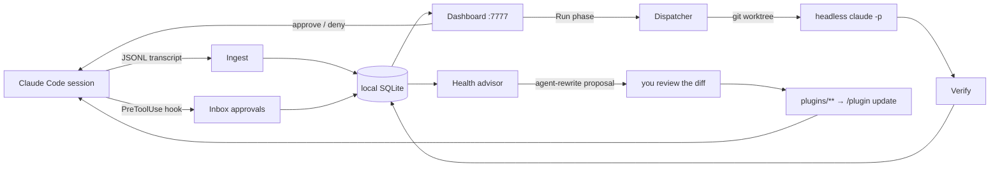

<div align="center">

<a href="https://atretyak1985.github.io/swarmery/uk/"></a>

# Swarmery

### Керуйте агентами Claude Code як флотом — а не як купою вкладок у терміналі.

[English](README.md) · **Українська**

Центр керування сесіями Claude Code, де все локально. План складається через інтерв’ю, виконується в ізольованих
worktree, кожен агент, що чекає, отримує відповідь з однієї черги, і видно, скільки це коштувало. Один бінарник на Go, без хмари
й без акаунта. Плюс версійований маркетплейс плагінів: агенти живуть в одному місці, а кожен проєкт підтягує їх через `/plugin update`.

**[Сайт](https://atretyak1985.github.io/swarmery/uk/)** · **[Можливості](https://atretyak1985.github.io/swarmery/uk/features/)** · **[Відео](https://atretyak1985.github.io/swarmery/uk/videos/)** · **[Плагіни](https://atretyak1985.github.io/swarmery/uk/plugins/)** · **[Почати](https://atretyak1985.github.io/swarmery/uk/install/)** · **[Документація](docs/TOUR.md)** · **[Блог](https://swarmery.substack.com)** · **[X @SwarmeryDev](https://x.com/SwarmeryDev)**

[](LICENSE) [](tools/swarmery/LICENSE) [](https://github.com/atretyak1985/swarmery/actions/workflows/ci.yml) [](https://github.com/atretyak1985/swarmery/actions/workflows/swarmery-ci.yml)   

<a href="https://atretyak1985.github.io/swarmery/uk/videos/"></a>

<sub>Кожна сесія. Кожне рішення. Кожен план. Кожен долар. — <a href="https://atretyak1985.github.io/swarmery/uk/videos/">75-секундний тур і шість епізодів про можливості</a> дивіться на сайті.</sub>

</div>

## Швидкий старт

```bash
curl -fsSL https://raw.githubusercontent.com/atretyak1985/swarmery/main/scripts/install.sh | bash
swarmery serve                            # слухає :7777
```

```bash
curl -s http://localhost:7777/api/health  # → {"status":"ok",…}
open http://localhost:7777
```

Сесії, які ви вже запускали, з’являються одразу: демон підтягує їх із JSONL-транскриптів, які Claude Code і так пише
в `~/.claude/projects/`. Нічого не треба інструментувати, нічого не покидає машину. Якщо хочете спершу прочитати
скрипт (у конвеєрі виконається все, що поверне сервер):

```bash
url=https://raw.githubusercontent.com/atretyak1985/swarmery/main/scripts/install.sh
curl -fsSL "$url" -o install.sh && less install.sh && bash install.sh
```

Далі [налаштуйте проєкт](#налаштування-проєкту): одна команда пише його конфіг `.claude/`.

## Що він робить

- **Видно все** — кожна сесія в кожному проєкті наживо: виклики інструментів, диффи, вартість, субагенти, помилки.
- **Ви більше не вузьке місце** — погоджуйте чи відхиляйте запити дозволу з одного Inbox (черга вхідних); повторюваний запит перетворіть на правило автопогодження; агент сам розбирає те, що ніколи не потребувало вас.
- **Делегуйте, а не наглядайте** — запустіть фазу або весь план із Plans (сторінка планів); фоновий агент (headless) виконує її у власному git worktree, по ходу відмічає критерії приймання, а перевіряльник оцінює результат.
- **Покращуйте систему, а не промпт** — табелі для кожного агента, радник (Advisor) на правилах із доказами, уроки із запусків, що розійшлися з прогнозом, і пропозиції переписати агента, які ви переглядаєте як дифф.
- **Публікуйте агентів один раз** — справжній маркетплейс плагінів Claude Code: `core` і доменні пакети на вибір, із semver, оновлення через `/plugin update`.

Кожне місце нижче має свою сторінку й епізод на [сайті](https://atretyak1985.github.io/swarmery/uk/features/); повний тур місце за місцем —
у [docs/TOUR.md](docs/TOUR.md). На скриншотах вигадані проєкти (TrailMap, Ledgerly API).

### Планування — [епізод 1](https://atretyak1985.github.io/swarmery/uk/features/planning/)

Опишіть звичайним текстом, що потрібно. Планувальник ставить по одному питанню, а план тим часом перебудовується поруч. Результат — документи фаз із критеріями приймання, прогнозами й залежностями. Запускайте одну фазу або весь граф. Якщо фаза далеко розійшлася з прогнозом, ви отримаєте запропоноване виправлення й переглянете його як дифф.

<table><tr><td width="50%" valign="top"><a href="site/assets/img/01-planning-1-interview1-pros-lg.webp"></a><br><sub>Планувальник розпитує вас: варіанти з плюсами, мінусами й рекомендованим вибором</sub></td><td width="50%" valign="top"><a href="site/assets/img/01-planning-3-readme-lg.webp"></a><br><sub>План стає документами: мета, рішення з інтерв’ю, фази й залежності</sub></td></tr></table>

### Вхідні — [епізод 2](https://atretyak1985.github.io/swarmery/uk/features/inbox/)

Запити дозволу, питання агентів, кандидати в уроки, знахідки радника, пропозиції змін агентів і перевірки класифікатора — одна черга, яку розбирають із клавіатури (`j`/`k`, `e`, `x`, `s`). Агент-сортувальник позначає й закриває все, що може, а на решті лишає підказку. Погодження, зміни агентів і сповіщення завжди чекають на вас.

<table><tr><td width="50%" valign="top"><a href="site/assets/img/02-inbox-1-all-lg.webp"></a><br><sub>Кожне рішення, що чекає на вас, в одній черзі</sub></td><td width="50%" valign="top"><a href="site/assets/img/02-inbox-2-askq-lg.webp"></a><br><sub>Питання агентів як справжній вибір, а не «так» чи «ні»</sub></td></tr></table>

### Здоров’я — [епізод 3](https://atretyak1985.github.io/swarmery/uk/features/health/)

Один діапазон дат, зведений до одного речення про флот і агентів, які на нього вплинули. Табелі порівняно з попереднім вікном. Тертя, яке можна прибрати сьогодні: заборонені інструменти, повторювані помилки, час, коли агенти чекали на вас. Радник, кожна рекомендація якого спирається на докази. Вартість і токени можна розбити за проєктом, моделлю чи агентом.

<table><tr><td width="50%" valign="top"><a href="site/assets/img/03-health-1-overview-lg.webp"></a><br><sub>Одне речення про флот і тертя, яке можна прибрати сьогодні</sub></td><td width="50%" valign="top"><a href="site/assets/img/03-health-4-advisor-lg.webp"></a><br><sub>Рекомендації радника з доказами та пропозиції щодо агентів</sub></td></tr></table>

### Сесії — [епізод 4](https://atretyak1985.github.io/swarmery/uk/features/sessions/)

Кожна сесія, яку індексує демон, від найновішої. Рядок `now:` каже, що агент робить цієї секунди, а позначка відрізняє роботу від застрягання. Відкрийте сесію як Chat, Timeline і Diffs, відповідайте прямо з дашборду й дивіться бічну панель: моделі, дерево викликів, змінені файли й вартість.

<table><tr><td width="50%" valign="top"><a href="site/assets/img/04-sessions-2-chattop-lg.webp"></a><br><sub>Одна сесія: статус, вартість, чат і бічна панель</sub></td><td width="50%" valign="top"><a href="site/assets/img/04-sessions-4-diffs-lg.webp"></a><br><sub>Diffs: кожен змінений файл, зміни поза планом позначені</sub></td></tr></table>

### Навчання — [епізод 5](https://atretyak1985.github.io/swarmery/uk/features/learning/)

Запуск, що далеко розійшовся з прогнозом, стає кандидатом в уроки з доданими доказами. Без вашого схвалення нічого не стає активним, а активні уроки переміряються й списуються, коли перестають себе виправдовувати. Локальний класифікатор спостерігає, доки його відповіді не почнуть збігатися з вашими, а чесність прогнозів показує, хто обіцяє забагато.

<table><tr><td width="50%" valign="top"><a href="site/assets/img/05-learning-1-lessons-lg.webp"></a><br><sub>Кандидати в уроки з причиною й доказами та пропозиція списати урок</sub></td><td width="50%" valign="top"><a href="site/assets/img/05-learning-2-classifier-lg.webp"></a><br><sub>Локальний класифікатор і як часто він збігається з вами</sub></td></tr></table>

### Знання — [епізод 6](https://atretyak1985.github.io/swarmery/uk/features/knowledge/)

Що проєкт знає про себе. Інструкції, автопам’ять і нотатки Serena — в одному редакторі із захистом від конфліктів і лінтом застарілих фактів. Карта архітектури вбудована з позначкою свіжості й перебудовою в один клік. А коли ввімкнені відповідні пакети, тут же дашборди Serena і Graphify.

<table><tr><td width="50%" valign="top"><a href="site/assets/img/06-knowledge-1-memory-preview-lg.webp"></a><br><sub>Memory: інструкції проєкту, автопам’ять і нотатки Serena в одному редакторі</sub></td><td width="50%" valign="top"><a href="site/assets/img/06-knowledge-2-arch-flow-lg.webp"></a><br><sub>Карта архітектури з потоком, простеженим крок за кроком</sub></td></tr></table>

## Навіщо

Ви відкриваєте п’ять сесій Claude Code у трьох репозиторіях. Одна чекає на запит дозволу,
якого ви так і не побачили. Ще одна спалила $20, знову й знову запускаючи той самий тест, що падає. Третя закінчила годину тому.
Дізнаєтеся ви про це, перебираючи вкладки терміналу.

Swarmery дає цьому флоту одне вікно — а потім замикає цикл.

---

## Налаштування проєкту

Інсталятор завантажує бінарник релізу для вашої платформи (macOS і Linux, amd64 і arm64),
звіряє його з `SHA256SUMS` і кладе в `~/.local/bin` (`SWARMERY_INSTALL_DIR` змінює теку,
`SWARMERY_VERSION` фіксує реліз). Готові бінарники — на сторінці
[Releases](https://github.com/atretyak1985/swarmery/releases); збірка з коду описана в розділі
[Робота над самим swarmery](#робота-над-самим-swarmery).

`swarmery install` реєструє сервіс launchd (macOS) або юніт `systemd --user` (Linux), тож демон
стартує разом із машиною. Запускайте його знову після кожного встановлення релізу: сервіс і хуки
проєкту запускають копію з `~/.swarmery/bin`, а не ту, яку щойно замінив інсталятор
([деталі](tools/swarmery/README.md#install-as-a-service-and-upgrading-it)).

Swarmery спостерігає саме за CLI `claude`. Якщо його ще немає, встановіть окремо.

### 1 — Підключіть проєкт

З будь-якого репозиторію одна ідемпотентна команда пише його конфіг `.claude/` і виділяє
простір імен у робочому просторі:

```bash
cd /path/to/your/project
swarmery onboard <project-slug> [pack ...]
#   пакети: web-pack | iot-pack | uav-pack | infra-pack | lsp-pack
#           claude-eng-pack | graphify-pack | graft-pack | architecture-pack
#           jira-pack | accounts-pack | design-pack | review-pack
```

Потім відкрийте нову сесію Claude Code і прийміть запит довіри до маркетплейсу `swarmery` —
проєкт з’явиться в дашборді.
(`scripts/init.sh` — двійник цієї команди на чистому bash.)

Робочі артефакти — плани, теки задач, ретроспективи — за замовчуванням лягають у `$HOME/swarmery-workspace`.
Інше місце задає `SWARMERY_WORKSPACE_ROOT` (демон) / `AGENT_WORKSPACE_ROOT`
(плагіни).

> [!TIP]
> **Ігноруйте `.serena/` і `.swarmery/` на рівні машини, а не в кожному проєкті.** `.serena/` (стан
> мовного сервера Serena MCP, `lsp-pack`) і `.swarmery/` (документ фази, який swarmery тимчасово кладе
> у worktree запуску фази — `internal/worktree/plandoc.go`; прибирається разом із worktree
> і не має його пережити) можуть опинитися в дереві *будь-якого* підключеного проєкту, а не лише
> того, де ви їх помітили вперше. Жоден не ігнорується за замовчуванням, тож широкий `git add -A` —
> або власний коміт фонового запуску — може справді їх закомітити; таке вже траплялося. Додайте обидва
> до **глобального** git ignore, а не до відстежуваного `.gitignore` кожного проєкту:
> ```
> **/.serena/
> **/.swarmery/
> ```
> Git за замовчуванням читає `~/.config/git/ignore`, налаштовувати `core.excludesfile` не треба.

### 2 — Перенаправте запити дозволу в дашборд (необов’язково)

```bash
swarmery hooks install       # встановлює шим хуків PreToolUse / Stop
```

Тепер кожен запит дозволу й `AskUserQuestion` з’являється в **Inbox** дашборду з повним
контекстом, де б ви не були. Шим працює за принципом **fail-open**: якщо демон не запущений, шим тихо
завершується, і Claude Code, як завжди, питає вас у терміналі.

<details>
<summary><b>Увімкнути кнопку «＋ new project» у дашборді</b></summary>

Запис `.claude/` за довільним шляхом вмикається лише явно. Тому ендпоінт підключення вимкнений,
доки ви не дозволите батьківські теки, у які йому можна писати:

```bash
SWARMERY_ONBOARD_ROOTS="$HOME/projects" ./tools/swarmery/swarmery serve
# зберегти це в сервісі launchd (macOS):
./tools/swarmery/swarmery install --onboard-roots "$HOME/projects"
```

Без цього кнопка (і `POST /api/projects/onboard`) повертає `403 onboarding is disabled`.
CLI `swarmery onboard` працює завжди.

</details>

---

**Тур дашбордом місце за місцем — Today (сьогодні), Inbox (вхідні), Needs you (черга «потребує вас»), Sessions (сесії), Plans (плани),
Health (здоров’я), Learning (навчання), Knowledge (знання), Docs (документація), System (система), Settings (налаштування) — у [docs/TOUR.md](docs/TOUR.md); на
[сайті](https://atretyak1985.github.io/swarmery/uk/) кожна можливість має свою сторінку й епізод.**

---

## Як замикається цикл



Сесії дають докази, докази дають рекомендації, рекомендації стають переглянутими змінами
самих агентів, а маркетплейс доставляє ці зміни в кожен проєкт.

---

## Маркетплейс плагінів

Друга половина репозиторію. Систему агентів, скопійовану між проєктами, швидко роз’їдає: підстановки
накопичуються, файли розходяться, кожне покращення доводиться переносити N разів. Swarmery замінює це
рідним механізмом плагінів Claude Code — **з версіями semver**, **із просторами імен** (`core:tech-lead`),
**з оновленнями** (`/plugin update`). Проєкти фіксують перевірену версію й переходять на нову, коли її піднімуть.

Описи пакетів у таблиці беруться з маніфесту маркетплейсу, тому лишаються англійською.

<!-- BEGIN generated:packs -->
| Плагін | Що всередині |
|---|---|
| **`core`** | Фреймворк, незалежний від постачальника, який вмикає кожен споживач: 13 агентів з власним судженням (tech-lead, planner, architect, implementation-agent, code-reviewer, … — див. `plugins/core/AGENTS.md`), 37 скілів із поступовим розкриттям, 8 команд, хуки життєвого циклу й безпеки, statusline і CLI робочого простору `agent-work`, що знає про проєкт. |
| `uav-pack` | UAV/drone domain pack: MAVLink-style telemetry, mission planning, embedded/edge runtime. |
| `iot-pack` | IoT domain pack: BLE communication, device telemetry, health-metrics processing. |
| `web-pack` | Web/marketing domain pack: SEO, i18n, landing-page CRO, Figma-to-code styling. |
| `infra-pack` | Infrastructure & delivery domain pack: Kubernetes/Helm, GitOps promotion, IaC, GitLab CI, cloud CI auth (GCP + AWS), Keycloak. |
| `lsp-pack` | Semantic code-navigation pack: Serena LSP MCP server. Requires the serena binary (uv) on the machine. |
| `claude-eng-pack` | Claude-engineering pack: skills for building/auditing Claude agent systems — agent architecture, tool/MCP design, prompt engineering, Claude Code config, context reliability. |
| `graft-pack` | Context-graph pack: the graft skill plus two hooks — coverage-gated file:line locators injected into a prompt before the first grep, and a blast-radius note after every edit. Requires the graft CLI on the machine. |
| `graphify-pack` | Knowledge-graph pack: the /graphify skill — repo/folder → persistent knowledge graph with query/path/affected tools and HTML/JSON/Neo4j exports. Requires the graphify CLI on the machine. |
| `architecture-pack` | Repo-wide architecture map: /architecture-map generates a machine-readable JSON contract (layers, modules, file-anchored flows) + self-contained HTML viewer, freshness-stamped per commit; the swarmery dashboard serves both on its Architecture page. Also /visualize: turn a document or an explanation into one interactive, self-contained HTML explainer page. |
| `jira-pack` | Issue-tracker pack: /jira-fix drives any Jira ticket end-to-end — access preflight, defect-or-change triage, reproduction or test-first evidence, delegated fix/implementation, evidence comment, QA transition. Requires an Atlassian MCP provider enabled on the machine. |
| `accounts-pack` | Multi-account pack: bind a project to one of several Claude Code accounts and run every session under it — /account, a shell wrapper, an optional shell function, and a wrong-account warning. The binding is machine-local, and a binding file committed to git is ignored. Requires the swarmery CLI. |
| `design-pack` | Design-handoff pack: /design-implement takes an exported design and re-expresses it in the project's stack pixel-accurately — computed-style token inventory, reuse-vs-create recon, an approval gate, and a measured pixel diff as the completion criterion. |
| `review-pack` | Pull-request review pack: /pr-review reviews a GitHub PR and posts verified inline findings, or triages the reviewer comments on it — verify each against the code, fix the valid ones behind the repo's gates, rebut the rest with file:line evidence, reply in-thread. Requires the gh CLI. |
<!-- END generated:packs -->

Кожен пакет потребує `core` і вмикається окремо для кожного проєкту.

### Як підключити

Одна команда з кореня проєкту (деталі — у [docs/ONBOARDING.md](docs/ONBOARDING.md)):

```bash
bash <swarmery-repo>/scripts/init.sh <project-slug> [pack ...]
```

Або вручну, у `.claude/settings.json` проєкту:

```jsonc
{
  "extraKnownMarketplaces": {
    "swarmery": { "source": { "source": "github", "repo": "atretyak1985/swarmery" } }
  },
  "enabledPlugins": {
    "core@swarmery": true,
    "web-pack@swarmery": true
  },
  "env": { "AGENT_PROJECT": "your-project" }
}
```

Потім покладіть конфіг свого проєкту в `.claude/project.json` (схема — в `overlays/_schema/`,
еталонний оверлей — в `overlays/example/`). Агенти, скіли й хуки `core` читають його під час виконання:
репозиторії, головний застосунок, хмарні налаштування, доменні терміни. **Нічого специфічного для проєкту
в плагін не вшивається** (політика: [docs/NEUTRALITY.md](docs/NEUTRALITY.md); у CI це перевіряє
`scripts/scan-flavor.sh`, який має звітувати нуль збігів).

### Принципи побудови

- **Ізоляція між проєктами.** Увімкнений swarmery нічого не забирає: власні `.claude/agents/` проєкту
  й далі перемагають за іменем — це задуманий механізм перевизначення, а не форк. Робочі артефакти живуть
  в окремому просторі імен кожного проєкту (`AGENT_WORKSPACE_ROOT` + `AGENT_PROJECT`), тож клієнти ніколи
  не ділять контекст.
- **Фреймворк ≠ робочий простір.** Плани, сесії й теки задач живуть в окремому приватному репозиторії
  робочого простору, ніколи не тут.
- **Правило просування** ([docs/EXTENDING.md](docs/EXTENDING.md)): компоненти народжуються
  локально в проєкті, переходять у доменний пакет, коли знадобляться другому проєкту, а потім у `core`, коли
  знадобляться всім. **Рух лише вгору.**
- **Явний semver** у кожному `plugin.json`: зміну, запушену без підняття версії, жоден споживач
  ніколи не отримає.

---

## Конфігурація

<details>
<summary><b>Довідник CLI</b></summary>

| Команда | Призначення |
|---|---|
| `serve` | Запускає демон і дашборд на `:7777`. |
| `onboard` / `offboard` / `attach` | Бере теку під керування swarmery (пише `.claude/`) або скасовує це. |
| `hooks install\|uninstall\|status` | Встановлює шим хуків дозволу й зупинки в налаштування Claude Code. |
| `hook <permission-request\|stop>` | Сам шим: його викликає Claude Code, завершується завжди з кодом 0. |
| `console` | Інтерактивний TUI: живий потік подій, погодження y/n, пауза диспетчера. |
| `status` / `service-status` | Знімок стану запущеного демона / стан сервісу launchd. |
| `install` / `uninstall` | Реєструє або прибирає сервіс автозапуску launchd (macOS). |
| `ingest` / `backfill` / `wscan` / `sysscan` | Разові проходи індексації (транскрипти, робочий простір, конфіг машини). |
| `backup` / `prune` / `recost` | Знімок БД (безпечно під час роботи), згортання й видалення старих рядків, переоцінка сесій. |

</details>

<details>
<summary><b>Змінні середовища</b></summary>

| Змінна | За замовчуванням | Дія |
|---|---|---|
| `SWARMERY_PORT` | `7777` | Порт, який слухає демон. |
| `SWARMERY_PROJECTS_ROOTS` | `~/.claude/projects` | Корені транскриптів через кому — по одному на кожну теку конфігу Claude Code, для машин із кількома підписками через `CLAUDE_CONFIG_DIR`. `auto` — кожен наявний `~/.claude*/projects`. Корінь, якого на цій машині немає, потрапляє в лог і пропускається. Кожна сесія отримує позначку акаунта, який називає її корінь (`~/.claude-work` → `work`, звичайний `~/.claude` → типовий), тож список сесій фільтрується за підпискою, а `GET /api/stats/breakdown?by=account` ділить вартість за тарифними планами. |
| `SWARMERY_PROJECTS_ROOT` | *(не задано)* | Застаріла форма попередньої змінної в однині; сприймається як список з одного елемента. |
| `SWARMERY_WORKSPACE_ROOT` | `~/swarmery-workspace` | Корінь приватного репозиторію робочого простору (плани, задачі). |
| `SWARMERY_EXCLUDE` | `/tmp/*,/private/tmp/*` | Шляхи проєктів через кому, які треба ігнорувати. |
| `SWARMERY_ONBOARD_ROOTS` | *(порожньо — вимкнено)* | Список дозволених батьківських тек, у яких дашборд може підключати проєкти. |
| `SWARMERY_SETTINGS_OVERLAYS` | `~/.swarmery/overlays.json` | Шлях до опису файлів налаштувань, які також діють для заданих коренів проєктів. Це для проєктів, чий набір плагінів підставляється з пріоритетом CLI (`claude --settings <file>`), а не комітиться в репозиторій. Див. [Оверлеї налаштувань](#settings-overlays) нижче. Якщо файлу немає або він зіпсований, виявлення тихо обмежується репозиторієм. Замінено прив’язкою estate (`swarmery.estate` у `.claude/settings.local.json`); лишається для налаштувань, старших за estate. |
| `SWARMERY_SYSTEM_READONLY` | `0` | `1` забороняє **будь-які** записи конфігу й пам’яті — безпечно для спільних машин. |
| `SWARMERY_DISPATCH` | on | `0`/`false`/`off` вимикає диспетчер дошка→агент. |
| `SWARMERY_AUTOVERIFY` / `SWARMERY_ROUTINES` / `SWARMERY_AUTOPROVISION` | on | Вимикачі перевірки, рутин і автопідготовки пакетів. |
| `SWARMERY_MAX_CONCURRENT` / `SWARMERY_MAX_WORKTREES` | `2` / `4` | Паралельність диспетчера й стеля для worktree. |
| `SWARMERY_DISPATCH_TIMEOUT_MIN` | `45` | Жорсткий тайм-аут на кожен запуск агента з диспетчера. |
| `SWARMERY_MICRO_PLANS` | on | `0`/`false`/`off` вимикає однофазний план, який диспетчер пише в робочий простір проєкту для кожної відправленої картки. |
| `SWARMERY_NOTIFY_URL` / `_EVENTS` / `_TELEGRAM_CHAT` | — | Вихідні вебхук-сповіщення (наприклад, коли чекає погодження). |
| `SWARMERY_CLAUDE_BIN` | `claude` | Шлях до Claude Code CLI, який запускає демон. |

`swarmery install` вшиває в plist launchd усі `SWARMERY_*`, які ви експортували.
Прапорці дублюють більшість змінних (`--port`, `--bind`, `--exclude-projects`, `--workspace-root`, …);
повний список показує `swarmery help`.

<a id="settings-overlays"></a>
**Оверлеї налаштувань.** Зазвичай swarmery вирішує, чи проєкт *керований* (і які пакети він
запускає), за власним `.claude/settings.json` проєкту. Буває, що Claude Code стартує через лаунчер,
який підставляє файл налаштувань із пріоритетом CLI — `claude --settings <file>`, — а `enabledPlugins`
навмисно тримають поза репозиторієм. Тоді демон показав би `managed: false` для проєкту, який
у кожній сесії працює з повним набором плагінів.

Оголосіть додатковий файл налаштувань і корені, до яких він застосовується, — і дашборд
накладе його поверх налаштувань самого репозиторію (за конфлікту ключів перемагає оверлей,
так само як у реальному пріоритеті сесії):

```jsonc
// ~/.swarmery/overlays.json
{
  "overlays": [
    {
      "name": "acme",                                    // label echoed as provenance
      "settingsPath": "~/launcher/orgs/acme/settings.json",
      "roots": ["~/work/acme"]                           // this project and everything under it
    }
  ]
}
```

`~` розгортається в домашню теку. Відповіді API, яких це стосується, отримують поле
`overlaySources` з назвами оверлеїв, що долучилися, тож `managed: true` завжди можна простежити
до джерела. Виявлення **дрейфу** плагінів навмисно лишається в межах репозиторію (його виправлення
пише `settings.json` репозиторію). Тому плагін, увімкнений лише оверлеєм, має статус `unknown`,
а не зелений `ok`: його ніхто не перевіряв.

</details>

---

## Межі та обмеження

Прямо, щоб згодом нічого не стало сюрпризом:

- **Один користувач, лише localhost.** Демон слухає `127.0.0.1`; ендпоінти, що змінюють стан, захищені
  перевіркою локального походження. Автентифікації й багатокористувацької моделі немає — не відкривайте його назовні.
- **Вартість не розкладається по агентах.** Транскрипти Claude Code не записують ходи субагентів,
  тож для агентів і скілів є **лічильники запусків**, а не долари. Вартість на рівні сесії
  й проєкту точна.
- **Сесії планування живуть у пам’яті.** Після перезапуску демон забуває незавершену сесію планування
  (записаний план лишається — це файл).
- **Playbooks — лише перегляд і дублювання.** Візуального редактора немає; редагуйте скопійований файл.
- **Артефакти Graphify демон лише віддає, а не будує.** Він вбудовує наявний `graph.html`;
  генерувати його — справа CLI `graphify`.
- **Автопідготовка генерує файли лише для `architecture-pack`.** Інші пакети тільки встановлюються.
- **macOS — основна платформа; автозапуск на Linux підтримується.** Демон написаний на портативному
  Go. `install` / `uninstall` / `service-status` керують launchd на macOS і юнітом `systemd --user`
  (`~/.config/systemd/user/swarmery.service`) на Linux; шлях для Linux перевірено на фейковому
  менеджері, а не на справжньому в CI.

---

## Робота над самим swarmery

**Що потрібно:** git, Go ≥ 1.25 (старіший Go сам завантажить зафіксований toolchain), Node ≥ 22.

```bash
git clone https://github.com/atretyak1985/swarmery.git
cd swarmery
bash scripts/install-swarmery.sh          # зібрати єдиний бінарник із вбудованим дашбордом
./tools/swarmery/swarmery serve           # слухає :7777
```

```bash
cd tools/swarmery
make build          # знімок документації → бандл vite → go:embed → єдиний бінарник ./swarmery
make test           # go vet ./... && go test ./...
make dev            # демон Go + dev-сервер vite (проксіює /api на :7777)
make install        # перезбирає й підміняє бінарник сервісу та перезапускає його (launchd на macOS, systemd --user на Linux)
```

Перевірки з боку маркетплейсу (повторюють [`ci.yml`](.github/workflows/ci.yml)):

```bash
find plugins scripts -name '*.sh' -exec bash -n {} \;      # синтаксис shell
bash scripts/tests/protect-sensitive-files.test.sh          # поведінка хуків
bash scripts/scan-flavor.sh                                 # храповик нейтральності — має бути "✓ clean"
```

Встановлені плагіни запускаються з `~/.claude/plugins/cache`, **а не** з вашої робочої копії. Незавершені
зміни плагінів тестуйте через `claude --plugin-dir plugins/core` (прапорець можна повторити для кожного пакета).

Що почитати далі: [docs/ONBOARDING.md](docs/ONBOARDING.md) ·
[docs/PLUGINS.md](docs/PLUGINS.md) · [docs/EXTENDING.md](docs/EXTENDING.md) ·
[docs/NEUTRALITY.md](docs/NEUTRALITY.md) · [docs/WORKFLOW.md](docs/WORKFLOW.md) ·
[ADR 0001 — типові налаштування агентів живуть в upstream](docs/adr/0001-agent-defaults-live-upstream.md) ·
[README центру керування](tools/swarmery/README.md) · [SECURITY.md](SECURITY.md)

---

## Слідкувати за розробкою

Сайт: [atretyak1985.github.io/swarmery/uk](https://atretyak1985.github.io/swarmery/uk/) · серія «будую публічно» на [Substack](https://swarmery.substack.com) ·
новини в [X @SwarmeryDev](https://x.com/SwarmeryDev). Якщо Swarmery вам корисний, ⭐ допоможе іншим його знайти.

## Ліцензія

- Плагіни, скрипти, оверлеї й документація — **Apache-2.0** ([`LICENSE`](LICENSE)). Використовуйте будь-де, зокрема комерційно.
- Центр керування (`tools/swarmery/`) — **PolyForm Noncommercial 1.0.0** ([`tools/swarmery/LICENSE`](tools/swarmery/LICENSE)). Безкоштовно для особистого, навчального й open-source використання.
