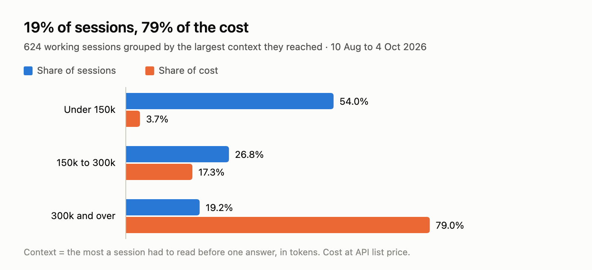
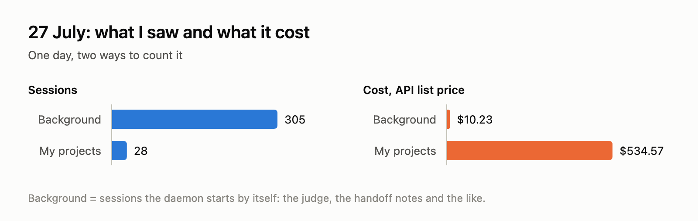
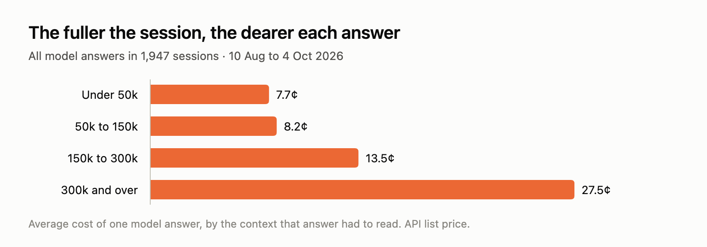
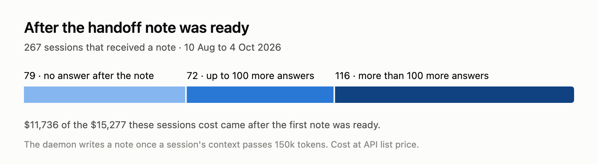

П'ята частина моїх сесій дала чотири п'ятих витрат.

У мене дві підписки Claude Max 20x, і в обох є тижневий ліміт. Для мене дорого — це коли ліміт закінчується посеред тижня. І в якийсь момент я побачив, що тижневі токени закінчуються швидко. Коли вони закінчувались, я працював далі через платний API. Тож я почав досліджувати чому.

Для тих, хто не читав попередні пости: [Swarmery](https://github.com/atretyak1985/swarmery) — це програма, яка працює на моєму комп'ютері поруч із Claude Code. Claude Code зберігає на диск повний запис кожної сесії, а Swarmery читає ці записи в локальну базу: кожну відповідь моделі, скільки токенів вона забрала, який це був агент. Тож мені не треба гадати, куди йдуть токени, я можу їх порахувати.

Одне зауваження перед цифрами. Я не бачу, як підписка рахує токени в тижневий ліміт. Що я можу — це оцінити кожен токен так, як його оцінює прайс API. Тому всі суми в доларах нижче — це скільки та сама робота коштувала б за прайсом API. Це не мій рахунок. Це лінійка, і іншої в мене немає.

Перше місце, куди я подивився, — це фон. Деякі сесії Swarmery запускає сам: суддю, який оцінює, як попрацювали агенти, автора нотаток для хендофу і так далі. Це не ті субагенти, про яких зазвичай сперечаються, до них я дійду пізніше. Це маленькі сесії, які ніхто не запускав руками, і на дашборді їх були сотні. 27 липня їх було 305 проти 28 сесій у моїх проєктах. Напередодні їх було 30, а наступного дня 55, тож той день не був звичайним. Там був баг: суддя оцінював власні сесії оцінювання.

Баг я виправив. Але потім подивився, скільки все це коштувало. 305 фонових сесій разом коштували $10,23. 28 сесій у моїх проєктах коштували $534,57.

Триста п'ять сесій за десять доларів і двадцять вісім за п'ятсот.

Тобто кількість сесій нічого не сказала мені про вартість. Щоб побачити, що про неї каже, я взяв вісім повних тижнів, з 10 серпня по 4 жовтня. Липня там немає: детальний запис кожної відповіді Swarmery зберігає шістдесят днів, а далі лишаються тільки денні підсумки.

За ці вісім тижнів було 1 947 сесій, і коштували вони $16 378. З них 1 323 були фоновими, і всі вони разом коштували $76. Тому я відклав їх убік і подивився на решту 624 — сесії, де відбувалась справжня робота.

Я відсортував їх за тим, наскільки великим став їхній контекст. Контекст — це все, що модель має прочитати перед відповіддю: розмова до цього моменту, файли, результати команд. Моделі, якими я користуюсь, приймають до мільйона токенів контексту, тож сесія може рости довго, перш ніж її щось зупинить.

Сесії, які так і не перейшли 150 тисяч токенів, — це 54% робочих сесій і 3,7% витрат. У середньому така сесія — це 19 відповідей моделі і $1,78.

Сесій, які перейшли 300 тисяч токенів, 120, тобто 19% робочих сесій, і вони дали 79% витрат. У середньому така сесія — це 727 відповідей, чотирнадцять годин за годинником між першою відповіддю й останньою, разом із паузами, і $107. Самі лише десять найдорожчих сесій — це понад 22% усього.

Чому довга сесія коштує так багато? Причин дві, і вони перемножуються.

Перша — просто кількість відповідей: 727 проти 19.

Друга — що кожна відповідь дорожчає, поки сесія наповнюється. Модель нічого не пам'ятає між відповідями. Щоразу вона читає всю розмову заново, від початку. Claude Code тримає цей текст у кеші, і токен, прочитаний із кешу, коштує десяту частину нового або й менше, тож одне перечитування дешеве. Але воно відбувається перед кожною відповіддю, а текст увесь час росте.

Я це виміряв. Відповідь, дана, коли контекст був до 150 тисяч токенів, коштувала в середньому близько 8 центів. Між 150 і 300 тисячами — 13,5 цента. Понад 300 тисяч — 27,5 цента.

Та сама відповідь у повній сесії коштує втричі більше, ніж у свіжій.

Уявіть нараду, де перед кожним новим реченням секретар зачитує вголос увесь протокол від першої хвилини. Першу годину ніхто цього не помічає. Під вечір уже ніхто не працює, усі слухають протокол.

Коли я розклав вартість за типом токенів, перечитування кешу виявилось приблизно 72% від неї. Запис у кеш — 19%, власні відповіді моделі — 9%. Новий вхід, тобто те, що я справді набираю, — одна десята відсотка.

І тут мушу повернутись до лінійки. Якщо рахувати токени, а не долари, то кешовані — це 98% усіх токенів, що пройшли. Я не знаю, як їх зважує тижневий ліміт. Якщо він рахує їх дешево, як прайс, то картина така, як вище. Якщо рахує кожен повністю, то довгі сесії виглядають ще гірше.

Тепер про субагентів. Пост на Substack, [Why Claude Code Subagents Burn So Many Tokens](https://youcanbuildthings.substack.com/p/why-claude-code-subagents-burn-so), каже, що субагенти коштують до 85% важкої сесії. Для такого типу сесій мої цифри з цим згодні. З моїх 120 великих сесій 51 — це оркестрації, де головний агент годинами роздає роботу субагентам. У цих 51 субагенти — це 70% вартості, а в одній із них 97%.

Але за всі вісім тижнів субагенти — це 35% вартості, а основна розмова — 65%. Причина в решті 69 великих сесій. Субагентів у них майже немає, тільки я й одна довга розмова, і разом вони коштували $6 226 проти $6 660 в оркестрацій. Одна оркестрація дорожча за одну довгу розмову, $131 проти $90. Але обидві в цьому списку з тієї самої причини.

Із субагентами чи без них, дорога сесія — це довга сесія.

Claude Code вміє стискати розмову, тобто заміняти стару частину коротким підсумком. У даних стиснення виглядає як раптове падіння контексту більш ніж удвічі. У своїх 120 великих сесіях я знайшов таких п'ять.

Я не тільки дивився на все це, я ще й будував проти цього. На кожній картці сесії у Swarmery тепер є бейдж контексту: жовтий від 150 тисяч токенів, червоний від 300 тисяч. А головне — це хендоф. Коли сесія переходить 150 тисяч токенів, Swarmery сам пише коротку нотатку: мета, поточний стан, файли, які зачепили, ухвалені рішення і наступний крок. Якщо сесія виросте ще на 75 тисяч, він пише нову. Пише він зі своєї бази, а не з запису розмови, бо читати запис на 400 тисяч токенів заради економії токенів — це зробити ліки такими ж дорогими, як хвороба. Ідея була проста: я беру нотатку, очищаю сесію і продовжую в новій, з малим контекстом.

А тепер чесна частина. Я перевірив, що було із сесіями після цих нотаток.

За ці вісім тижнів Swarmery написав 546 нотаток для 267 сесій. У 79 із цих сесій після нотатки не було жодної відповіді. З даних я не можу сказати, чи скористався я там нотаткою, чи робота просто закінчилась. 72 тривали ще до ста відповідей. А 116 тривали ще понад сто відповідей після того, як нотатка була готова.

Нотатка була готова, а сесія пішла далі без неї.

Скільки це коштувало? Усі відповіді, дані понад 150 тисяч токенів, у всіх сесіях, коштували $12 151, тобто 74% усього. Якби кожна з них коштувала стільки, скільки коштує відповідь між 50 і 150 тисячами токенів, а це 8,2 цента, вони коштували б $5 400. Різниця — $6 750, або 41% усіх восьми тижнів. Заради справедливості: це стеля, а не обіцянка. Нова сесія мусить дещо з файлів прочитати знову, а порахувати це звідси я не можу.

Мушу чесно сказати, що нотатка — це лише пропозиція. Вона з'являється на картці сесії, і сесію ніщо не зупиняє. І причину про себе я знаю: коли велика задача, шкода втратити контекст.

Що я хочу спробувати далі — робити хендоф не тоді, коли контекст став великим, а тоді, коли завершилась фаза. У Swarmery велика задача — це план, розбитий на фази, і кожна фаза — окремий документ зі своїми чекбоксами. Кінець фази здається мені природним місцем, щоб зупинитись і продовжити в новій сесії. Цього ще не збудовано. Поки що це лише ідея.

Якщо ваш ліміт теж закінчується посеред тижня, я б не починав із підрахунку агентів. Я б пошукав ті кілька сесій, які прожили найдовше. Для першого погляду Swarmery не потрібен: Claude Code тримає по одному файлу на сесію в `~/.claude/projects`, і починати варто з найбільших файлів.

Пост про уроки й прогнози, який я обіцяв минулого разу, ще попереду, він буде наступним. Код Swarmery відкритий на [GitHub](https://github.com/atretyak1985/swarmery), а скрипт, який рахує кожну цифру в цьому пості, лежить [поруч зі статтею](https://github.com/atretyak1985/swarmery/tree/main/articles/substack/where-the-tokens-went/evidence).

Попередній пост: [Why I Don't Believe an Agent When It Says "Done"](https://swarmery.substack.com/p/why-i-dont-believe-an-agent-when)
