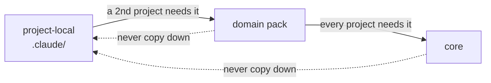

# Extending swarmery: where project-specific things live

swarmery is **one global system + a thin native overlay per project** — never a separate
"sub-agent-system" inside a project. Claude Code merges both layers in every session:
enabled plugins supply the global components; the project's own `.claude/` supplies local
ones; **on a name collision the project-local component wins** (native base + overlay).

## Decision tree for every new skill / agent / command / template / script

| The thing is… | It goes to… |
|---|---|
| useful to any project | `plugins/core` (bump semver → consumers adopt via `/plugin update`) |
| useful to ≥2 projects of one domain or capability | the matching pack — domain (`uav-pack` / `iot-pack` / `web-pack`) or capability (`infra-pack` / `lsp-pack`) |
| unique to one project | **the project's own `.claude/{agents,skills,commands,templates}/`** — versioned with the project's code, because it evolves with the product |
| configuration, not logic (repo lists, env names, commit scopes, domain nouns) | the project's `.claude/project.json` |

**Every new agent, skill or command owes its reader a `# How to use` block, and CI enforces
it.** Whatever the thing does, it lands in `plugins/**` with one `# How to use` H1 carrying
the four required subsections — What it does, When to use it, How to invoke, Worked example
— or the **System item docs coverage** step fails the build; the gate runs
`scripts/docgen/check-coverage.sh` with `DOCS_MAX_PROBLEMS` unset, so the tolerated problem
count is zero. The full contract (heading placement, the `docs:` frontmatter provenance,
the parser's edge cases, and what the dashboard does with the block) is
[`tools/swarmery/docs/system-docs-format.md`](../tools/swarmery/docs/system-docs-format.md);
`scripts/docgen/generate.sh` will draft the block for you from the item's own body, but the
prose is yours to make worth reading. Run `bash scripts/docgen/check-coverage.sh` before you
push.

## The graduation rule (flow goes UP only)

New things are born **project-local**. When a *second* project needs the same thing, promote it
to a pack; when every project needs it, promote to core. Never copy downward — copying framework
files into projects recreates the fork-and-sync rot this repo exists to eliminate.



Promotion checklist:
1. De-flavor it (see `docs/NEUTRALITY.md`) — values move to `project.json` reads.
2. Move the file into the pack/core; bump that plugin's semver.
3. Delete the project-local copy in the consumer that donated it (the plugin now supplies it).

## Pack requirements (`requirements.json`)

A pack that cannot work without project-specific config declares it in
`plugins/<pack>/requirements.json` — at the **pack root**, next to `agents/` and `skills/`
(only `plugin.json` lives under `.claude-plugin/`). This is how a pack says "I need block `X`
in `.claude/project.json`, here is its schema, here is why" **without** any reader needing to
know what the pack does — the same neutrality rule that keeps domain knowledge out of core.

```json
{
  "version": 1,
  "projectConfig": [
    {
      "key": "<top-level project.json key>",
      "title": "<human label>",
      "why": "<one sentence: what breaks without it>",
      "docs": "skills/<skill>/SKILL.md",
      "schema": { "type": "object", "properties": {}, "required": [] }
    }
  ]
}
```

| Field | Required | Purpose |
|---|---|---|
| `version` | yes | integer, currently exactly `1`. A reader seeing any other number ignores the file (forward-compat) |
| `projectConfig[]` | yes | the top-level `project.json` keys the pack needs |
| `.key` | yes | the key name in `project.json` |
| `.title` | yes | human-readable heading |
| `.why` | yes | one sentence on why the pack can't run without it — shown above the form |
| `.docs` | no | pack-relative path to documentation, rendered as a link |
| `.schema` | yes | self-contained JSON Schema fragment (`type: object` + `properties` + `required`) |
| `.probe` | no | how to discover **live** values for some of those fields — see below |

Unknown fields are ignored by readers, so a later version can add optional fields without
bumping `version`.

### `probe` — asking for real values instead of guesses

A declared key is only half the operator's problem. The other half is that the obvious value is
often the wrong one: a status name that reads right in the form does not exist on the board, and
the only way to learn the real one is to ask the system that owns it. The daemon cannot ask — it
holds no credentials for anything a pack integrates with, by design. So the pack ships a
**prompt**, and the daemon hands it to a `claude` session that already has the operator's live
connectors. The daemon learns nothing about the domain and gains no client and no token.

```json
"probe": {
  "needs": ["baseUrl", "projectKey"],
  "fields": ["qaStatus", "repro.test"],
  "timeoutSeconds": 180,
  "prompt": "…self-contained instruction; output ONLY {\"suggestions\":{…},\"notes\":\"…\"}…"
}
```

| Field | Required | Purpose |
|---|---|---|
| `.needs` | no | dotted paths that must be filled before the probe can run — its **inputs**. Until they are, the button is disabled |
| `.fields` | yes | dotted paths the probe may suggest values for. A **whitelist**: anything else the agent returns is discarded |
| `.timeoutSeconds` | no | clamped to `[1, 300]`; default `180` |
| `.prompt` | yes | self-contained instruction. Placeholders only — the real host and key arrive in the value at call time |

The prompt must demand JSON and nothing else, and must tell the agent to **omit** a key rather
than guess at it: an absent key is a correct answer, a plausible fabrication is not. Suggestions
render as a `<datalist>`, never a `<select>` — what the probe can reach is not guaranteed to be
the whole truth, so the field stays typeable.

A probe never writes and is never an operator-facing error: a timeout, a missing `claude`, prose
instead of JSON, a connector that would not resolve — every one of them comes back `200` with an
empty `suggestions` object and a one-line reason. A **malformed** `probe` block costs the pack
its suggestions and nothing else; the config form still renders. CI validates the block's shape
(`check-plugin-requirements.sh`) but deliberately does **not** compare it against the overlay
schema — it declares how to discover values, not what shape they take.

**Sync rule (CI-enforced).** `.schema` must be canonically identical to the matching branch of
`overlays/_schema/project.schema.json` → `properties[<key>]` — same `description` strings, same
`required`, same defaults. A consumer's `project.json` is validated against the overlay schema
while the form is rendered from the pack file; if they drift, the form collects one shape and
the schema rejects another. `scripts/check-plugin-requirements.sh` compares them under a
canonical form (object keys sorted recursively, so ordering and formatting never count as
drift) and fails the build on any difference, or when the key is missing from the overlay
schema entirely. The file is optional per pack — its absence is not an error. Run it locally:

```bash
bash scripts/check-plugin-requirements.sh   # → ✓ plugin requirements in sync (<n> checked)
```

Changing the schema means editing **both** files in the same commit.

**Neutrality.** `requirements.json` is under `plugins/**`, so it carries placeholders only —
never a real host, project key, or status name (`docs/NEUTRALITY.md`).

**Semver.** Adding a new required key to `requirements.json` changes the pack's contract with
its consumers: existing projects become under-configured until someone fills the new key in.
That is a **minor bump** of the pack's `plugin.json` at minimum, so consumers pick it up via
`/plugin update`. Loosening the contract (dropping a required key, adding an optional one) is a
patch bump.

## Overriding core behavior

A project may ship a component with the **same name** as a core one in its `.claude/agents/`
(etc.) — the local one wins in that project only. Use this for project-specific variants of a
core agent instead of forking the framework.

**Overriding an agent replaces it whole, never per key.** So when the only thing a project
wants to change is one frontmatter key — in practice `isolation:`, which Claude Code (not
swarmery) resolves out of the agent file — do **not** hand-copy the agent. Declare the
narrowing in the project's `.claude/settings.json` and let the fork be generated:

```json
"swarmery": { "agents": { "implementation-agent": { "isolation": "none" } } }
```

```bash
swarmery agents sync            # writes .claude/agents/<name>.md, stamped with the upstream source_sha
swarmery agents sync --check    # writes nothing; exits 1 once upstream has moved on
```

Commit the generated file next to `settings.json`. **Any file in a project's `.claude/agents/`
is either generated or a bug** — the one exception is an agent that is genuinely unique to that
project and never existed upstream (the graduation rule above). The reasoning, the rejected
alternatives, and what stays deferred are in
[`docs/adr/0001-agent-defaults-live-upstream.md`](adr/0001-agent-defaults-live-upstream.md).

## Template & script resolution convention

- **Templates:** agents look in `${CLAUDE_PROJECT_DIR}/.claude/templates/` first, then fall back
  to the plugin's `${CLAUDE_PLUGIN_ROOT}/templates/`. Project-specific report/summary formats
  live with the project; generic ones ship with core.
- **Scripts:** project automation stays in the project repo (`scripts/` or `.claude/scripts/`).
  Core ships only project-agnostic tooling (`plugins/core/bin/`), which reads `project.json`
  for anything project-shaped.

## What a consumer project's `.claude/` looks like

```
<project>/.claude/
├── settings.json        # enables core@swarmery + the packs it needs (+ AGENT_PROJECT env)
├── project.json         # the flavor config (schema: overlays/_schema/project.schema.json)
├── agents/              # project-unique agents + intentional overrides (often empty)
├── skills/              # project-unique skills (often just a few)
├── templates/           # project-specific templates (checked before plugin templates)
└── scripts/             # project automation (optional)
```

Thin is healthy: if this directory starts growing generic content, something wants promoting.

## Versioning the overlay itself

A single-repo project versions `.claude/` naturally — it lives inside the project repo.
**Multi-repo workspaces** (no single root repo) should make the overlay its own small repo:

```
<workspace>/agents/        ← git repo holding ONLY the project-specific overlay
<workspace>/.claude -> agents   (symlink; sub-repo .claude symlinks point here too)
```

This keeps rules/, project-specific skills/agents/commands, agent-memory and project.json
under version control and shareable across machines, while the generic framework still
arrives via plugins. If the workspace previously hosted a full pre-swarmery agent framework
repo, reuse it: push the thin overlay as a successor branch — history stays, layout shrinks.
