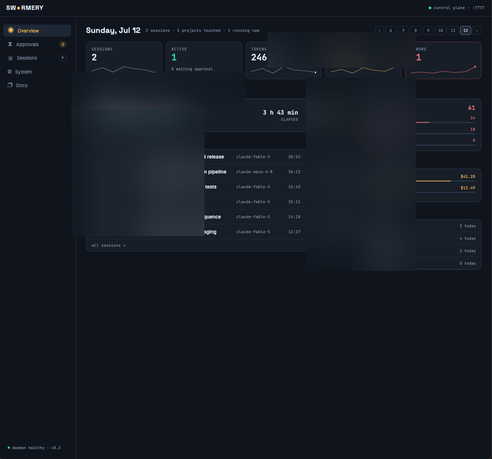
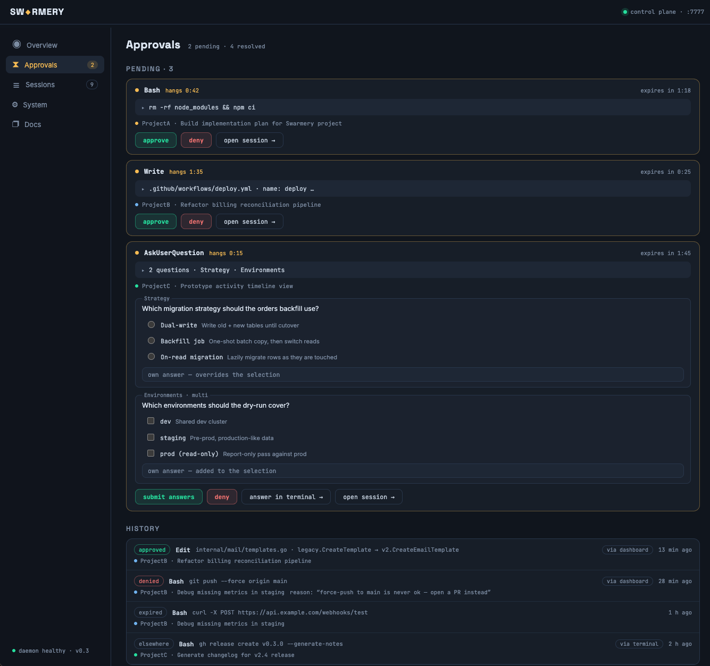
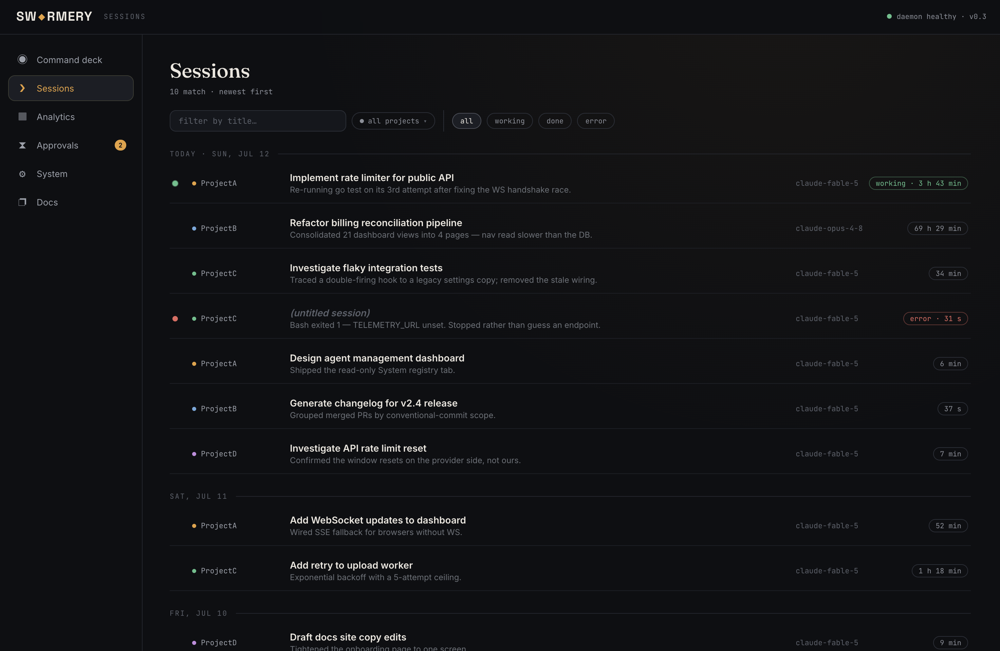
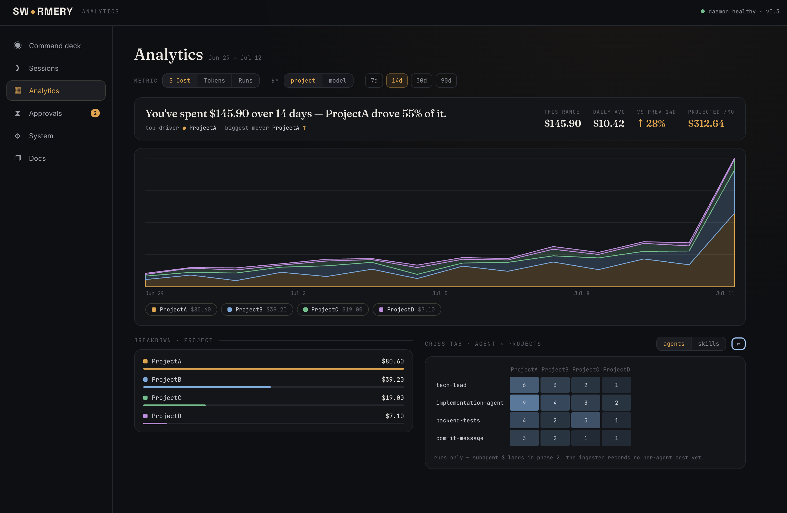

# The dashboard — a place-by-place tour

This is the long-form companion to the [README](../README.md): every place in the
Swarmery dashboard, in sidebar order. None of it is required reading to install or run
swarmery; the README covers that in two commands. The same map, kept short, ships
inside the dashboard as the **The dashboard** guide under Docs.

> **About the screenshots.** They were captured before the Canvas v3 navigation
> landed, so the sidebar and page headers in them are the old ones. The screen
> bodies — the deck, the session views, the plans, the board, the embedded tools —
> are the same components, now reached through the places described here.

---

## Ten places, two scopes

The sidebar holds ten **places**, in three groups:

| Group | Places |
|---|---|
| Main | **Today** · **Inbox** · **Sessions** · **Plans** |
| Improve | **Health** · **Learning** · **Knowledge** |
| Bottom | **Docs** · **System** · **Settings** |

A place is a destination, not a page: each gathers everything about one question under
tabs, and absorbed the pages that used to answer it separately — Health took Analytics
and Retro, Inbox took Approvals, Plans took the board, Planning Mode and Playbooks.
The old addresses redirect onto the matching tab, so bookmarks keep working.

The **project switcher** at the top of the sidebar is the scope control. *All projects*
is the fleet view; picking a project re-scopes the same places to it under
`/p/<slug>/…`. **Plans** and **Knowledge** need a project — under All projects their
rows are dimmed and open the project you visited last. **⌘K** opens a global palette
over sessions, message text, files and projects from anywhere.

Only two rows carry a signal: **Inbox** counts the decisions waiting on you, and
**Sessions** shows a live dot while anything runs.

---

### Today

The home of both scopes answers *what do I do now*. **The loop, this week** lays out
five joined stages — Plan → Run → Measure → Learn → Change — and any stage with
something waiting on you turns amber and links straight to it. Beside it, **Waiting on
you** lists the top of the Inbox and **Live now** the running sessions.

Under **Today in detail** sits the command deck, built around a number most tooling
never shows you: **how long your agents spent waiting on a human**. The hero says it
outright — how much they waited today, and which handful of tools caused most of it.

Under it, a three-cell ledger splits that time into *waited*, *auto-approved*, and *still
blocked*. Then **The day** rasterises each project into a lane of working / waiting / idle
segments, so a morning lost to one prompt nobody saw becomes a visible gap rather than a
vague feeling that things were slow.

**Where your time went** groups today's approvals by tool, and every row is one click from
a **stop asking** control that writes an auto-approve rule on the spot — the deck is both
where you notice a recurring prompt and where you kill it. Below that runs the spine of
today's notable sessions, next to a sticky rail of what is blocked on you and what is
erroring.

Nothing here is a new metric pipeline: wait time is `resolvedAt − requestedAt` over
permission requests the daemon already stores (live-aged for anything still pending), and
auto-approved rows are the ones a rule resolved. On a day when nothing waited on you, the
wait sections say exactly that instead of showing a decorative zero.

Inside a project, *Today in detail* is the project overview instead: a hero sentence
pairing what shipped this week against how often the agents had to stop and ask you,
right-now tiles (running, blocked, in flight, stale worktrees), week-over-week deltas, and
the capability inventory — which agents, skills, commands and hooks this project
*actually uses*, as opposed to which are installed.

  
   <i>The deck reads the whole day in one sentence; the right rail is what still needs you.</i>

### Inbox

One queue for every decision that waits on you, whatever produced it. Tabs split it by
kind — **approvals**, **lessons**, **advisor** recommendations, agent-change
**proposals**, **classifier** answers to check, and **stop using a lesson?** — and
**all** shows them together. The list sits on the left, the selected item on the right,
and the keyboard does the work: `j`/`k` to move, `e` for the primary action, `x` to deny
or dismiss, `s` to skip.

An agent can work the backlog for you. When something it could handle has waited a day,
a strip under the header offers **run triage**. **run triage** starts a run over exactly the
items the strip counts — the classifier's guesses, advisor findings, lesson candidates and
retirements — and never over Health's friction groups or agents; a run visits at most 1000
items. The agent labels the classifier's guesses
(it keeps a sample of its labels for you to check, and the Inbox shows how often it
matched you), closes what is only informational, and leaves a suggestion with its reasoning
on lessons, advisor recommendations and retirements. The strip lists the suggestions
whenever any are waiting, and **accept all** confirms them except fix tasks, which you
open and read one at a time. On a single item the primary button names the action and
whose idea it is (for example **mark not useful · agent's suggestion**), and `e` performs
that same action, negative ones (not useful, dismiss, stop) included. Everything it closed is listed under **handled by agent**
for seven days, each with an **undo**. Approvals, agent changes and alerts are never
handled by the agent: they always wait for you.

An approval shows the tool, the essential part of its input (expandable to the full hook
payload), which session it belongs to, how long it has been hanging, and a countdown
before it expires. `AskUserQuestion` prompts render as what they actually are — radio
groups for single-select, checkboxes for multi-select, plus a free-text *own answer*
box — rather than being flattened into a yes/no. **Answer in the terminal** is
deliberately a separate handoff rather than an approval, because approving would mark the
questions resolved without any of them ever being answered.

Auto-approval rules and the resolved history — which records *how* each request ended,
including `answered in the terminal` — live one link away, at `/approvals/manage`.

  
   <i>Pending cards carry the tool input, the owning session, and an expiry countdown.</i>

### Sessions

Every session the daemon has indexed, newest first, grouped under day rules
(`today · wed, jul 29`). A plan run collapses into one card inside its day and fans out on
click. The status chips carry live counts — `active`, `waiting`, `idle`, `done`,
`killed` — and filter client-side, so the counts keep describing the whole loaded list
rather than the slice you are looking at.

A row is a status dot, the project, the title, the model, and a chip. What makes it useful
while work is happening is the line under the title: for a live session it reads
`now: <what the agent is doing this second>`, pushed over WebSocket as events land — for a
finished one, why it ran in the first place.

The chip separates states most dashboards flatten into one. A working session shows
elapsed time; a **stuck** one shows *quiet time* — how long the transcript has been
silent — because `working · 17 h 32 min` was a lie worth deleting. Two more chips appear
only when they have something to say: a context badge (amber past 150k tokens, red past
300k — a fat context quietly multiplies cost, since every turn re-reads it) and a purple
**Handoff** badge once the daemon has written a continuation brief for a session that got
too heavy. Live rows offer a graceful **Stop**; a stuck one with a confirmed-alive process
gets a hard **Kill**.

  
   <i>Chips filter and count, day rules group, and the <code>now:</code> line under each title updates live.</i>

**Session detail — Chat · Timeline · Diffs.** Opening a session gives you the entire run
in three tabs, under a pinned header with live tokens, cost, error count, and the same
working/quiet chip the list speaks.

**Chat** replays the run as a conversation — your turns as bubbles, the agent's as prose.
Runs of tool activity collapse into one line (*"Ran 2 agents, ran 4 commands, used a
tool"*) that expands inline into the real timeline rows, nested sub-agents included. A
composer at the bottom resumes the session: your message appears immediately and
reconciles against the real turn once it is ingested — and flips to a retry affordance in
place if the send died. **Timeline** is every tool call with its duration and pass/fail.
**Diffs** aggregates every file the session touched into unified diffs with `+`/`−`
counters.

On a wide screen the right rail turns the run into numbers without an extra request:
models by share of tokens, agents by runs × duration, skills by uses, the call tree of who
invoked what (skills → tools → sub-agents, recursive), and every file touched ranked by
churn.

  
   <i>Chat keeps the run readable; the rail turns it into models, agents, skills, call tree and churn.</i>

### Plans — New plan · Plans · Board · Playbooks

Everything before and around a run, for one project.

**New plan** is Planning Mode. Describe what you want to build, in prose. A planner
session interviews you through a wizard — one question at a time on the left, the plan as
it currently stands sticky on the right, where you can refine it or tell the planner to
proceed. While it thinks you get elapsed time and its last reasoning snippet rather than
an opaque spinner. If a planner reply ever fails to parse against the wizard protocol, the
page shows the raw prose plus a free-text box that answers through the same endpoint — a
malformed reply degrades into a conversation instead of dead-ending the session.

  
   <i>Question on the left, the plan so far on the right — refine or proceed at any point.</i>

**Plans** is the control surface over the workspace. A plan *is* an epic, and the markdown
on disk stays the source of truth, so the workspace folder becomes infrastructure you never
have to open. Plans filter by Active / Done / Archived and drill into a phase timeline in
sequence order, with depends-on badges and per-phase progress derived from the
acceptance-criteria checkboxes in the doc itself. Lifecycle controls (pause / resume /
archive / restore) are real file operations on the daemon side, not database flags.

A plan opens into **Plan · Spec · Summary · Revisions · Edit** tabs (Spec only when the
plan has a `spec.md`, Summary only once it is complete); a phase opens in a drawer over the
list with **Story · Criteria · Runs · Report · Edit**. Ticking a criterion in the UI
patches that exact `- [ ]` ↔ `- [x]` line in the file. Revisions are staged proposals —
nothing changes on disk until you apply one.

Work runs from here two ways: a single phase executes headlessly from its own doc, or the
**whole plan** goes to one agent via `Run plan` with an agent and mode picker. While a
plan-level run owns the docs, the per-phase Run buttons stand down and progress surfaces as
checkboxes ticking themselves — the honest signal, since that is literally what the agent
is doing.

  
   <i>Phases in sequence with their dependencies; progress comes from real checkboxes in the markdown.</i>

  
   <i>Criteria are clickable: ticking one rewrites that line in the phase document.</i>

**Board** is for work that fits on one card. It has three lanes: **Inbox → Working →
Review**, with done and archived cards in a collapsed strip below. Cards stay in the Inbox
lane until you press their **▶ Run** verb; there is no drag and drop. Running a card
dispatches it to a headless agent in a dedicated `swarm/<task-id>` git worktree — so the
agent can never collide with your working tree — under that card's playbook, and hands the
result to the verifier, which stamps `PASS` / `FAIL` / `INCONCLUSIVE` before the card lands
in Review. From there it leaves by **Land** (push + PR), **Re-run** with feedback, or
**Discard**.

  
   <i>Run is the trigger: worktree, headless agent, verification, then Review.</i>

**Playbooks** makes the recipe a dispatched card runs under visible instead of implicit.
Selecting one renders its stage chain — boxes joined by arrows — with the model and the
exact prompt each stage receives. Three built-ins ship with the daemon (`standard`,
`plan-first`, `review-heavy`) and stay read-only. **Duplicate to project** copies the
markdown into `<project>/.claude/playbooks/`, at which point the prompts are yours to
edit — the same graduation rule the marketplace uses, applied to execution recipes.

  
   <i>Which model runs each stage, and the literal prompt it gets — before you dispatch anything.</i>

### Health — Overview · Agents · Friction · Estimates · Advisor · Cost & tokens

Where the loop stops being a dashboard and starts changing the agents. One date range
covers the whole place, in a status strip that answers three questions: what this window
looks like, what is waiting on you, and what changed because of you.

**Overview** is the one sentence about the fleet, the agents that moved it, and the
friction you can remove right now. **Agents** holds per-agent scorecards — runs, success
rate, error rate, cost, p95 — each compared against the previous window, so you see
direction, not just a level. **Friction** is the diagnostic half: which tools got denied
most (each one click from an auto-approve rule), the top error groups, and how long
approvals kept agents waiting. **Estimates** sets estimated against actual hours per task,
next to the lessons your workspace retrospectives recorded.

**Advisor** is where a deterministic rule engine raises evidenced recommendations — every
one carries the data that triggered it — which you **Accept** or **Dismiss**, and which then
move through `proposed → accepted → adopted → verified` so a suggestion cannot quietly go
stale in a list. When a recommendation implies rewriting an agent, you get the rewrite **as a
diff to review** — nothing touches an agent file unapproved.

  
   <i>Recommendations carry their evidence and a lifecycle, so accepting one is trackable.</i>

**Cost & tokens** shows cost, tokens and runs over the range. The metric switch
(`$` / tokens / runs) gates what you can pivot by: dollars and tokens are computed from
turns, runs from events. The headline names the top driver, the biggest mover since the
previous window, and a projected monthly figure. Under it: a stacked trend whose legend
doubles as the include/exclude control, a ranked breakdown for the current pivot, and an
agents × projects cross-tab. KPI tiles cover autonomy (tool calls per human
intervention), cost per task, cache-hit rate, and productivity by language. Everything
exports to CSV.

  
   <i>The metric switch decides the pivot; the legend is the include/exclude control.</i>

### Learning — Lessons · The classifier · Forecast honesty · Proof

What the system has learned, and whether it deserves trust. **Lessons** are drawn from runs
that landed far from their forecast; none becomes active without your accept, each active
one carries its measured effect, and ineffective, stale or unused ones are proposed for
retirement. **The classifier** is the optional local model that labels runs and sessions —
off, watching, or acting — with how often its answers match yours. **Forecast honesty**
shows how well up-front forecasts match outcomes, next to the routing report. **Proof** is
the feed of your decisions and their measured effect.

### Knowledge — Memory · Architecture · Serena · Graphify

What one project knows about itself.

**Memory** is everything a project remembers, in one editor, grouped by the three roots it
lives in: project instructions (`CLAUDE.md`), Claude Code's auto-memory, and Serena notes.
Markdown editing with a preview toggle, and two guards that matter when a running agent may
be writing the same files: saving checks a base hash and offers a reload instead of
silently clobbering a change made underneath you, and navigating away with unsaved edits
asks first.

  
   <i>Three memory roots, one editor — with a conflict guard for files an agent may be writing.</i>

**Architecture** embeds the project's architecture map (`/architecture-map` from
`architecture-pack`) — modules by layer, named end-to-end flows, API surface — instead of
leaving it as an HTML file you forget you generated. A staleness badge compares the commit
baked into the map against current `HEAD`, and a rebuild runs headlessly from the page. The
dashboard's live design tokens are pushed into the embedded map, so it follows your theme.

  
   <i>The staleness badge compares the map's commit against <code>HEAD</code> — rebuild is one click.</i>

**Serena** and **Graphify** embed those tools' own dashboards for the project, when
`lsp-pack` and `graphify-pack` are enabled.

### Docs

Swarmery's own documentation, fleet-wide: the illustrated guides first, then the reference
docs. The `?` explanations next to terms across the dashboard deep-link into the matching
section of the Concepts doc.

### System — Agents · Skills · Plugins · Hooks · Routines · Insights

The answer to *"which agent is actually going to run here, and where did it come from?"* —
the entire Claude config graph on the machine, across the three scopes that can define it:
global (`~/.claude`), project (`.claude/`), and the plugin cache. Each tab lives at
`/system/<tab>`. **Skills** covers skills, commands and templates; **Plugins** holds a
project's pack toggles.

Items carry origin and scope badges, usage stats, and lint severity badges that double as
filters. Because config drift is the failure mode here, every item keeps a
**content-addressed version history**: you can diff any two versions of an agent and see
exactly what changed. The page is live — when the daemon re-scans, the open tab refetches.

  
   <i>Every agent, skill, hook and command on the machine, with scope, origin and version history.</i>

**Routines** is scheduled automation with three triggers — cron, webhook, or manual. Each
routine shows its scope, a human-readable rendering of its cron expression, an enable
toggle, last and next run, and how the last one ended. Editing happens in a drawer with a
typed step builder: a step is a `command`, an `ai-prompt`, or a `create-task`, and the
cron field validates as you type. Any routine can be run on demand.

  
   <i>Cron, webhook or manual; steps are typed, and the schedule is rendered back in English.</i>

### Settings — Appearance · Accounts · Notifications · Projects

Machine-wide settings. **Appearance** holds the theme plus daemon health, worktrees and
connectors; **Accounts** your Claude accounts; **Notifications** the background toasts.

**Projects** lists every project the daemon knows about, split by the distinction that
matters operationally: **managed** (the swarmery plugin is enabled in its
`.claude/settings.json`) versus **telemetry-only** (sessions are indexed, but the project
never opted in). Each row carries lifetime sessions, tokens and spend, plus last activity.
Pinned projects sort first; tags are editable inline and filter the list; row actions cover
archive, restore, detach and tagging.

A project's own settings — pack toggles, archive, detach — are at `/p/<slug>/settings`.

  
   <i>Managed vs telemetry-only, lifetime spend, pins and tags.</i>

---

### Terminal

Real PTYs docked under the project workspace, opened in the project root or directly in a
task's worktree — so checking what an agent actually did does not cost you a context
switch out of the page.

Each tab is its own live shell, with font sizing, clear, fullscreen and a drag handle to
resize the dock. Open state, height and the tab list persist per project, so a browser
reload restores the workspace you left. The terminal bundle is lazy-loaded — it is never
fetched until you first open a tab.

  
   <i>One live PTY per tab, opened in the repo root or in a task's worktree.</i>

