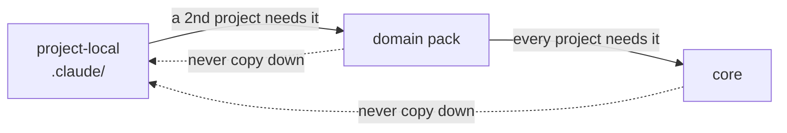

# Розширення swarmery: де живе специфічне для проєкту

swarmery — це **одна глобальна система + тонкий нативний оверлей на кожен проєкт**, а не окрема
«під-агентна система» всередині проєкту. Claude Code зливає обидва шари в кожній сесії:
увімкнені плагіни постачають глобальні компоненти; власна тека `.claude/` проєкту постачає локальні;
**за збігу імен перемагає локальний для проєкту компонент** (нативна база + оверлей).

## Дерево рішень для кожного нового скілу / агента / команди / шаблону / скрипта

| Ця річ… | Іде в… |
|---|---|
| корисна будь-якому проєкту | `plugins/core` (підняти semver → споживачі приймають через `/plugin update`) |
| корисна ≥2 проєктам одного домену або здатності | відповідний пакет — доменний (`uav-pack` / `iot-pack` / `web-pack`) або за здатністю (`infra-pack` / `lsp-pack`) |
| унікальна для одного проєкту | **власна тека проєкту `.claude/{agents,skills,commands,templates}/`** — версіонується разом із кодом проєкту, бо розвивається разом із продуктом |
| конфігурація, а не логіка (списки репозиторіїв, назви середовищ, scope комітів, доменні іменники) | `.claude/project.json` проєкту |

**Кожен новий агент, скіл чи команда винен читачеві блок `# How to use`, і CI це
забезпечує.** Хоч би що ця річ робила, вона потрапляє в `plugins/**` з одним H1 `# How to use`, що несе
чотири обов’язкові підрозділи — What it does, When to use it, How to invoke, Worked example —
інакше крок **System item docs coverage** провалює збірку; гейт запускає
`scripts/docgen/check-coverage.sh` з незаданим `DOCS_MAX_PROBLEMS`, тож допустима кількість
проблем — нуль. Повний контракт (розміщення заголовка, походження через frontmatter `docs:`,
крайові випадки парсера і що дашборд робить із блоком) —
[`tools/swarmery/docs/system-docs-format.md`](../tools/swarmery/docs/system-docs-format.md);
`scripts/docgen/generate.sh` накидає блок за вас із тіла самого елемента, але
зробити прозу вартою читання — ваша справа. Перед пушем запустіть `bash scripts/docgen/check-coverage.sh`.

## Правило просування (потік іде лише вгору)

Нові речі народжуються **локальними для проєкту**. Коли та сама річ потрібна *другому* проєкту, просуньте її
в пакет; коли вона потрібна кожному проєкту, просуньте в ядро. Ніколи не копіюйте вниз — копіювання файлів
фреймворку в проєкти відтворює гниль «форкни-і-синхронізуй», заради усунення якої цей репозиторій і існує.



Чекліст просування:
1. Очистіть її від специфіки (див. `docs/NEUTRALITY.md`) — значення переходять у читання з `project.json`.
2. Перенесіть файл у пакет/ядро; підніміть semver того плагіна.
3. Видаліть локальну копію в проєкті-споживачі, який її віддав (тепер її постачає плагін).

## Вимоги пакета (`requirements.json`)

Пакет, який не може працювати без специфічної для проєкту конфігурації, оголошує її в
`plugins/<pack>/requirements.json` — у **корені пакета**, поруч з `agents/` і `skills/`
(лише `plugin.json` лежить під `.claude-plugin/`). Так пакет каже: «мені потрібен блок `X`
у `.claude/project.json`, ось його схема, ось чому» — **без** потреби читачеві
знати, що пакет робить: те саме правило нейтральності, яке тримає доменні знання поза ядром.

```json
{
  "version": 1,
  "projectConfig": [
    {
      "key": "<top-level project.json key>",
      "title": "<human label>",
      "why": "<one sentence: what breaks without it>",
      "docs": "skills/<skill>/SKILL.md",
      "schema": { "type": "object", "properties": {}, "required": [] }
    }
  ]
}
```

| Поле | Обов’язкове | Призначення |
|---|---|---|
| `version` | так | ціле число, наразі рівно `1`. Читач, що бачить будь-яке інше число, ігнорує файл (сумісність уперед) |
| `projectConfig[]` | так | верхньорівневі ключі `project.json`, яких потребує пакет |
| `.key` | так | ім’я ключа в `project.json` |
| `.title` | так | заголовок для людини |
| `.why` | так | одне речення про те, чому пакет не може працювати без нього — показується над формою |
| `.docs` | ні | шлях до документації відносно пакета, рендериться як посилання |
| `.schema` | так | самодостатній фрагмент JSON Schema (`type: object` + `properties` + `required`) |
| `.probe` | ні | як дізнатися **живі** значення для деяких із цих полів — див. нижче |

Невідомі поля читачі ігнорують, тож пізніша версія може додати необов’язкові поля, не
піднімаючи `version`.

### `probe` — запит справжніх значень замість здогадок

Оголошений ключ — лише половина проблеми оператора. Друга половина в тому, що очевидне значення
часто хибне: назва статусу, яка у формі виглядає правильно, на дошці не існує, і
єдиний спосіб дізнатися справжню — спитати систему, якій вона належить. Демон спитати не може — він
не тримає облікових даних ні до чого, з чим інтегрується пакет, за задумом. Тож пакет постачає
**промпт**, а демон передає його сесії `claude`, у якої вже є живі
конектори оператора. Демон нічого не дізнається про домен і не отримує ні клієнта, ні токена.

```json
"probe": {
  "needs": ["baseUrl", "projectKey"],
  "fields": ["qaStatus", "repro.test"],
  "timeoutSeconds": 180,
  "prompt": "…self-contained instruction; output ONLY {\"suggestions\":{…},\"notes\":\"…\"}…"
}
```

| Поле | Обов’язкове | Призначення |
|---|---|---|
| `.needs` | ні | шляхи з крапками, які мають бути заповнені, перш ніж проба зможе запуститися — її **входи**. Доки їх немає, кнопка вимкнена |
| `.fields` | так | шляхи з крапками, для яких проба може пропонувати значення. **Білий список**: усе інше, що повертає агент, відкидається |
| `.timeoutSeconds` | ні | обрізається до `[1, 300]`; типово `180` |
| `.prompt` | так | самодостатня інструкція. Лише плейсхолдери — справжній хост і ключ надходять у значенні під час виклику |

Промпт має вимагати JSON і нічого більше, а також наказувати агенту **пропускати** ключ, а не
вгадувати його: відсутній ключ — правильна відповідь, правдоподібна вигадка — ні. Пропозиції
рендеряться як `<datalist>`, ніколи як `<select>` — те, до чого проба може дотягнутися, не обов’язково
вся правда, тож поле лишається доступним для введення.

Проба ніколи не пише й ніколи не є помилкою для оператора: тайм-аут, відсутній `claude`, проза
замість JSON, конектор, який не вдалося розв’язати, — кожне з цього повертається з `200`, порожнім
об’єктом `suggestions` і однорядковою причиною. **Некоректний** блок `probe` коштує пакетові
його пропозицій і нічого більше; форма конфігурації все одно рендериться. CI перевіряє форму блоку
(`check-plugin-requirements.sh`), але навмисно **не** порівнює його зі схемою оверлею —
він оголошує, як знаходити значення, а не якої форми вони мають бути.

**Правило синхронності (забезпечує CI).** `.schema` має бути канонічно тотожним відповідній гілці
`overlays/_schema/project.schema.json` → `properties[<key>]` — ті самі рядки `description`, той самий
`required`, ті самі типові значення. `project.json` споживача перевіряється проти схеми оверлею,
тоді як форма рендериться з файлу пакета; якщо вони розійдуться, форма збирає одну форму даних, а
схема відкидає іншу. `scripts/check-plugin-requirements.sh` порівнює їх у
канонічному вигляді (ключі об’єктів відсортовано рекурсивно, тож порядок і форматування ніколи не рахуються
дрейфом) і провалює збірку на будь-якій відмінності або коли ключа взагалі немає в схемі
оверлею. Файл необов’язковий для кожного пакета — його відсутність не помилка. Запустіть локально:

```bash
bash scripts/check-plugin-requirements.sh   # → ✓ plugin requirements in sync (<n> checked)
```

Зміна схеми означає редагування **обох** файлів в одному коміті.

**Нейтральність.** `requirements.json` лежить під `plugins/**`, тож містить лише плейсхолдери —
ніколи справжній хост, ключ проєкту чи назву статусу (`docs/NEUTRALITY.md`).

**Semver.** Додавання нового обов’язкового ключа в `requirements.json` змінює контракт пакета з
його споживачами: наявні проєкти стають недоналаштованими, доки хтось не заповнить новий ключ.
Це щонайменше **minor-підняття** `plugin.json` пакета, щоб споживачі підхопили його через
`/plugin update`. Послаблення контракту (вилучення обов’язкового ключа, додавання необов’язкового) — це
patch-підняття.

## Перевизначення поведінки ядра

Проєкт може постачати компонент з **тим самим іменем**, що й у ядра, у своїй `.claude/agents/`
(тощо) — локальний перемагає лише в цьому проєкті. Використовуйте це для специфічних для проєкту варіантів
агента ядра замість форкати фреймворк.

**Перевизначення агента замінює його цілком, ніколи не по ключу.** Тож коли єдине, що проєкт
хоче змінити, — один ключ frontmatter (на практиці `isolation:`, який Claude Code, а не
swarmery, читає з файлу агента), — **не** копіюйте агента руками. Оголосіть
звуження в `.claude/settings.json` проєкту і дайте форку згенеруватися:

```json
"swarmery": { "agents": { "implementation-agent": { "isolation": "none" } } }
```

```bash
swarmery agents sync            # пише .claude/agents/<name>.md зі штампом upstream source_sha
swarmery agents sync --check    # нічого не пише; виходить з 1, щойно upstream пішов далі
```

Закомітьте згенерований файл поруч із `settings.json`. **Будь-який файл у `.claude/agents/` проєкту
або згенерований, або баг** — єдиний виняток — агент, справді унікальний для цього
проєкту, якого ніколи не існувало upstream (правило просування вище). Міркування, відхилені
альтернативи і те, що лишається відкладеним, — у
[`docs/adr/0001-agent-defaults-live-upstream.md`](adr/0001-agent-defaults-live-upstream.md).

## Домовленість про пошук шаблонів і скриптів

- **Шаблони:** агенти шукають спершу в `${CLAUDE_PROJECT_DIR}/.claude/templates/`, а потім відкочуються
  до `${CLAUDE_PLUGIN_ROOT}/templates/` плагіна. Специфічні для проєкту формати звітів/підсумків
  живуть із проєктом; загальні постачаються з ядром.
- **Скрипти:** автоматизація проєкту лишається в репозиторії проєкту (`scripts/` або `.claude/scripts/`).
  Ядро постачає лише незалежний від проєкту інструментарій (`plugins/core/bin/`), який читає `project.json`
  для всього, що має форму проєкту.

## Як виглядає `.claude/` проєкту-споживача

```
<project>/.claude/
├── settings.json        # enables core@swarmery + the packs it needs (+ AGENT_PROJECT env)
├── project.json         # the flavor config (schema: overlays/_schema/project.schema.json)
├── agents/              # project-unique agents + intentional overrides (often empty)
├── skills/              # project-unique skills (often just a few)
├── templates/           # project-specific templates (checked before plugin templates)
└── scripts/             # project automation (optional)
```

Тонкий — значить здоровий: якщо ця тека починає обростати загальним вмістом, щось проситься на просування.

## Версіонування самого оверлею

Однорепозиторійний проєкт версіонує `.claude/` природно — тека живе всередині репозиторію проєкту.
**Багаторепозиторійні робочі простори** (без єдиного кореневого репозиторію) мають зробити оверлей окремим маленьким репозиторієм:

```
<workspace>/agents/        ← git repo holding ONLY the project-specific overlay
<workspace>/.claude -> agents   (symlink; sub-repo .claude symlinks point here too)
```

Так rules/, специфічні для проєкту skills/agents/commands, пам’ять агентів і project.json
лишаються під контролем версій і доступними з різних машин, тоді як загальний фреймворк і далі
надходить через плагіни. Якщо робочий простір раніше містив повний репозиторій агентного фреймворку часів
до swarmery, використайте його: запуште тонкий оверлей як гілку-наступницю — історія лишається, розкладка стискається.
