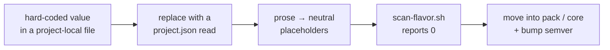

# Політика нейтральності щодо постачальників

`plugins/**` має містити **нуль** специфічних для проєкту токенів — жодних назв компаній чи
продуктів, жодних імен внутрішніх репозиторіїв, жодних псевдонімів середовищ, жодних хмарних
регіонів. Специфіка кожного проєкту живе в його власному `.claude/project.json` (схема:
`overlays/_schema/project.schema.json`; зразок: `overlays/example/`) і читається **під час
виконання** агентами, скілами й хуками ядра.

## Правила

- **Назви брендів** (ідентичність проєкту чи компанії, імена внутрішньої інфраструктури) — заборонені будь-де в `plugins/**`.
- **Доменний словник** (наприклад, дрони для `uav-pack`, носимі пристрої для `iot-pack`) — доречний *усередині
  власного доменного пакета*, заборонений у `core`.
- Скрипти й хуки читають `${CLAUDE_PROJECT_DIR}/.claude/project.json`; ніколи не використовують зашитий шлях за замовчуванням.
- Приклади в прозі використовують нейтральні заповнювачі (`apps/<mainApp>`, `<device>`, `<envAlias>`) або нейтральні
  доменні приклади (`orders/line-items`, `pipelines/job_runs`).
- Ідентичність у frontmatter — `swarmery-core`.

Зняття специфіки — це те, через що проходить компонент на шляху вгору, і воно механічне:



## Перевірка

`scripts/scan-flavor.sh` шукає у `plugins/**` ваші шаблони токенів:

```bash
# Покладіть свої (приватні) регулярні вирази токенів поруч із репозиторієм або в середовище:
echo 'mycompany|my-app|my-env-alias' > .flavor-tokens          # сімейство брендів (у gitignore)
echo 'my-domain-noun' > .flavor-tokens-domain                  # сімейство домену (у gitignore)
bash scripts/scan-flavor.sh                                    # мета: 0 збігів
```

Без цих файлів скрипт відкочується до невеликого прикладного шаблону — замініть його своїм.

> [!IMPORTANT]
> Запускайте це в CI як перевірку, що не дає лічильнику піднятися з нуля: лічильник ніколи не повинен зростати. Регресію нейтральності
> дешево виправити того ж дня, коли вона потрапила в код, і дорого — коли її вже підхопив другий
> споживач.
