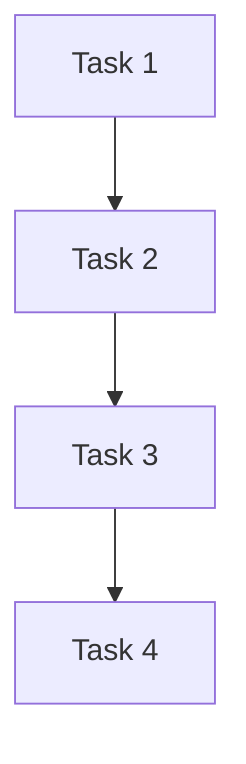

# Phase 3: Planning

**Task**: {{TASK_NAME}}
**Agent**: @task-planner
**Started**: {{PHASE_START}}
**Completed**: {{PHASE_END}}
**Duration**: {{PHASE_DURATION}}

---

## Task Breakdown

### Task 1: {{TASK_1_NAME}}

- **Description**: {{TASK_1_DESC}}
- **Estimated**: {{TASK_1_HOURS}} hours
- **Dependencies**: {{TASK_1_DEPS}}
- **Assigned to**: @{{TASK_1_AGENT}}

### Task 2: {{TASK_2_NAME}}

- **Description**: {{TASK_2_DESC}}
- **Estimated**: {{TASK_2_HOURS}} hours
- **Dependencies**: {{TASK_2_DEPS}}
- **Assigned to**: @{{TASK_2_AGENT}}

### Task 3: {{TASK_3_NAME}}

- **Description**: {{TASK_3_DESC}}
- **Estimated**: {{TASK_3_HOURS}} hours
- **Dependencies**: {{TASK_3_DEPS}}
- **Assigned to**: @{{TASK_3_AGENT}}

---

## Dependency Graph

---

## Risk Assessment

| Risk | Probability | Impact | Mitigation |
|------|-------------|--------|------------|
| {{RISK_1}} | {{PROB_1}} | {{IMPACT_1}} | {{MITIGATION_1}} |
| {{RISK_2}} | {{PROB_2}} | {{IMPACT_2}} | {{MITIGATION_2}} |

---

## Estimation Summary

| Metric | Value |
|--------|-------|
| **Total Tasks** | {{TOTAL_TASKS}} |
| **Total Hours** | {{TOTAL_HOURS}} |
| **Buffer (20%)** | {{BUFFER_HOURS}} |
| **Final Estimate** | {{FINAL_HOURS}} hours |

---

## Acceptance Criteria

{{ACCEPTANCE_CRITERIA}}

---

## Next Phase

→ Phase 3.5: Prompt Generation (@prompting-agent) [if complex]
→ Phase 4: Implementation (@implementation-agent) [if simple/medium]

