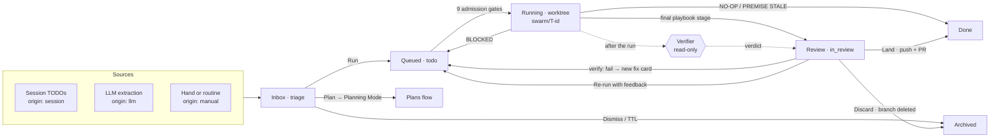

# The board

The board is not a parallel kanban you push cards around by hand. It is a funnel
around the plans flow: a self-cleaning **Inbox** of captured proposals, a
**Working** lane that shows the dispatcher's honest queue, and a **Review** lane
with exactly three meaningful exits. Dragging is dead — actions move cards, because
each action actually does something.

```figure board-lanes
```

The idea underneath is worth stating plainly: **a captured card is a proposal, not a
commitment.** It has a lifecycle and a shelf life. A card's column is no longer
"wherever somebody dropped it" — it is a consequence of actions that did real work.

The defaults that shape the whole funnel:

```stats
9 | admission gates before a card runs | hot
2 | cards running at once
4 | live worktrees
14 | days a captured card keeps its slot
3 | fix attempts before a card is parked
```

## A card's life



Six columns exist and no more: `triage`, `todo`, `in_progress`, `in_review`,
`done`, `archived`.

## Lane 1 — Inbox: proposals with a shelf life

Everything captured lands here. Each TODO item from a live session becomes a card
with `origin: session`, LLM extraction produces `origin: llm`, and anything you or
a routine creates by hand is `origin: manual`. Every card in triage gets three
buttons and a clock:

| Action | What it actually does |
|---|---|
| **Run** | Moves the card to `todo`. That *is* the instruction to the dispatcher — there is no separate "start" button, because the queue is the lane. |
| **Plan** | Opens Planning Mode prefilled with this card's text, for work that is bigger than one card. |
| **Dismiss** | Archives it. An honest "no" instead of permanent debt. |
| **TTL** | An hourly sweeper archives captured cards left in triage longer than `SWARMERY_INBOX_TTL` (14 days by default; `0` turns it off). |

The sweeper is deliberately narrow. It only touches cards whose origin is `session`
or `llm` — **hand-written cards are never swept** — and it skips any card holding a
worktree, whatever its age.

When triage grows past 50 cards and at least one of them is old enough to qualify,
an amnesty banner appears above the board. It always counts before it acts: the dry
run reports exactly how many cards match, and only then do you confirm the bulk
archive. Note that amnesty uses its own, shorter cutoff — cards idle more than
seven days — so it can clear a backlog well before the 14-day TTL would.

> [!TIP]
> Reach for **Plan** rather than **Run** whenever a card would need more than one
> coherent change. Planning Mode turns it into a phase document, and the phases come
> back as cards that already know their dependencies.

## Lane 2 — Working: the dispatcher underneath

A card in `todo` is an application, not a running process. Before it becomes one it
passes admission gates, in this order:

```figure dispatch-gates
```

Candidates are considered by priority first (`urgent` before `high`, `normal`,
`low`), then oldest-first. Clear every gate and the card is admitted in a single
guarded write — so two dispatcher passes can never start the same card twice.

The admitted card gets an isolated worktree on branch `swarm/<T-id>`, cut from the
tip of whatever branch your main checkout is currently on — so if that checkout is
sitting on a feature branch, cards branch from there, not from `main`. That commit
is **persisted** on the card as `start_point`, which is what lets verification and
the review diff stand on the same ground the agent started from.

Two failure paths are worth knowing. If the daemon restarts mid-run, cards that
still hold a worktree are healed back to `todo` with `daemon restart` recorded,
rather than left wedged — but an executor process that outlived the restart is
adopted instead, and its card keeps running. And when a card is repeatedly
reclaimed without making progress, the dispatcher parks it paused rather than
burning tokens forever.

## Playbooks pick themselves

Manual playbook selection failed in practice — roughly one deliberate choice across
hundreds of cards — so it is dispatcher policy now:

| Playbook | Stages | Verification | When it is chosen |
|---|---|---|---|
| `standard` | implement | normal | The default, when nothing else applies |
| `plan-first` | plan → implement | normal | Prompt longer than 1500 characters, **or** the card has dependencies |
| `review-heavy` | implement → self-review | strict | Never automatically — a human opt-in |

`quick-fix` no longer exists as a distinct recipe: it was byte-for-byte `standard`
and survives only as an alias that resolves to it. Whichever playbook runs is
**stamped onto the card**, so the chip always shows what actually executed rather
than what was requested. Projects can override or add playbooks by dropping
markdown into `.claude/playbooks/`.

Every dispatched stage gets an execution contract: a `Swarm-Task-Id` trailer on its
commits, no pushing, a file-scope fence, and a sentinel vocabulary that lets the
agent end the card honestly:

| Sentinel | Effect |
|---|---|
| `NO-OP:` / `DUPLICATE:` / `REDUNDANT:` | Closes the card as **done** immediately and stops the playbook chain |
| `PREMISE STALE:` | Same — the task's premise no longer holds |
| `BLOCKED:` | Returns the card to the queue, paused, with the reason recorded |

A sentinel is checked first and wins regardless of the process exit code.

**Micro-plans.** Each dispatched card also gets a one-phase plan in the private
workspace, so its progress ticks and its Completion Report show on the Plans page
like any other plan. The plan is written into the project's **own workspace
namespace**: the directory the project is mapped to. When the project has
several, it is the one scanned most recently. The same rule decides which
workspace overlay the card's repository is resolved from, so a card's repo and its
micro-plan always come from the same workspace. A mapped directory that no longer
exists, or that sits outside the configured workspace root, is logged and skipped
in favour of `<workspace root>/<project slug>`. The daemon never writes outside
its own workspace tree. An existing micro-plan is never rewritten, so a re-run or
a verification fix card keeps the ticks already recorded.
`SWARMERY_MICRO_PLANS=0` turns micro-plans off.

## Verification measures reality

After a run, a read-only verifier judges the work and returns one of three verdicts:

| Verdict | What follows |
|---|---|
| `pass` | Stamped on the card and cached |
| `fail` | Stamped, then a fix card is created — within budget |
| `inconclusive` | Stamped only. Nothing is spawned. |

The distinction is the point: a timeout, an unreadable diff or a garbled response is
`inconclusive`, never `fail`. The system does not manufacture failures out of its
own uncertainty.

Results are memoised on a tree hash, so re-verifying an unchanged tree returns the
cached verdict instead of paying for a second run. Only `pass` and `fail` are
cached — `inconclusive` never is.

A failing card produces at most one open fix card at a time, and the fix budget is
charged on the root card, capped at three. Past that, the card is paused rather than
looping. Verification also refuses to start on a runaway diff: more than
`SWARMERY_VERIFY_MAX_DIFF_FILES` files (40 by default) returns `inconclusive` with a
note telling you to split the work or raise the bound. The bound needs the card's
`start_point` and a readable diff to apply — when either is missing it is skipped
rather than guessed at.

## Lane 3 — Review: three real exits

Start by reading the change: **Diff** shows the work against the card's persisted
`start_point`. That is a read, not an exit. From there the card leaves the lane in
one of exactly three ways:

| Exit | What actually happens |
|---|---|
| **Land** | Pushes the branch and opens a PR. The card becomes `done` **only after** the PR URL exists |
| **Re-run** | Appends your feedback to the prompt, clears the previous verdict, and returns the card to `todo` |
| **Discard** | Reclaims the worktree, deletes the `swarm/` branch, and archives the card |

> [!IMPORTANT]
> Done is a consequence, not a gesture. Nothing in this lane marks a card complete
> because someone clicked it — Land waits on a real PR URL, and a failed
> verification opens a fix card instead of quietly letting the work through.

## Operator cheat sheet

| Environment variable | Default | Effect |
|---|---|---|
| `SWARMERY_DISPATCH` | on | Global kill switch for the dispatcher |
| `SWARMERY_MAX_CONCURRENT` | `2` | Concurrent running cards |
| `SWARMERY_MAX_WORKTREES` | `4` | Live worktrees across all projects |
| `SWARMERY_INBOX_TTL` | `336h` (14 days) | Triage shelf life; `0` disables the sweeper |
| `SWARMERY_DISPATCH_TIMEOUT_MIN` | `45` | Minutes before a run is abandoned |
| `SWARMERY_DISPATCH_PERMISSION_MODE` | `bypassPermissions` | Permission mode for dispatched agents; a playbook may override it |
| `SWARMERY_MICRO_PLANS` | on | Write a one-phase plan into the project's workspace for every dispatched card; `0` disables it |
| `SWARMERY_AUTOVERIFY` | on | Automatic verification after a run; manual verify still works when off |
| `SWARMERY_VERIFY_MAX_DIFF_FILES` | `40` | Diff-size bound above which verification returns inconclusive |
| `SWARMERY_VERIFY_TIMEOUT_MIN` | `15` | Minutes before a verification run is abandoned |
| `SWARMERY_WORKTREE_LEND` | `node_modules`, `.venv`, `vendor` | Directories lent into a fresh worktree so builds work immediately |

> [!NOTE]
> These are read once, when the daemon starts. Changing one means restarting the
> daemon — there is no live reload.

| Endpoint | Purpose |
|---|---|
| `GET /api/board/tasks` | List cards; filter with `?projectId=` and `?boardColumn=` |
| `POST /api/board/tasks` | Create a card (manual origin only) |
| `PATCH /api/board/tasks/{id}` | Move or edit a card |
| `POST /api/board/tasks/bulk-archive` | Amnesty; send `dryRun` first to count |
| `GET /api/board/tasks/{id}/diff` | The card's diff against `start_point` |
| `POST /api/board/tasks/{id}/rerun` | Re-run with reviewer feedback |
| `POST /api/board/tasks/{id}/discard` | Discard the branch and archive |
| `POST /api/board/tasks/{id}/land` | Push and open the PR |
| `POST /api/tasks/{id}/verify` | Verify on demand (asynchronous) |
| `GET /api/dispatch`, `POST /api/dispatch/pause` | Inspect and pause the dispatcher |
