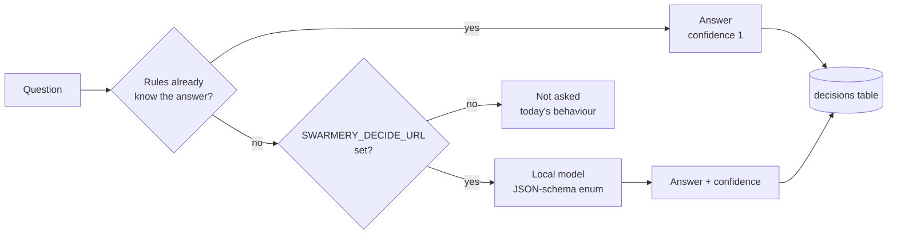

# Decisions and local models

Some questions the daemon faces are small and closed: *did this run stop because it
is blocked, or because it reported progress?*, *was this session a feature or a
bugfix?* Paying a frontier model for a one-word answer is waste. **Learning → The
classifier** is where a small classifier running on your own machine answers them
instead.

**This is optional.** Swarmery does everything else without it — sessions, plans,
the board, runs, approvals, cost. With no local model configured the classifier is
switched off entirely and the daemon behaves exactly as it did before the feature
existed. Set it up when you want the extra labels, not before.

## What it answers

The classifier works *around* Claude runs, never inside them. It is never called from
a hook, never trims a context window, never picks a tool, a model or an effort.

| Question | When it is asked | Answers | What uses it |
|---|---|---|---|
| **D1** `d1.run_end` | A headless phase or plan run ended cleanly with acceptance criteria still unticked | `report-with-next-step` · `blocked` · `question-for-operator` · `done` | The run's settle loop: continue it, stop and notify you, or mark it blocked |
| **D2** `d2.task_type` | Every 15 minutes, for finished sessions | `feature` · `bugfix` · `refactor` · `docs` · `research` · `review` · `ops` · `planning` · `other` | Analytics labels on the session |
| **D2** `d2.outcome` | Same pass | `shipped` · `partial` · `abandoned` · `failed` | Analytics labels on the session |
| **D2** `d2.failure_cause` | Same pass | `none` · `tool-error` · `test-failure` · `blocked-on-operator` · `refusal` · `timeout` · `context-exhausted` · `scope-misread` · `other` · `auth` · `quota` · `api-error` | Analytics labels on the session |
| **D3** `d3.divergence_cause` | A scored phase run landed far from its own forecast | `spec-wrong` · `code-differs` · `scope-grew` · `tooling-env` · `model-fallback` · `other` | Analytics, and the cause behind a lesson candidate |

The evidence each question sees is deliberately small — the tail of the last
assistant message, the session title and times — never a full transcript.

A finished session with **no turns at all** is left alone: there is nothing for a
question to read, so D2 never asks about it, and any answers already recorded for such
a session are hidden from the labelling queue (hidden, not deleted — they come back
the moment the session has a turn).

### Account and API failures

Three failure causes name sessions that did not fail at the work — the account or the
API stopped them:

| Cause | The session ended on |
|---|---|
| `auth` | A login problem: not logged in, login expired, the OAuth session could not be refreshed, subscription access disabled for the organization |
| `quota` | A usage limit: the session, weekly, model, or a spend limit |
| `api-error` | The API itself: unreachable, overloaded, a connection lost mid-response, a timeout |

They were added after labelling had begun, when all three were labelled `other`. So
each has `other` as its **parent**, and agreement follows one rule:

- an answer of `auth`, `quota` or `api-error` **agrees** with a label of `other` — the
  old label was the closest one available, and the answer is the more precise reading
  of it;
- an answer of `other` does **not** agree with a label of `auth`, `quota` or
  `api-error` — once you have said which it was, the vaguer answer is a miss.

Old labels therefore stay valid, and you never have to relabel a session to keep the
agreement numbers honest.

## Where the answer comes from



The local backend speaks the OpenAI chat-completions API, so any of these work:
**LM Studio**, **Ollama** (through its `/v1` endpoint), the **llama.cpp** server or
**vLLM**. The reply is constrained by a JSON schema whose only field is an enum of the
allowed answers, with `temperature: 0`, and each call is capped at five seconds — a
slow model costs seconds, never a run's budget.

A third backend, headless Claude Haiku, exists behind `SWARMERY_DECIDE_CLAUDE`. It is
off by default, it is only a fallback when the local model is unreachable, and none of
the shipped questions allow it — so in practice nothing leaves your machine.

## Setting it up

### 1. Run a local model server

Any OpenAI-compatible server will do. The two most common:

- **LM Studio** — install it, download an instruct model, load it, and start the local
  server from the Developer tab. It listens on `http://localhost:1234`.
- **Ollama** — install it and `ollama pull <model>`. It listens on
  `http://localhost:11434` and serves the OpenAI API under `/v1`.

Size: the questions are short closed choices, so a 7–14B instruct model is plenty.
Bigger models only add latency against the five-second cap.

Find the exact model id the server expects:

```bash
curl -s http://localhost:1234/v1/models      # LM Studio
curl -s http://localhost:11434/v1/models     # Ollama
```

### 2. Point the daemon at it

| Variable | Value | Default |
|---|---|---|
| `SWARMERY_DECIDE_URL` | The server: a bare host (`http://localhost:1234`), a `/v1` base, or the full `/chat/completions` URL | unset — classifier off |
| `SWARMERY_DECIDE_MODEL` | The model id from `/v1/models` | `local-model` |
| `SWARMERY_DECIDE_D1` / `_D2` / `_D3` | `off` · `shadow` · `active` | `shadow` |
| `SWARMERY_DECIDE_D1_THRESHOLD` (and `_D2_`, `_D3_`) | Confidence floor for `active`, in (0, 1] | D1 `0.85`, D2 `0.6`, D3 `0.6` |
| `SWARMERY_DECIDE_CLAUDE` | `1` enables the Haiku fallback | off |

If you run the daemon by hand, pass them on the command line:

```bash
SWARMERY_DECIDE_URL=http://localhost:1234 SWARMERY_DECIDE_MODEL=<model-id> swarmery serve
```

If the daemon runs as the macOS launchd service, bake them into its plist and
re-install. `swarmery install` keeps every variable already in the plist, so these
survive later upgrades:

```bash
PLIST=~/Library/LaunchAgents/com.swarmery.daemon.plist
plutil -replace EnvironmentVariables.SWARMERY_DECIDE_URL -string http://localhost:1234 "$PLIST"
plutil -replace EnvironmentVariables.SWARMERY_DECIDE_MODEL -string <model-id> "$PLIST"
~/.swarmery/bin/swarmery install
```

### 3. Check it took

The daemon logs its configuration at startup (the launchd service writes its log to
`swarmery.err.log`):

```bash
grep 'decide: local=' ~/.swarmery/logs/swarmery.err.log | tail -1
# decide: local=http://localhost:1234/v1 model=qwen/qwen3-14b claude=false d1=shadow(0.85) …
```

`local=off` means `SWARMERY_DECIDE_URL` did not reach the daemon.

The classifier tab stops showing *No local model configured*. Calls start
appearing as runs finish and the 15-minute D2 pass reaches your sessions. A question
whose status sentence reports errors usually means the server is not running or the
model id is wrong.

## Shadow first, active later

The mode switch on each question reads **off · watching · acting** — the dashboard's
words for the `off`, `shadow` and `active` values of the environment variables.

Every question starts in **shadow** (*watching*): it is asked, the answer is logged,
and nothing acts on it. Its answers wait in the Inbox's **classifier** tab for you to
check — that is how you find out whether a model is good enough before trusting it.

- **agreement** (*matches you*) is the share of answers that matched what actually
  happened, over the decisions that have a ground truth — including the ones you
  checked. D1 records its own: when a run was continued,
  the next run's end says whether continuing was right.
- **confidence** is a histogram of how sure the model was. Confidence is *calibrated*
  only when the server returns token log-probabilities; whether it does depends on the
  server and its version. An uncalibrated answer is logged, but it never clears an
  `active` threshold.

Only D1 changes behaviour when active, and it fails safe: below the threshold, or
uncalibrated, it does not continue the run — it stops and notifies you. Promote a
question to *acting* with its mode switch once its agreement is high; the switch
overrides the environment default for that one question.

## Measuring a change before you trust it

`swarmery decide eval` replays the classifier over the labels you have already recorded
and reports how often the replayed answer agrees with them. Run it before and after a
rule or prompt change and compare the two tables.

```bash
swarmery decide eval                                        # rules only, every label
swarmery decide eval --truth-since 2026-09-29T00:00:00Z     # only labels recorded since then
SWARMERY_DECIDE_URL=http://localhost:1234 SWARMERY_DECIDE_MODEL=<model-id> \
  swarmery decide eval --llm                                # also ask the local model
```

It is **read-only**: it records no decision, writes no label and never migrates the
database, so it is safe to run while the daemon is serving. Nothing leaves your
machine — the only backend it can call is the local model, and only with `--llm`.

| Flag | Meaning |
|---|---|
| `--db <path>` | The database (default `~/.swarmery/swarmery.db`) |
| `--llm` | Also ask the local model. Needs `SWARMERY_DECIDE_URL`; the other `SWARMERY_DECIDE_*` variables apply. Without it only the rules answer, and every other question is counted as *unanswered* |
| `--truth-since <RFC3339>` | Keep labels recorded at or after this instant |
| `--questions <a,b>` | A subset of `d2.task_type`, `d2.outcome`, `d2.failure_cause` (the `d2.` prefix may be dropped) |
| `--limit <n>` | Replay at most *n* sessions, newest label first |
| `--json` | Emit the report as JSON instead of a table |
| `--out <file>` | Also write the report to a file |
| `--min-outcome` · `--min-failure` · `--min-task` `<f>` | Agreement floors in [0, 1] |

When a session was labelled more than once, the **latest** label is the truth. Only the
three D2 questions can be replayed: their evidence is rebuilt from the session, while D1
and D3 read a run's state at the moment it ended, which is not kept.

Per question the report gives:

- **labelled / replayed / skipped** — labels found, questions rebuilt, and the ones
  that could not be (`no-session`: the session is gone; `zero-turns`: it has no turn
  left to read, for example after retention pruned it);
- **agreement** — agreeing answers over replayed questions. An unanswered question is
  a miss, so a rules-only run reads low by design: it is the floor the model adds to;
- **recorded** — the same comparison over the answer the daemon stored when it first
  asked, before any replay;
- **by backend** — how many answers came from the rules and from the local model, and
  the *precision* of each (agreeing answers over that backend's answers);
- **confusions** — the most frequent *answer → label* disagreements;
- **confidence** — ten buckets of the local model's answers, with how many in each
  agreed. A well-calibrated model agrees more in the higher buckets.

Exit code: `0` on success, `1` when a `--min-*` floor is missed, `2` on a usage or
database error — so a script can gate a change on it.

## Turning it off

Unset `SWARMERY_DECIDE_URL` and restart the daemon, or set a single question to `off`
on Learning → The classifier. The logged decisions stay in the database; nothing else depends
on them.
