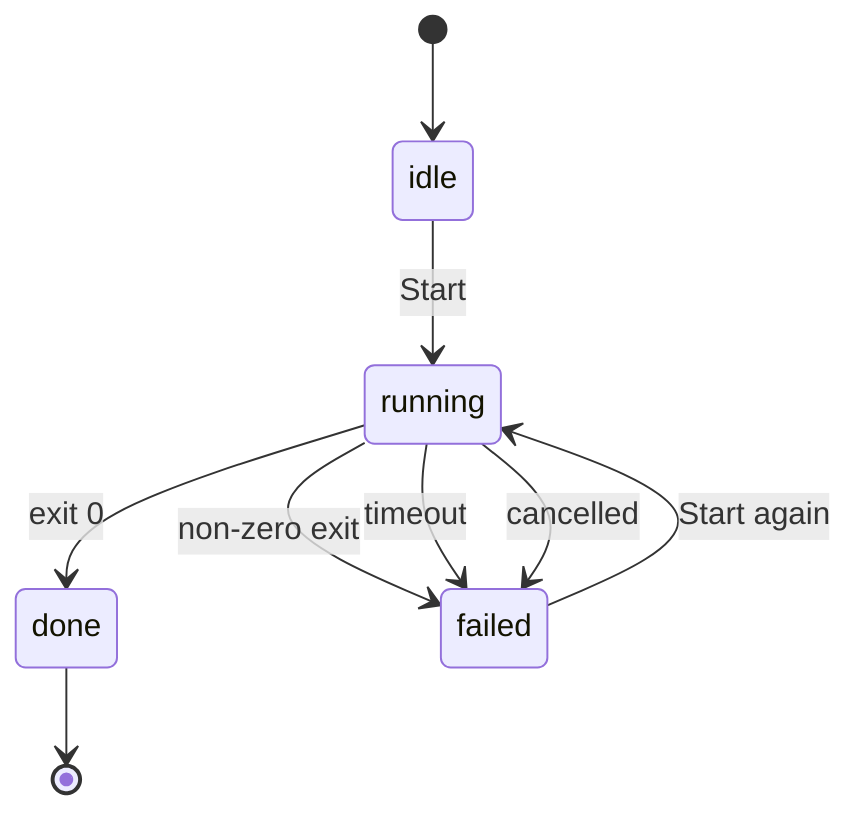

# Plans

Some work does not fit on one card. A plan is the shape swarmery gives that work: a
short interview that turns an idea into phase documents, a dependency graph over
those phases, and a run engine that executes them and reports progress back from the
documents themselves.

```figure plan-dag
```

## From idea to plan

Planning Mode is a durable, database-backed wizard — not a chat you must not close.
Its state lives in the daemon's SQLite tables, so refreshing the page, losing the
tab or restarting your browser does not lose the interview.

A planning session moves through a small closed set of states:

| State | Meaning |
|---|---|
| `generating` | The planner is thinking — producing the next question, or the plan itself |
| `awaiting_answer` | A question is on screen, waiting for you |
| `proceeding` | You ended the interview; the plan is being written |
| `done` | The plan is on disk; the session records where |
| `failed` / `cancelled` | The planner errored, or you stopped it |

The interview runs in two phases. **Phase A** asks you multiple-choice questions,
one at a time, each answer narrowing the design. **Phase B** stops asking and writes
the plan. The planner is instructed to write no code and create no branches — that is
an instruction it follows, though, not a sandbox that constrains it.

You do not have to start from a blank page. The board's **Plan** action opens
Planning Mode with the card's title and prompt already in the box — and the
prefill parameter is consumed as it is used, so a later refresh does not silently
re-seed the form.

When the planner finishes it ends with `PLAN SAVED:` and the absolute path of the
plan directory. The daemon accepts that only if the path has the shape a workspace
plan must have; anything else is treated as an unfinished run rather than a plan.

## Anatomy of a plan

Plans live in the workspace, never in your code repository:

```
<workspace-root>/<project>/workspace/working/{YYYY}/{MM}/{DD}/{slug}/plan/
├── README.md              objective, sequencing table, risks, definition of done
├── phase-1-<slug>.md
├── phase-2-<slug>.md
└── …
```

The date lives in the path, so the leaf folder is a plain kebab slug with no date
prefix. Archived tasks are scanned from `workspace/archive/` on the same shape, so a
finished plan keeps its history.

A task directory is treated as a plan when it holds a `plan/` subdirectory — but it
only *appears* on the Plans page once at least one phase has been indexed from it. A
`plan/` containing nothing but a README shows up nowhere, which is usually the
explanation when a freshly written plan seems to be missing.

The `README.md` carries the sequencing table, and the daemon really does parse it.
It needs a **Doc** column and a **Phase** (name) column at minimum; a `#` column
sets the order and a `Depends on` column builds the graph from the phase numbers you
list there:

| # | Phase | Doc | Depends on |
|---|-------|-----|------------|
| 1 | Schema and migration | `phase-1-schema.md` | — |
| 2 | API endpoints | `phase-2-api.md` | — |
| 3 | UI screen | `phase-3-ui.md` | 1, 2 |

If a plan has no table at all, every `phase-*.md` becomes a phase in filename order —
and legacy `step-NN-*.md` documents are still read, so older plans keep working.

> [!IMPORTANT]
> Every phase document must end with an empty `## Completion Report` section. The
> dashboard parses that exact heading out of the document and renders it as the
> phase's Summary. A report written anywhere else — a `reports/` file, a chat
> message, the run log — is invisible there, and the phase shows "no summary of the
> work written" over work that actually shipped.

## Phase documents

A phase document is meant to be executable on its own: a header naming its repo and
dependencies, the design, a self-contained copy-paste agent prompt, and its
acceptance criteria as checkboxes.

Those checkboxes are not decoration. **Progress is derived from them** — the daemon
counts `- [ ]` versus `- [x]` lines in each phase document and rolls the totals up
into the plan's percentage. The markdown is the source of truth; the database is a
cache of what the markdown says.

That has one consequence worth internalising: work that is finished but unticked is
invisible, and a criterion ticked to "close out" a phase is a lie the whole system
then believes. You can tick a box straight from the Plans page — it writes back to
the document.

Dependencies are enforced on the same evidence. A phase counts as satisfied when its
criteria are all ticked — never because a process happened to exit successfully.
(A legacy phase driven by a board card also counts once that card is done or
archived.)

> [!NOTE]
> The `Depends on` cell is read as a scan for bare numbers, so keep it to phase
> numbers. Prose like `2 (see ticket 11)` is read as depending on phases 2 *and* 11;
> a number matching no phase is discarded, but one that happens to match a real phase
> is not.

## Running a plan

You can run a single phase, or the whole plan. Either way the work happens in an
isolated git worktree on its own branch — `swarm/plan-<task-id>` for a whole-plan
run, `swarm/phase-<phase-id>` for a single phase. The branch survives when the
worktree is reclaimed, so the work is never stranded.

**What a run remembers.** The worktree sits at a different absolute path from the
checkout, and Claude Code names a session's transcript directory after the path the
session runs in — so a run's transcripts land under a directory of their own, one
per worktree. Auto-memory does *not* follow that split: it is resolved from the
canonical project, so a headless run reads the same `MEMORY.md` index an
interactive session in the checkout reads. Project memory is therefore neither
re-learned per run nor forked per worktree: every run of every plan in a repo
*reads* one index. Writing is a separate claim and worth keeping separate — the
probe measured read resolution and the absence of a per-worktree `memory/`, not
write-through sharing. What the daemon writes is canonical by construction
rather than by measurement: `memconsolidate.AutoMemoryDir` keys on the project's
own path, never on the cwd of the run, so a consolidation from any worktree
edits the checkout's index. This is the
tool's behaviour rather than the daemon's, so it is measured rather than assumed —
`scripts/tests/worktree-memory-probe.sh` re-derives it on any machine (free,
read-only, prints `MATCH`, `MISMATCH` or `INCONCLUSIVE`), and
`tools/swarmery/internal/worktree/memory.go` holds a dormant, tested remedy in
case the answer ever changes.

A run's state machine is deliberately small:



There is no `review` state — a run either finished, or it did not, and what it
*achieved* is read from the ticked checkboxes rather than from the exit code.

The bounds a run operates under:

```stats
8h | ceiling on a whole-plan run | hot
4h | ceiling on a single phase
1 | run in flight per plan
3 | run modes — auto, subagent-driven, inline
```

The daemon does not sequence phases itself. It hands one session the README plus a
manifest of every phase — sequence, name, document path, criteria counts and
dependencies — and lets the `run-plan` skill triage the route from that graph.
Phases already finished are marked *skip* in the manifest, which is what makes a
re-run resume rather than redo: there is no in-place resume, but a second Start
rebuilds the manifest from current checkbox counts.

Three modes are available when you start a whole-plan run: **auto** lets the skill
choose its route from the DAG, **subagent-driven** forces an executor plus a fresh
reviewer per phase, and **inline** makes the controller do the work itself.

> [!WARNING]
> Only one run per plan can be in flight, and starting a whole-plan run is refused
> while any of its phases is running. The reverse is guarded in the interface rather
> than the daemon — the Run-phase button is disabled during a plan run, but the
> endpoint behind it will still accept the call, so avoid driving it by hand mid-run.
> Starting a plan whose phases are all done is refused outright rather than quietly
> re-running finished work.

## Watching a run

The Plans page gives every phase a card with three tabs: **Phase** (the document and
its live checkboxes), **Summary** (the Completion Report), and **Edit** (raw
markdown). Summary always exists, even before anything has shipped — an empty note
is a better answer than a missing tab.

Runs are long-lived by design: a whole-plan run may take up to eight hours and a
single phase up to four before it is abandoned as a timeout. That is why restart
behaviour matters:

- A run whose process survives a daemon restart is **adopted**, not killed. Because
  its exit status is no longer recoverable, it is recorded as done with a note
  saying exactly that.
- A run whose process did not survive is marked failed with `daemon restart`, so it
  is visible rather than stuck on "running" forever.

If a run cannot proceed honestly — an approval gate it cannot defer, a destructive
operation, or a phase whose premises contradict the code — the convention is to stop
and say `PLAN BLOCKED at phase <n>` rather than improvise a different design. That
sentinel is a message to *you*; the daemon records the run's outcome from the process
itself.

## Cheat sheet

| Where | What |
|---|---|
| `<workspace>/<project>/workspace/working/{YYYY}/{MM}/{DD}/{slug}/plan/` | Where plans live |
| `plan/README.md` | Objective, sequencing table, risks, definition of done |
| `plan/phase-N-<slug>.md` | One phase: design, agent prompt, criteria, Completion Report |
| Plans page → phase card → Summary | Renders the `## Completion Report` section |

| Environment variable | Default | Effect |
|---|---|---|
| `SWARMERY_PLANRUN_TIMEOUT` | `8h` | Ceiling on a whole-plan run |
| `SWARMERY_PHASERUN_TIMEOUT` | `4h` | Ceiling on a single-phase run |
| `SWARMERY_PLANRUN_AGENT` | `tech-lead` | Default agent for a plan run |
| `SWARMERY_PLANRUN_MODEL` / `SWARMERY_PHASERUN_MODEL` | account default | Model pin for runs |
| `SWARMERY_WORKSPACE_ROOT` | `$HOME/swarmery-workspace` | Where plans are scanned from — `AGENT_WORKSPACE_ROOT` takes precedence when both are set |

| Endpoint | Purpose |
|---|---|
| `GET /api/epics` | List plans with their phases and rollup |
| `GET`/`PUT`/`PATCH` `/api/epics/{taskId}/docs` | Read, save, or tick one checkbox in a plan document |
| `POST /api/epics/{taskId}/run` | Run the whole plan (`{agent, mode}`) |
| `POST /api/epics/{taskId}/phases/{phaseId}/run` | Run one phase |
| `POST /api/epics/{taskId}/run/cancel` | Stop the run |
| `GET /api/epics/{taskId}/phases/{phaseId}/diagnosis` | Derived run outcome and blockers |
| `POST /api/projects/{id}/planning` | Start Planning Mode |
