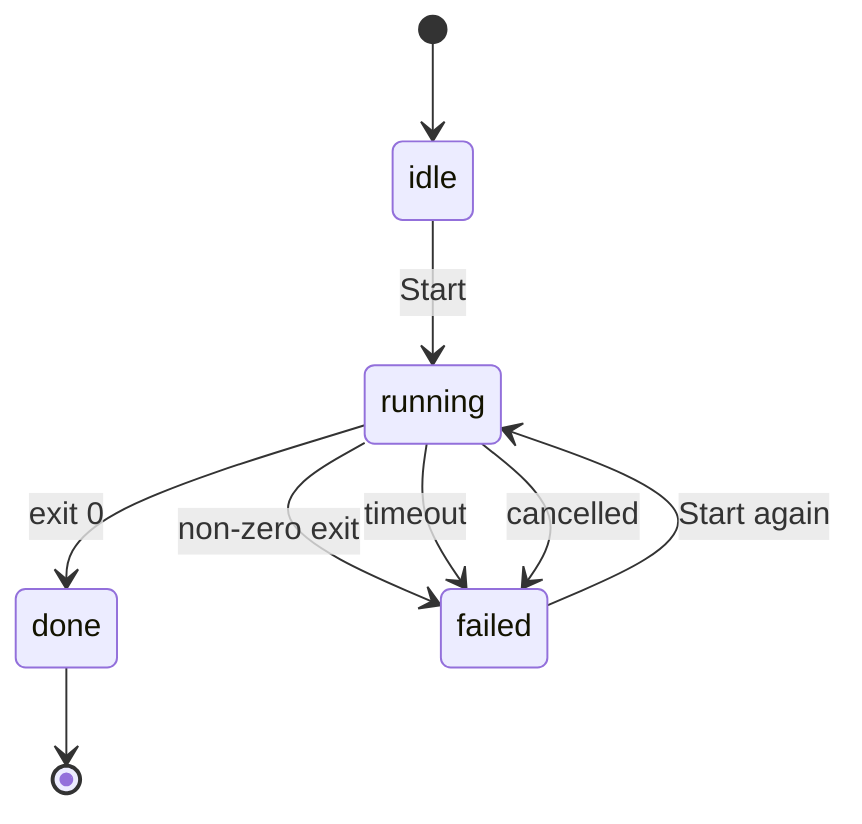
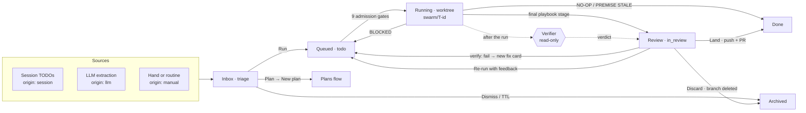

# Plans and the board

Everything that happens before and around a run lives in one place: **Plans**. It
belongs to a project — under *All projects* the sidebar row opens the project you
visited last — and it has four tabs:

| Tab | What it is for |
|---|---|
| **New plan** | Planning Mode: a short interview that turns an idea into phase documents |
| **Plans** | Every plan in the project, its phases, progress and runs |
| **Board** | Single cards — work small enough not to need a plan — and the dispatcher that runs them |
| **Playbooks** | The recipes a dispatched card runs under |

The tab lives in `?tab=` (`/p/<slug>/plans?tab=board`), so a link lands on a
specific tab. The old `/board`, `/planning` and `/playbooks` addresses still work —
they redirect onto the matching tab.

Some work does not fit on one card. A plan is the shape swarmery gives that work: a
dependency graph over phase documents, and a run engine that executes them and reads
progress back from the documents themselves. Work that *does* fit on one card goes
through the board instead.

```figure plan-dag
```

## From idea to plan

**New plan** is Planning Mode — a durable, database-backed wizard, not a chat you
must not close. Its state lives in the daemon's SQLite tables, so refreshing the
page, losing the tab or restarting your browser does not lose the interview.

A planning session moves through a small closed set of states:

| State | Meaning |
|---|---|
| `generating` | The planner is thinking — producing the next question, or the plan itself |
| `awaiting_answer` | A question is on screen, waiting for you |
| `proceeding` | You ended the interview; the plan is being written |
| `done` | The plan is on disk; the session records where |
| `failed` / `cancelled` | The planner errored, or you stopped it |

The interview runs in two phases. **Phase A** asks you multiple-choice questions,
one at a time, each answer narrowing the design. **Phase B** stops asking and writes
the plan. The planner is instructed to write no code and create no branches — that is
an instruction it follows, though, not a sandbox that constrains it.

You do not have to start from a blank page. A board card's **Plan** action opens
Planning Mode with the card's title and prompt already in the box — and the
prefill parameter is consumed as it is used, so a later refresh does not silently
re-seed the form.

When the planner finishes it ends with `PLAN SAVED:` and the absolute path of the
plan directory. The daemon accepts that only if the path has the shape a workspace
plan must have; anything else is treated as an unfinished run rather than a plan.

## Anatomy of a plan

Plans live in the workspace, never in your code repository:

```
<workspace-root>/<project>/workspace/working/{YYYY}/{MM}/{DD}/{slug}/plan/
├── README.md              objective, sequencing table, risks, definition of done
├── spec.md                optional: the WHAT/WHY with SC-n acceptance criteria
├── phase-1-<slug>.md
├── phase-2-<slug>.md
└── …
```

The date lives in the path, so the leaf folder is a plain kebab slug with no date
prefix. Archived tasks are scanned from `workspace/archive/` on the same shape, so a
finished plan keeps its history.

A task directory is treated as a plan when it holds a `plan/` subdirectory — but it
only *appears* on the Plans tab once at least one phase has been indexed from it. A
`plan/` containing nothing but a README shows up nowhere, which is usually the
explanation when a freshly written plan seems to be missing.

The `README.md` carries the sequencing table, and the daemon really does parse it.
It needs a **Doc** column and a **Phase** (name) column at minimum; a `#` column
sets the order and a `Depends on` column builds the graph from the phase numbers you
list there:

| # | Phase | Doc | Depends on |
|---|-------|-----|------------|
| 1 | Schema and migration | `phase-1-schema.md` | — |
| 2 | API endpoints | `phase-2-api.md` | — |
| 3 | UI screen | `phase-3-ui.md` | 1, 2 |

If a plan has no table at all, every `phase-*.md` becomes a phase in filename order —
and legacy `step-NN-*.md` documents are still read, so older plans keep working.

An optional `spec.md` states what the plan must achieve as `- [ ] **SC-n** — …`
checkboxes. When it is present, each phase header declares the criteria it covers in
a `**Covers:** SC-…` line, the plan gains a **Spec** tab, and the dashboard lints the
coverage.

> [!IMPORTANT]
> Every phase document must end with an empty `## Completion Report` section. The
> dashboard parses that exact heading out of the document and renders it as the
> phase's Report. A report written anywhere else — a `reports/` file, a chat
> message, the run log — is invisible there, and the phase shows "no summary of the
> work written" over work that actually shipped.

## Phase documents

A phase document is meant to be executable on its own: a header naming its repo and
dependencies, the design, a self-contained copy-paste agent prompt, and its
acceptance criteria as checkboxes.

Those checkboxes are not decoration. **Progress is derived from them** — the daemon
counts `- [ ]` versus `- [x]` lines in each phase document and rolls the totals up
into the plan's percentage. The markdown is the source of truth; the database is a
cache of what the markdown says.

That has one consequence worth internalising: work that is finished but unticked is
invisible, and a criterion ticked to "close out" a phase is a lie the whole system
then believes. You can tick a box straight from the Plans tab — it writes back to
the document.

Dependencies are enforced on the same evidence. A phase counts as satisfied when its
criteria are all ticked — never because a process happened to exit successfully.
(A legacy phase driven by a board card also counts once that card is done or
archived.)

> [!NOTE]
> The `Depends on` cell is read as a scan for bare numbers, so keep it to phase
> numbers. Prose like `2 (see ticket 11)` is read as depending on phases 2 *and* 11;
> a number matching no phase is discarded, but one that happens to match a real phase
> is not.

## Reading a plan

Opening a plan shows its detail with up to five tabs:

| Tab | Shows |
|---|---|
| **Plan** | The README and the phase list, with each phase's progress and run state |
| **Spec** | `spec.md` and its criteria — only when the plan has one |
| **Summary** | The plan's closing summary — only once every phase is complete |
| **Revisions** | Staged proposals to change the plan; the count shows how many wait |
| **Edit** | The raw README markdown |

A phase opens in a drawer over that list, so you never lose your place; ↑ and ↓ step
to the neighbouring phase. The drawer has its own tabs:

| Tab | Shows |
|---|---|
| **Story** | The phase at a glance, and its forecast against what actually happened — expected, happened, why, what follows |
| **Criteria** | The document with its live checkboxes |
| **Runs** | Run state, the model used, the verification verdict, and the run history |
| **Report** | The `## Completion Report` section. It always exists, even before anything has shipped — an empty note is a better answer than a missing tab |
| **Edit** | The raw phase markdown |

A plan is revised the same way it is written — in markdown. A revision is a staged
proposal: nothing changes on disk until you apply it on the **Revisions** tab.

## Links and Back

Everything you select on the Plans tab is in the address bar: the filter, the plan,
the open phase and its drawer tab, the plan-details tab, one revision. So any of
them can be bookmarked, pasted to someone else or opened in a new tab, and the
browser's Back button retraces what you clicked.

| What is open | Address |
|---|---|
| The plan list (Active) | `/p/<slug>/plans` — lands on the first Active plan |
| A filter with nothing selected | `/p/<slug>/plans?status=done` · `?status=archived` |
| One plan | `/p/<slug>/plans/<externalId>` |
| A phase, on Story | `/p/<slug>/plans/<externalId>/phase/<seq>` |
| A phase, on another tab | `/p/<slug>/plans/<externalId>/phase/<seq>/{criteria,runs,report,edit}` |
| A plan-details tab | `/p/<slug>/plans/<externalId>/details/{plan,spec,summary,revisions,edit}` |
| One revision | `/p/<slug>/plans/<externalId>/details/revisions/<revId>` |
| A plan by numeric id | `/p/<slug>/plans?task=<id>` or `?plan=<id>`, optionally `&phase=<seq>` and `&tab=revisions` |

The plans in the list, the filter tabs, the phase names and every tab are real links, so
⌘-click and middle-click open them in a new tab. Any `?scope=` already on the
address rides along on every one of them. The four top tabs keep their own `?tab=`;
a plan address is the **Plans** tab by definition, so it never carries one.

**Every click is a Back step; automatic corrections are not.** Opening a plan, a
phase or a tab adds one history entry, and Back undoes exactly that. When the page
fixes the address for you — `/plans` resolving to the first Active plan, a numeric
link turning into its canonical path, a tab the plan does not have falling back to
the one its panel shows — it replaces the entry instead. That is why Back from a
plan you landed on never bounces you forward again. The one thing that interrupts
Back is an Edit tab with unsaved changes: leaving it asks first, and so does
reloading or closing the page.

**A stale link lands on the nearest level that still exists.** A plan that is gone
(by external id or by numeric id) drops you on the plan list, at its first Active
plan; a phase the plan no longer has drops you on the plan; a revision that is gone
leaves you on the Revisions tab. Each says so in a one-line notice you can dismiss,
naming what was not found — `Plan <externalId> not found — showing the plan list`,
`Plan #<id> not found`, `Phase <seq> not found in <plan>`, `Revision #<revId> not
found`. A mistyped tab name, or a tab the plan does not offer, is simply corrected,
with no notice. In a project that has no plans at all there is nothing to land on, so
the link stays as typed and the empty plan list shows instead.

**`?task=` and `?plan=` are a permanent entry point.** Pages that know a plan only
by its numeric task id — a plan run on the Sessions timeline, the Planning Mode
banner before the plan's details have loaded, an old bookmark — link there, and the
Plans tab swaps the address for the canonical one on arrival. Everything else links
the canonical address directly: board cards, the task modal and the brief all point
at `/p/<slug>/plans/<externalId>`.

Prefer the canonical address when you save a link. The external id is the plan's
own name (`yyyy-mm-dd-slug`) and a phase is addressed by its sequence number, both
read from the plan documents — so the link survives the daemon rebuilding its
database. The numeric id is a database row id, and a rebuild can renumber it.

## Running a plan

You can run a single phase, or the whole plan. Either way the work happens in an
isolated git worktree on its own branch — `swarm/plan-<task-id>` for a whole-plan
run, `swarm/phase-<phase-id>` for a single phase. The branch survives when the
worktree is reclaimed, so the work is never stranded.

**What a run remembers.** The worktree sits at a different absolute path from the
checkout, and Claude Code names a session's transcript directory after the path the
session runs in — so a run's transcripts land under a directory of their own, one
per worktree. Auto-memory does *not* follow that split: it is resolved from the
canonical project, so a headless run reads the same `MEMORY.md` index an
interactive session in the checkout reads. Project memory is therefore neither
re-learned per run nor forked per worktree: every run of every plan in a repo
*reads* one index. Writing is a separate claim and worth keeping separate — the
probe measured read resolution and the absence of a per-worktree `memory/`, not
write-through sharing. What the daemon writes is canonical by construction
rather than by measurement: `memconsolidate.AutoMemoryDir` keys on the project's
own path, never on the cwd of the run, so a consolidation from any worktree
edits the checkout's index. This is the
tool's behaviour rather than the daemon's, so it is measured rather than assumed —
`scripts/tests/worktree-memory-probe.sh` re-derives it on any machine (free,
read-only, prints `MATCH`, `MISMATCH` or `INCONCLUSIVE`), and
`tools/swarmery/internal/worktree/memory.go` holds a dormant, tested remedy in
case the answer ever changes.

A run's state machine is deliberately small:


```mermaid
stateDiagram-v2
  [*] --> idle
  idle --> running: Start
  running --> done: exit 0
  running --> failed: non-zero exit
  running --> failed: timeout
  running --> failed: cancelled
  failed --> running: Start again
  done --> [*]
```

There is no `review` state — a run either finished, or it did not, and what it
*achieved* is read from the ticked checkboxes rather than from the exit code.

The bounds a run operates under:

```stats
8h | ceiling on a whole-plan run | hot
4h | ceiling on a single phase
1 | run in flight per plan
3 | run modes — auto, subagent-driven, inline
```

The daemon does not sequence phases itself. It hands one session the README plus a
manifest of every phase — sequence, name, document path, criteria counts and
dependencies — and lets the `run-plan` skill triage the route from that graph.
Phases already finished are marked *skip* in the manifest, which is what makes a
re-run resume rather than redo: there is no in-place resume, but a second Start
rebuilds the manifest from current checkbox counts.

Three modes are available when you start a whole-plan run: **auto** lets the skill
choose its route from the DAG, **subagent-driven** forces an executor plus a fresh
reviewer per phase, and **inline** makes the controller do the work itself.

> [!WARNING]
> Only one run per plan can be in flight, and starting a whole-plan run is refused
> while any of its phases is running. The reverse is guarded in the interface rather
> than the daemon — the Run-phase button is disabled during a plan run, but the
> endpoint behind it will still accept the call, so avoid driving it by hand mid-run.
> Starting a plan whose phases are all done is refused outright rather than quietly
> re-running finished work.

Runs are long-lived by design, which is why restart behaviour matters:

- A run whose process survives a daemon restart is **adopted**, not killed. Because
  its exit status is no longer recoverable, it is recorded as done with a note
  saying exactly that.
- A run whose process did not survive is marked failed with `daemon restart`, so it
  is visible rather than stuck on "running" forever.

If a run cannot proceed honestly — an approval gate it cannot defer, a destructive
operation, or a phase whose premises contradict the code — the convention is to stop
and say `PLAN BLOCKED at phase <n>` rather than improvise a different design. That
sentinel is a message to *you*; the daemon records the run's outcome from the process
itself.

## The Board tab

The board is not a parallel kanban you push cards around by hand. It is a funnel
around the plans flow: a self-cleaning **Inbox** lane of captured proposals, a
**Working** lane that shows the dispatcher's honest queue, and a **Review** lane
with exactly three meaningful exits. Done and archived cards sit in a collapsed
history strip along the bottom. There is no drag and drop — actions move cards,
because each action actually does something.

```figure board-lanes
```

The idea underneath is worth stating plainly: **a captured card is a proposal, not a
commitment.** It has a lifecycle and a shelf life. A card's column is not "wherever
somebody dropped it" — it is a consequence of actions that did real work.

The board can also be read as a dependency graph (`?view=graph`), and narrowed by
state (`?f=` — needs me, running, stale) and by subject (`?label=`).

The defaults that shape the whole funnel:

```stats
9 | admission gates before a card runs | hot
2 | cards running at once
4 | live worktrees
14 | days a captured card keeps its slot
3 | fix attempts before a card is parked
```

### A card's life


```mermaid
flowchart LR
  subgraph SRC[Sources]
    S1[Session TODOs<br/>origin: session]
    S2[LLM extraction<br/>origin: llm]
    S3[Hand or routine<br/>origin: manual]
  end
  SRC --> IN[Inbox · triage]
  IN -- "Run" --> Q[Queued · todo]
  IN -- "Plan → New plan" --> PM[Plans flow]
  IN -- "Dismiss / TTL" --> AR[Archived]
  Q -- "9 admission gates" --> RUN[Running · worktree<br/>swarm/T-id]
  RUN -- "final playbook stage" --> REV[Review · in_review]
  RUN -- "NO-OP / PREMISE STALE" --> DONE[Done]
  RUN -- "BLOCKED" --> Q
  REV -- "verify: fail → new fix card" --> Q
  REV -- "Land · push + PR" --> DONE
  REV -- "Re-run with feedback" --> Q
  REV -- "Discard · branch deleted" --> AR
  V{{Verifier<br/>read-only}} -. verdict .-> REV
  RUN -. after the run .-> V
```

Underneath the three lanes, six columns exist and no more: `triage`, `todo`,
`in_progress`, `in_review`, `done`, `archived`.

### Inbox lane: proposals with a shelf life

Everything captured lands here. Each TODO item from a live session becomes a card
with `origin: session`, LLM extraction produces `origin: llm`, and anything you or
a routine creates by hand (**+ New task**) is `origin: manual`. Every card in triage
gets three buttons and a clock:

| Action | What it actually does |
|---|---|
| **Run** | Moves the card to `todo`. That *is* the instruction to the dispatcher — there is no separate "start" button, because the queue is the lane. |
| **Plan** | Opens **New plan** prefilled with this card's text, for work that is bigger than one card. |
| **Dismiss** | Archives it. An honest "no" instead of permanent debt. |
| **TTL** | An hourly sweeper archives captured cards left in triage longer than `SWARMERY_INBOX_TTL` (14 days by default; `0` turns it off). |

The sweeper is deliberately narrow. It only touches cards whose origin is `session`
or `llm` — **hand-written cards are never swept** — and it skips any card holding a
worktree, whatever its age.

When triage grows past 50 cards and at least one of them is old enough to qualify,
an amnesty banner appears above the board. It always counts before it acts: the dry
run reports exactly how many cards match, and only then do you confirm the bulk
archive. Amnesty uses its own, shorter cutoff — cards idle more than seven days — so
it can clear a backlog well before the 14-day TTL would.

> [!TIP]
> Reach for **Plan** rather than **Run** whenever a card would need more than one
> coherent change. Planning Mode turns it into phase documents, and the plan runs
> with its dependencies already known.

### Working lane: the dispatcher underneath

A card in `todo` is an application, not a running process. Before it becomes one it
passes admission gates, in this order:

```figure dispatch-gates
```

Candidates are considered by priority first (`urgent` before `high`, `normal`,
`low`), then oldest-first. Clear every gate and the card is admitted in a single
guarded write — so two dispatcher passes can never start the same card twice.

The admitted card gets an isolated worktree on branch `swarm/<T-id>`, cut from the
tip of whatever branch your main checkout is currently on — so if that checkout is
sitting on a feature branch, cards branch from there, not from `main`. That commit
is **persisted** on the card as `start_point`, which is what lets verification and
the review diff stand on the same ground the agent started from.

Two failure paths are worth knowing. If the daemon restarts mid-run, cards that
still hold a worktree are healed back to `todo` with `daemon restart` recorded,
rather than left wedged — but an executor process that outlived the restart is
adopted instead, and its card keeps running. And when a card is repeatedly
reclaimed without making progress, the dispatcher parks it paused rather than
burning tokens forever.

**Micro-plans.** Each dispatched card also gets a one-phase plan in the private
workspace, so its progress ticks and its Completion Report show on the Plans tab
like any other plan. The plan is written into the project's **own workspace
namespace**: the directory the project is mapped to. When the project has
several, it is the one scanned most recently. The same rule decides which
workspace overlay the card's repository is resolved from, so a card's repo and its
micro-plan always come from the same workspace. A mapped directory that no longer
exists, or that sits outside the configured workspace root, is logged and skipped
in favour of `<workspace root>/<project slug>`. The daemon never writes outside
its own workspace tree. An existing micro-plan is never rewritten, so a re-run or
a verification fix card keeps the ticks already recorded.
`SWARMERY_MICRO_PLANS=0` turns micro-plans off.

### Playbooks pick themselves

Manual playbook selection failed in practice — roughly one deliberate choice across
hundreds of cards — so it is dispatcher policy now:

| Playbook | Stages | Verification | When it is chosen |
|---|---|---|---|
| `standard` | implement | normal | The default, when nothing else applies |
| `plan-first` | plan → implement | normal | Prompt longer than 1500 characters, **or** the card has dependencies |
| `review-heavy` | implement → self-review | strict | Never automatically — a human opt-in |

`quick-fix` no longer exists as a distinct recipe: it was byte-for-byte `standard`
and survives only as an alias that resolves to it. Whichever playbook runs is
**stamped onto the card**, so the chip always shows what actually executed rather
than what was requested.

The **Playbooks** tab lists every recipe with its source (built-in or project) and
draws its stage chain with each stage's prompt. Built-ins are read-only; **Duplicate
to project** copies one into `<project>/.claude/playbooks/`, where its prompts become
yours to edit. A project playbook with the same name overrides the built-in.

Every dispatched stage gets an execution contract: a `Swarm-Task-Id` trailer on its
commits, no pushing, a file-scope fence, and a sentinel vocabulary that lets the
agent end the card honestly:

| Sentinel | Effect |
|---|---|
| `NO-OP:` / `DUPLICATE:` / `REDUNDANT:` | Closes the card as **done** immediately and stops the playbook chain |
| `PREMISE STALE:` | Same — the task's premise no longer holds |
| `BLOCKED:` | Returns the card to the queue, paused, with the reason recorded |

A sentinel is checked first and wins regardless of the process exit code.

### Verification measures reality

After a run, a read-only verifier judges the work and returns one of three verdicts:

| Verdict | What follows |
|---|---|
| `pass` | Stamped on the card and cached |
| `fail` | Stamped, then a fix card is created — within budget |
| `inconclusive` | Stamped only. Nothing is spawned. |

The distinction is the point: a timeout, an unreadable diff or a garbled response is
`inconclusive`, never `fail`. The system does not manufacture failures out of its
own uncertainty.

Results are memoised on a tree hash, so re-verifying an unchanged tree returns the
cached verdict instead of paying for a second run. Only `pass` and `fail` are
cached — `inconclusive` never is.

A failing card produces at most one open fix card at a time, and the fix budget is
charged on the root card, capped at three. Past that, the card is paused rather than
looping. Verification also refuses to start on a runaway diff: more than
`SWARMERY_VERIFY_MAX_DIFF_FILES` files (40 by default) returns `inconclusive` with a
note telling you to split the work or raise the bound. The bound needs the card's
`start_point` and a readable diff to apply — when either is missing it is skipped
rather than guessed at.

### Review lane: three real exits

Start by reading the change: **Diff** shows the work against the card's persisted
`start_point`. That is a read, not an exit. From there the card leaves the lane in
one of exactly three ways:

| Exit | What actually happens |
|---|---|
| **Land** | Pushes the branch and opens a PR. The card becomes `done` **only after** the PR URL exists |
| **Re-run** | Appends your feedback to the prompt, clears the previous verdict, and returns the card to `todo` |
| **Discard** | Reclaims the worktree, deletes the `swarm/` branch, and archives the card |

> [!IMPORTANT]
> Done is a consequence, not a gesture. Nothing in this lane marks a card complete
> because someone clicked it — Land waits on a real PR URL, and a failed
> verification opens a fix card instead of quietly letting the work through.

## Cheat sheet

| Where | What |
|---|---|
| `<workspace>/<project>/workspace/working/{YYYY}/{MM}/{DD}/{slug}/plan/` | Where plans live |
| `plan/README.md` | Objective, sequencing table, risks, definition of done |
| `plan/spec.md` | Optional acceptance criteria (`SC-n`) the phases declare they cover |
| `plan/phase-N-<slug>.md` | One phase: design, agent prompt, criteria, Completion Report |
| Plans → phase drawer → Report | Renders the `## Completion Report` section |
| `/p/<slug>/plans/<externalId>[/phase/<seq>[/<tab>]]` | A plan's (or phase's) permanent address — see *Links and Back* |
| `<project>/.claude/playbooks/` | Project playbooks; a name collision overrides the built-in |

| Environment variable | Default | Effect |
|---|---|---|
| `SWARMERY_PLANRUN_TIMEOUT` | `8h` | Ceiling on a whole-plan run |
| `SWARMERY_PHASERUN_TIMEOUT` | `4h` | Ceiling on a single-phase run |
| `SWARMERY_PLANRUN_AGENT` | `tech-lead` | Default agent for a plan run |
| `SWARMERY_PLANRUN_MODEL` / `SWARMERY_PHASERUN_MODEL` | account default | Model pin for runs |
| `SWARMERY_WORKSPACE_ROOT` | `$HOME/swarmery-workspace` | Where plans are scanned from — `AGENT_WORKSPACE_ROOT` takes precedence when both are set |
| `SWARMERY_DISPATCH` | on | Global kill switch for the board's dispatcher |
| `SWARMERY_MAX_CONCURRENT` | `2` | Concurrent running cards |
| `SWARMERY_MAX_WORKTREES` | `4` | Live worktrees across all projects |
| `SWARMERY_INBOX_TTL` | `336h` (14 days) | Triage shelf life; `0` disables the sweeper |
| `SWARMERY_DISPATCH_TIMEOUT_MIN` | `45` | Minutes before a card's run is abandoned |
| `SWARMERY_DISPATCH_PERMISSION_MODE` | `bypassPermissions` | Permission mode for dispatched agents; a playbook may override it |
| `SWARMERY_MICRO_PLANS` | on | Write a one-phase plan for every dispatched card; `0` disables it |
| `SWARMERY_AUTOVERIFY` | on | Automatic verification after a run; manual verify still works when off |
| `SWARMERY_VERIFY_MAX_DIFF_FILES` | `40` | Diff-size bound above which verification returns inconclusive |
| `SWARMERY_VERIFY_TIMEOUT_MIN` | `15` | Minutes before a verification run is abandoned |
| `SWARMERY_WORKTREE_LEND` | `node_modules`, `.venv`, `vendor` | Directories lent into a fresh worktree so builds work immediately |

> [!NOTE]
> These are read once, when the daemon starts. Changing one means restarting the
> daemon — there is no live reload.

| Endpoint | Purpose |
|---|---|
| `GET /api/epics` | List plans with their phases and rollup |
| `GET`/`PUT`/`PATCH` `/api/epics/{taskId}/docs` | Read, save, or tick one checkbox in a plan document |
| `POST /api/epics/{taskId}/run` | Run the whole plan (`{agent, mode}`) |
| `POST /api/epics/{taskId}/phases/{phaseId}/run` | Run one phase |
| `POST /api/epics/{taskId}/run/cancel` | Stop the run |
| `GET /api/epics/{taskId}/phases/{phaseId}/diagnosis` | Derived run outcome and blockers |
| `POST /api/projects/{id}/planning` | Start Planning Mode |
| `GET /api/board/tasks` | List cards; filter with `?projectId=` and `?boardColumn=` |
| `POST /api/board/tasks` | Create a card (manual origin only) |
| `PATCH /api/board/tasks/{id}` | Move or edit a card |
| `POST /api/board/tasks/bulk-archive` | Amnesty; send `dryRun` first to count |
| `GET /api/board/tasks/{id}/diff` | The card's diff against `start_point` |
| `POST /api/board/tasks/{id}/rerun` | Re-run with reviewer feedback |
| `POST /api/board/tasks/{id}/discard` | Discard the branch and archive |
| `POST /api/board/tasks/{id}/land` | Push and open the PR |
| `POST /api/tasks/{id}/verify` | Verify on demand (asynchronous) |
| `GET /api/dispatch`, `POST /api/dispatch/pause` | Inspect and pause the dispatcher |
