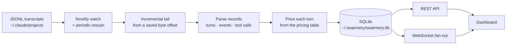

# Sessions and observability

Everything the dashboard knows about your agents comes from files Claude Code was
already writing. There is nothing to instrument, no SDK to adopt and no wrapper to
run your agents through — the daemon reads the transcripts, and the rest is
bookkeeping.

## What the daemon sees



Two globs are watched under each configured root: the session transcripts
themselves, and the `subagents/agent-*.jsonl` companions a session writes for its
subagents. A full scan always takes main transcripts before their sidechains; the
file-watcher, which reacts in whatever order writes land, cannot promise that — so
subagent records that arrive before the parent turn exists are held and adopted once
it does.

Reading is incremental. The daemon remembers a byte offset per file and resumes from
it, and it never consumes a trailing line that has not been newline-terminated yet —
so a half-written record is picked up on the next pass instead of being parsed as
truncated. The offset is committed in the same transaction as the rows it produced,
which is what keeps a crash from double-counting.

Freshness comes from two mechanisms working together: `fsnotify` reacts to writes
almost immediately, and a rescan every couple of seconds covers anything the watcher
missed. The dashboard is then pushed to over a WebSocket rather than polling — new
sessions, appended events, permission requests, board and plan updates all arrive as
frames. If the connection drops, the client refetches over REST and carries on.

## Reading a session

A session's status is a time-based heuristic with a liveness override:

| Status | Meaning |
|---|---|
| `active` | Something happened in the last two minutes |
| `idle` | Last activity within thirty minutes |
| `completed` | Older than that, **and** no live process |
| `waiting_approval` | A permission request is pending |
| `killed` | Stopped from the dashboard |

The override matters: while the daemon can still see the process alive, a quiet
session caps at `idle` and is never declared complete. A clock alone would lie about
an agent that is merely thinking.

The session view has three tabs — **Chat**, **Timeline** and **Diffs** — under a
pinned header carrying the status, model, duration, token total, cost and error
count. On a wide screen a right-hand rail adds what the session actually used:
models by share of tokens, agents by runs and duration, skills by uses, a recursive
call tree of skills → tools → subagents, and every file the session touched. Most of
that is derived from data the page already loaded; the handoff and context-hog cards
are the exceptions, and they fetch only when you expand them.

## Cost and usage

Cost is computed per turn from four token kinds — input, output, cache read and
cache write — against a pricing table keyed by model, in dollars per million tokens.

One rule governs the whole subsystem: **an unknown model produces no cost at all,
not a zero.** A missing price is recorded as unknown so it cannot masquerade as free
work. The per-project economics report goes a step further and carries a coverage
figure for every metric unpriced turns could distort, so a total built on partial
data announces itself — that report is the `swarmery economics` command rather than a
dashboard page.

The kinds of measurement available, rather than any dated numbers:

```stats
4 | token kinds priced per turn | hot
5 | breakdown dimensions — project, model, account, agent, skill
4 | timeseries metrics — cost, tokens, runs, cache
5 | economics audits — cost per task, cache efficiency, delegation, waste, model mix
```

Subscription **usage** is a different question from cost, and answered differently.
Cost is derived from your indexed transcripts; usage asks Anthropic directly how much
of your plan's quota is left. Several windows are tracked — the five-hour session
window, the weekly window, and per-model weekly windows — and each is paired with a
pace verdict: are you burning quota faster than the clock, on track, or behind. That
is more useful than a bare percentage, because "60% used" means one thing on day one
of a window and something else on day six.

> [!NOTE]
> The header chip is a summary, not a worst-case alarm: it shows the session window
> of the first healthy provider. A weekly window can be much closer to its limit than
> the chip suggests, so open the Usage modal to see every window.

## Accounts

If you keep more than one Claude account, swarmery follows the mechanism Claude Code
itself uses: an account **is** a config directory. `~/.claude` is the default
account; `~/.claude-work` is the account named `work`. Switching is done by setting
`CLAUDE_CONFIG_DIR` when spawning, and nothing else.

swarmery never writes credential files. It cannot log you in, and it does not try —
asking to add an account returns the exact command for you to run yourself.

"Connected" therefore means *a credential could be resolved for this account*, not
*a file exists* — on macOS the default account's credential lives in the login
keychain and has no file at all. The answer is three-valued: connected, not
connected, or unknown when the question could not be asked.

A project is bound to an account through its `.claude/settings.local.json`, which is
machine-local and gitignored — your teammate's checkout is unaffected. A binding
file that git **tracks** is ignored: the project runs under the default account, and
the picker shows why underneath. On a single-account machine the picker does not
appear at all.

## Approvals

When an agent needs permission, that request can come to you instead of sitting in a
terminal you are not looking at. Claude Code's `PermissionRequest` hook forwards it
to the daemon, the daemon holds the request open while the hook long-polls, and you
approve or deny from the dashboard — or your phone.

Requests are project-scoped in the list, deduplicated so a retried identical call
does not stack up, and capped per session so a runaway agent cannot flood the queue.
Every decision keeps its row, including automatic ones, so there is always an audit
trail of what was allowed and why.

The default window is ten minutes. What happens at the end of it is the important
part: a timed-out request is **neither approved nor denied** — it expires, the hook
returns no decision, and Claude Code falls back to its own terminal prompt. The same
is true if the daemon is down, unreachable or confused. The channel fails *open* to
the normal prompt, never into a silent yes.

> [!WARNING]
> Auto-approval rules match a tool name and an argument glob, and the glob is a
> prefix match on the raw command. A rule like `Bash(git *)` also matches
> `git status && rm -rf /`. Keep rules narrow, prefer naming exact tools, and
> remember that a rule is a standing decision you will not be asked about again.

## The retro loop

The daemon also watches its own performance. A deterministic advisor — no model in
the loop — evaluates rules over a trailing fourteen-day window and raises evidenced
recommendations: denied tools, agent error rates, recurring errors, re-dispatch
churn, stale improvements, cache regressions, stale architecture maps, trajectory
anti-patterns and expensive fat sessions.

Recommendations have a lifecycle — proposed, accepted or dismissed, adopted, then
**verified** by re-measuring the same metric later. A recommendation is only ever
verified against real activity: each rule has a floor below which it refuses to
conclude anything, so a quiet fortnight can never be mistaken for an improvement.

Per-agent scorecards sit alongside them: runs, error rate, success rate, cost and p95
duration for each agent over the same window. Where a recommendation targets an
agent, the loop can go one step further and draft an actual change to that agent as a
reviewable diff, which you approve or reject.

## Cheat sheet

| Page | What it answers |
|---|---|
| `/sessions` | Every session, live, with cost and status |
| `/sessions/{id}` | Chat, timeline, diffs, and what the session used |
| `/approvals` | Pending permission requests and the decision history |
| `/analytics` | Cost, tokens, runs and cache over time |
| `/retro` | Agent scorecards, recommendations, proposed changes |
| `/settings` | Accounts, and everything machine-wide |

| Environment variable | Default | Effect |
|---|---|---|
| `SWARMERY_PROJECTS_ROOTS` | `~/.claude/projects` | Transcript roots; `auto` finds every `~/.claude*/projects` |
| `SWARMERY_APPROVAL_TIMEOUT` | `10m` | How long a permission request stays open |
| `SWARMERY_PRICING` | embedded table | Path to a JSON pricing file that overrides the built-in one |
| `SWARMERY_EXCLUDE` | `/tmp/*,/private/tmp/*` | Paths whose sessions are not indexed |
| `SWARMERY_USAGE_OAUTH` | on | `0` disables subscription-quota lookups entirely |

Pricing is read once at startup. After editing prices, restart the daemon and run
`swarmery recost` to re-price turns that were already indexed.
