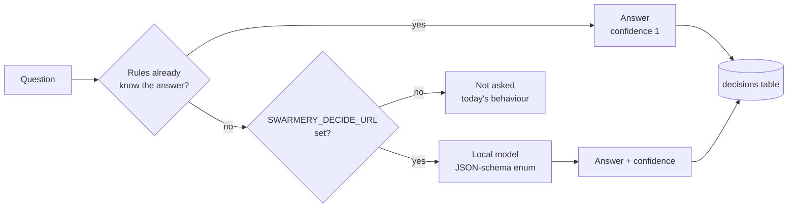

# Рішення і локальні моделі

Частина питань, що постають перед демоном, дрібні й закриті: *цей запуск зупинився,
бо заблокований, чи бо відзвітував про прогрес?*, *ця сесія була фічею чи
виправленням?* Платити фронтирній моделі за відповідь одним словом — марнотратство.
**Навчання → Класифікатор** — це місце, де замість неї на них відповідає невеликий
класифікатор, що працює на вашій власній машині.

**Це необов’язково.** Swarmery робить усе інше й без нього — сесії, плани, дошку,
запуски, погодження, вартість. Якщо локальну модель не налаштовано, класифікатор
вимкнений повністю, і демон поводиться точно так, як до появи цієї можливості.
Налаштовуйте його тоді, коли захочете додаткових міток, не раніше.

## На що він відповідає

Класифікатор працює *навколо* запусків Claude, ніколи всередині них. Його ніколи не
викликають із хука, він ніколи не підрізає контекстне вікно, ніколи не обирає інструмент,
модель чи рівень зусиль.

| Питання | Коли ставиться | Відповіді | Хто використовує |
|---|---|---|---|
| **D1** `d1.run_end` | Фоновий запуск фази або плану завершився чисто, але критерії приймання лишилися невідміченими | `report-with-next-step` · `blocked` · `question-for-operator` · `done` | Цикл досидання запуску: продовжити його, зупинитися й сповістити вас або позначити заблокованим |
| **D2** `d2.task_type` | Кожні 15 хвилин, для завершених сесій | `feature` · `bugfix` · `refactor` · `docs` · `research` · `review` · `ops` · `planning` · `other` | Аналітичні мітки на сесії |
| **D2** `d2.outcome` | Той самий прохід | `shipped` · `partial` · `abandoned` · `failed` | Аналітичні мітки на сесії |
| **D2** `d2.failure_cause` | Той самий прохід | `none` · `tool-error` · `test-failure` · `blocked-on-operator` · `refusal` · `timeout` · `context-exhausted` · `scope-misread` · `other` · `auth` · `quota` · `api-error` | Аналітичні мітки на сесії |
| **D3** `d3.divergence_cause` | Оцінений запуск фази опинився далеко від власного прогнозу | `spec-wrong` · `code-differs` · `scope-grew` · `tooling-env` · `model-fallback` · `other` | Аналітика і причина, що стоїть за кандидатом в уроки |

Свідчення, які бачить кожне питання, навмисно невеликі — хвіст останнього повідомлення
асистента, назва й часи сесії та короткий блок доказів — ніколи не повний транскрипт.
Блок перелічує те, що показує власний запис сесії: коміти, пуші й пул-реквести,
відредаговані файли, фазу плану, яку вона виконувала, скільки в ній було ходів, чи
завершилася вона на власній фінальній відповіді моделі, причину зупинки її останнього
ходу і чи не обірвали її акаунт або API.

Питання про тип задачі читає на один рядок більше: початок першого запиту сесії, коли
назва ще не повторює його. Сесію позначають за тим, що її просили зробити, і модель
отримує для позначення ті самі значення, що й ви:

| `d2.task_type` | Сесія |
|---|---|
| `feature` | створила або змінила те, що робить продукт |
| `bugfix` | знайшла причину або виправила щось зламане, хибне чи повільне |
| `refactor` | переструктурувала наявний код, не змінюючи того, що він робить |
| `docs` | писала текст для людей — документацію, інструкцію, README, файли ліцензії чи для контриб’юторів, пост або відповідь, файл передачі сесії |
| `research` | відповіла на питання про те, як щось працює, і нічого не змінила |
| `review` | оцінювала, перевіряла або судила готову роботу — пул-реквест, завершену роботу, запуск агента — не змінюючи її |
| `ops` | виконувала лише git- або машинні клопоти — коміт, пуш, пул-реквести, злиття, прибирання гілок, встановлення, деплой, вхід, налаштування |
| `planning` | писала або переглядала план для подальшої роботи й нічого не будувала |
| `other` | була тривіальною пробою або голою командою без задачі; рідкість |

Завершену сесію **без жодного ходу** не чіпають: питанню нема що читати, тож D2 ніколи
про неї не питає, а вже записані відповіді для такої сесії ховаються з черги позначення
(ховаються, не видаляються — вони повертаються, щойно в сесії з’явиться хід).

### На що спершу відповідають правила

Деяким сесіям модель не потрібна: їхній власний запис уже каже, як вони завершилися. Для
них D2 відповідає за правилом, з упевненістю 1, ще до того, як запитають локальну модель.
Виграє перше правило, що збіглося з питанням.

| Правило | Запис сесії показує | `d2.outcome` | `d2.failure_cause` |
|---|---|---|---|
| **R0** | Ви самі виставили вердикт сесії | ваш вердикт | — |
| **R1** | Останній хід асистента — рядок збою, який написав CLI: вхід, ліміт використання або помилка API (див. наступний розділ) | `failed` | `auth` · `quota` · `api-error` |
| **R2** | Останній виклик інструмента відхилено, бо перевірка автоматичного режиму не повернула вердикту | — | `api-error` |
| **R3** | Запуск фази завершився `done` з усіма відміченими критеріями приймання | `shipped` | `none` |
| **R4** | Не запуск фази чи плану; останній хід — власна фінальна відповідь моделі з причиною зупинки `end_turn`; жодного відредагованого файлу, жодного коміту, жодної помилки акаунта чи API | `shipped` | `none` |

Риска означає, що правило на це питання не відповідає, і тоді запитують модель. Три
обмеження тримають правила чесними:

- **R4 потребує причини зупинки.** Сесії, проіндексовані до того, як причини зупинки
  почали записуватися, її не мають, і R4 для них ніколи не спрацьовує — вони йдуть до моделі.
- Останній хід, який написав CLI і який не називає збою (порожній або
  `No response requested.`), не збігається з жодним правилом.
- Дві відповіді однієї сесії ніколи не суперечать одна одній: правило не дає жодної
  причини, крім `none`, поруч із `shipped`, на яке воно відповіло, і жодного `none` поруч
  із будь-яким іншим результатом. Там, де таке сталося б, питання натомість іде до моделі.

Сесія, що **виконувала фазу плану або цілий план**, ніколи не є `planning` — вона робить
роботу, яку описує фаза. Для таких сесій `planning` вилучається з варіантів
`d2.task_type`, а свідчення називають фазу й цитують початок її мети. Сесія вважається
таким запуском, коли план посилається на неї або коли вона відкривається промптом, який
демон сам надсилає, щоб запустити фазу чи план — фаза пам’ятає лише свій останній запуск,
тож попередні розпізнаються за цим промптом. Мету читають із документа фази або з копії
всередині промпта, коли документ перемістили.

Ще одне правило постачається вимкненим: **R5** відповідає `d2.task_type` = `feature` для
кожного запуску фази чи плану. Це запасний варіант для моделі, яка не може позначати такі
запуски достатньо добре; вмикайте його через `SWARMERY_DECIDE_R5=on` лише після того, як
описаний нижче eval покаже його точність на ваших власних мітках.

Відповідь, яку дало правило, **не** потрапляє до вкладки «класифікатор» у Вхідних: вам там
нема чого судити. Вона все одно записується, і
`GET /api/decisions/queue?rules=1` повертає її, коли ви хочете проаудитувати правила.

### Збої акаунта і API

Три причини збою називають сесії, які не провалили саму роботу — їх зупинили акаунт або
API:

| Причина | Сесія завершилася на |
|---|---|
| `auth` | Проблема з входом: не ввійшли, вхід протермінувався, OAuth-сесію не вдалося оновити, доступ за підпискою вимкнено для організації |
| `quota` | Ліміт використання: сесійний, тижневий, на модель або ліміт витрат |
| `api-error` | Сам API: недоступний, перевантажений, з’єднання обірвалося посеред відповіді, тайм-аут |

Їх додали після того, як позначення вже почалося, тож у кожної як **батьки** записані
мітки, якими оператори користувалися для неї до її появи:

| Причина | Батьки |
|---|---|
| `auth` | `other`, `blocked-on-operator` — CLI, що вийшов з акаунта, чекає, доки ви ввійдете |
| `quota` | `other` |
| `api-error` | `other`, `tool-error` |

Згода підпорядковується одному правилу:

- відповідь `auth`, `quota` або `api-error` **узгоджується** з міткою, що називає одного з
  її батьків — стара мітка була найближчою з доступних, а відповідь є її точнішим
  прочитанням;
- у зворотному напрямку згоди **нема**: відповідь `other` (або `blocked-on-operator`)
  проти мітки `auth` — це промах; щойно ви сказали, що саме це було, розмитіша відповідь
  стає промахом.

Отже, старі мітки лишаються чинними, і вам ніколи не доведеться перепозначати сесію, щоб
числа згоди лишалися чесними.

## Звідки береться відповідь



Локальний бекенд говорить API chat-completions від OpenAI, тож підійде будь-що з цього:
**LM Studio**, **Ollama** (через її ендпоінт `/v1`), сервер **llama.cpp** або
**vLLM**. Відповідь обмежена JSON-схемою, єдине поле якої — enum дозволених відповідей,
із `temperature: 0`, а кожен виклик обрізається на п’яти секундах — повільна модель
коштує секунд, ніколи не бюджету запуску.

Третій бекенд, фоновий Claude Haiku, існує за `SWARMERY_DECIDE_CLAUDE`. За замовчуванням
він вимкнений, це лише запасний варіант на випадок, коли локальна модель недоступна, і
жодне з постачених питань його не дозволяє — тож на практиці нічого не покидає вашу машину.

## Налаштування

### 1. Запустіть сервер локальної моделі

Підійде будь-який OpenAI-сумісний сервер. Два найпоширеніші:

- **LM Studio** — встановіть його, завантажте instruct-модель, підвантажте її й запустіть
  локальний сервер із вкладки Developer. Він слухає на `http://localhost:1234`.
- **Ollama** — встановіть її та виконайте `ollama pull <model>`. Вона слухає на
  `http://localhost:11434` і віддає OpenAI API під `/v1`.

Розмір: питання — це короткі закриті вибори, тож instruct-моделі на 7–14B цілком досить.
Більші моделі лише додають затримки на тлі п’ятисекундного обрізання.

Знайдіть точний ідентифікатор моделі, якого очікує сервер:

```bash
curl -s http://localhost:1234/v1/models      # LM Studio
curl -s http://localhost:11434/v1/models     # Ollama
```

### 2. Вкажіть демону на нього

| Змінна | Значення | За замовчуванням |
|---|---|---|
| `SWARMERY_DECIDE_URL` | Сервер: голий хост (`http://localhost:1234`), база `/v1` або повний URL `/chat/completions` | не задано — класифікатор вимкнений |
| `SWARMERY_DECIDE_MODEL` | Ідентифікатор моделі з `/v1/models` | `local-model` |
| `SWARMERY_DECIDE_D1` / `_D2` / `_D3` | `off` · `shadow` · `active` | `shadow` |
| `SWARMERY_DECIDE_D1_THRESHOLD` (а також `_D2_`, `_D3_`) | Поріг упевненості для `active`, у (0, 1] | D1 `0.85`, D2 `0.6`, D3 `0.6` |
| `SWARMERY_DECIDE_THRESHOLDS` | Пороги для окремих питань, які беруть гору над порогом їхньої родини: `d2.outcome=0.95,d2.task_type=0.8`. `1.01` вимикає відповіді моделі на це питання — жодна упевненість його не досягне, — а відповіді правил і далі рахуються. Запис, що не має вигляду `<question>=<число в (0, 1.01]>`, ігнорується з одним попередженням на старті | не задано |
| `SWARMERY_DECIDE_R5` | `on` вмикає правило R5 (запуск фази чи плану має тип задачі `feature`) | вимкнено |
| `SWARMERY_DECIDE_CLAUDE` | `1` вмикає запасний Haiku | вимкнено |

Якщо ви запускаєте демон вручну, передайте їх у командному рядку:

```bash
SWARMERY_DECIDE_URL=http://localhost:1234 SWARMERY_DECIDE_MODEL=<model-id> swarmery serve
```

Якщо демон працює як сервіс launchd у macOS, впишіть їх у його plist і перевстановіть.
`swarmery install` зберігає кожну змінну, що вже є в plist, тож вони переживуть наступні
оновлення:

```bash
PLIST=~/Library/LaunchAgents/com.swarmery.daemon.plist
plutil -replace EnvironmentVariables.SWARMERY_DECIDE_URL -string http://localhost:1234 "$PLIST"
plutil -replace EnvironmentVariables.SWARMERY_DECIDE_MODEL -string <model-id> "$PLIST"
~/.swarmery/bin/swarmery install
```

### 3. Перевірте, що спрацювало

Демон логує свою конфігурацію на старті (сервіс launchd пише лог у
`swarmery.err.log`):

```bash
grep 'decide: local=' ~/.swarmery/logs/swarmery.err.log | tail -1
# decide: local=http://localhost:1234/v1 model=qwen/qwen3-14b claude=false d1=shadow(0.85) …
```

`local=off` означає, що `SWARMERY_DECIDE_URL` до демона не дійшов.

Вкладка «Класифікатор» перестає показувати *Локальну модель не налаштовано*. Виклики
починають з’являтися, коли завершуються запуски і 15-хвилинний прохід D2 доходить до ваших
сесій. Питання, у якого рядок статусу повідомляє про помилки, зазвичай означає, що сервер
не запущений або ідентифікатор моделі хибний.

## Спершу тінь, потім дія

Перемикач режиму біля кожного питання має значення **вимк. · спостерігає · діє** — так
дашборд називає значення `off`, `shadow` і `active` змінних середовища.

Кожне питання починає в режимі **shadow** (*спостерігає*): його ставлять, відповідь
записують, і ніщо на неї не діє. Відповіді моделі чекають у вкладці **класифікатор** у
Вхідних, доки ви їх перевірите — саме так ви дізнаєтеся, чи модель достатньо добра, перш
ніж їй довіритися. Відповіді, які дали правила, у чергу не стають.

- **згода** (*збігається з вами*) — частка відповідей, що збіглися з тим, що сталося
  насправді, серед рішень, у яких є істина — включно з тими, що ви перевірили. D1 записує
  свою власну: коли запуск продовжили, завершення наступного запуску каже, чи правильно
  було продовжувати.
- **упевненість** — гістограма того, наскільки модель була певна. Упевненість *калібрована*
  лише тоді, коли сервер повертає логарифмічні ймовірності токенів; чи повертає — залежить
  від сервера та його версії. Некалібровану відповідь записують, але вона ніколи не долає
  поріг `active`.

Лише D1 змінює поведінку в активному режимі, і він відмовляє безпечно: нижче порога або
без калібрування він не продовжує запуск — зупиняється й сповіщає вас. Переводьте питання
в режим *діє* його перемикачем, щойно його згода стане високою; перемикач перекриває
значення зі змінних середовища для цього одного питання.

## Виміряйте зміну, перш ніж їй довіритися

`swarmery decide eval` програє класифікатор над мітками, які ви вже записали, і повідомляє,
як часто програна відповідь з ними збігається. Запускайте його до і після зміни правила чи
промпта й порівнюйте дві таблиці.

```bash
swarmery decide eval                                        # лише правила, усі мітки
swarmery decide eval --truth-since 2026-09-29T00:00:00Z     # лише мітки, записані відтоді
SWARMERY_DECIDE_URL=http://localhost:1234 SWARMERY_DECIDE_MODEL=<model-id> \
  swarmery decide eval --llm                                # також запитати локальну модель
```

Він працює **лише на читання**: не записує жодного рішення, не пише жодної мітки й ніколи
не мігрує базу даних, тож його безпечно запускати, поки демон обслуговує запити. Нічого не
покидає вашу машину — єдиний бекенд, який він може викликати, це локальна модель, і лише з
`--llm`.

| Прапорець | Значення |
|---|---|
| `--db <path>` | База даних (за замовчуванням `~/.swarmery/swarmery.db`) |
| `--llm` | Також запитати локальну модель. Потребує `SWARMERY_DECIDE_URL`; інші змінні `SWARMERY_DECIDE_*` діють. Без нього відповідають лише правила, а кожне інше питання рахується як *без відповіді* |
| `--truth-since <RFC3339>` | Залишити мітки, записані в цю мить або пізніше |
| `--questions <a,b>` | Підмножина з `d2.task_type`, `d2.outcome`, `d2.failure_cause` (префікс `d2.` можна опустити) |
| `--limit <n>` | Програти щонайбільше *n* сесій, найновіша мітка першою |
| `--json` | Видати звіт як JSON замість таблиці |
| `--out <file>` | Також записати звіт у файл |
| `--min-outcome` · `--min-failure` · `--min-task` `<f>` | Пороги згоди в [0, 1] |

Коли сесію позначали більше ніж раз, істиною є **найновіша** мітка. Програти можна лише
три питання D2: їхні свідчення відбудовуються із сесії, тоді як D1 і D3 читають стан
запуску в мить його завершення, а він не зберігається.

Для кожного питання звіт дає:

- **labelled / replayed / skipped** — знайдені мітки, відбудовані питання і ті, що не
  вдалося відбудувати (`no-session`: сесії більше немає; `zero-turns`: у неї не лишилося
  ходу, який можна прочитати, наприклад після того, як її підрізала політика зберігання);
- **agreement** — відповіді, що збіглися, серед програних питань. Питання без відповіді —
  це промах, тож прохід лише з правилами навмисно читається низько: це підлога, до якої
  модель додає;
- **recorded** — те саме порівняння для відповіді, яку демон зберіг, коли запитав уперше,
  до будь-якого програвання;
- **by backend** — скільки відповідей прийшло від правил і скільки від локальної моделі, та
  *точність* кожного (відповіді, що збіглися, серед відповідей цього бекенду);
- **by rule** — відповіді правил, розбиті за правилом, що дало кожну (`R0` … `R5`), з його
  *точністю* і *покриттям* (частка програних питань, на які воно відповіло). Правило з
  низькою точністю на ваших мітках варто підтягнути або вимкнути;
- **confusions** — найчастіші розходження *відповідь → мітка*;
- **confidence** — десять кошиків відповідей локальної моделі з кількістю тих, що збіглися,
  у кожному. Добре калібрована модель частіше збігається у вищих кошиках.

Код виходу: `0` при успіху, `1` коли не досягнуто порога `--min-*`, `2` при помилці
використання або бази даних — тож скрипт може стримувати зміну за ним.

## Вимкнення

Скиньте `SWARMERY_DECIDE_URL` і перезапустіть демон або поставте одному питанню `off`
на сторінці Навчання → Класифікатор. Записані рішення лишаються в базі даних; більше ніщо
від них не залежить.
