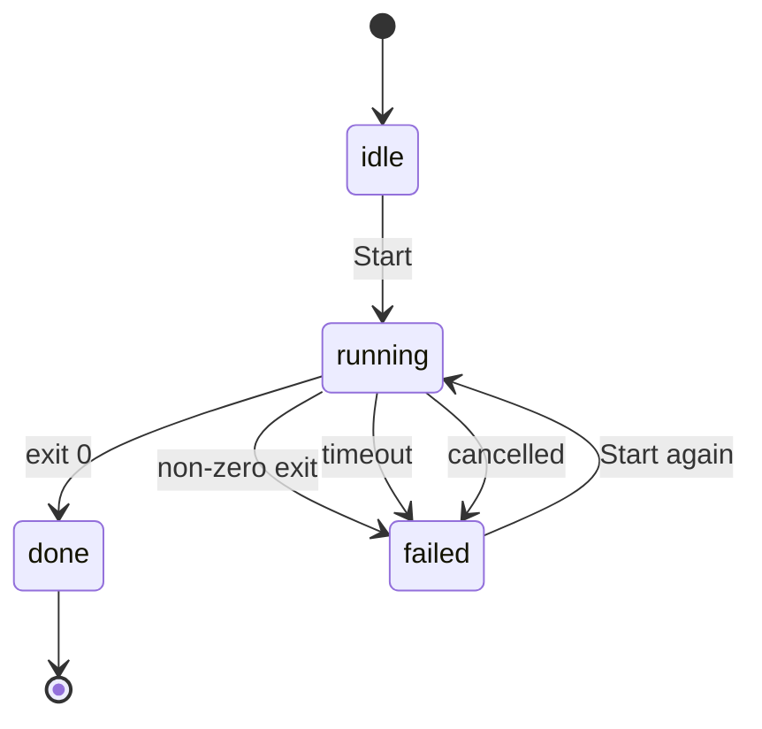
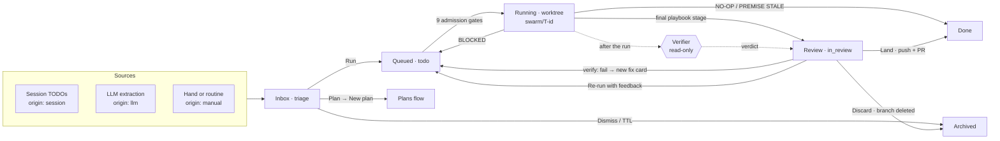

# Плани і дошка

Усе, що відбувається до запуску й навколо нього, живе в одному місці: **Плани**. Воно
належить проєкту — під *Усі проєкти* рядок у сайдбарі відкриває проєкт, який ви
відвідували останнім, — і має чотири вкладки:

| Вкладка | Для чого вона |
|---|---|
| **Новий план** | Режим планування: коротке інтерв’ю, що перетворює ідею на документи фаз |
| **Плани** | Кожен план проєкту, його фази, прогрес і запуски |
| **Дошка** | Поодинокі картки — робота, занадто мала для плану, — і диспетчер, що їх виконує |
| **Плейбуки** | Рецепти, за якими виконується відправлена картка |

Вкладка живе в `?tab=` (`/p/<slug>/plans?tab=board`), тож посилання приводить на
конкретну вкладку. Старі адреси `/board`, `/planning` і `/playbooks` досі працюють —
вони перенаправляють на відповідну вкладку.

Не кожна робота вміщується на одну картку. План — це форма, яку swarmery надає такій
роботі: граф залежностей над документами фаз і рушій запусків, що їх виконує і зчитує
прогрес назад із самих документів. Робота, яка *таки* вміщується на одну картку, іде
натомість через дошку.

```figure plan-dag
```

## Від ідеї до плану

**Новий план** — це Режим планування: довговічний майстер із базою даних за спиною, а не
чат, який не можна закривати. Його стан живе в таблицях SQLite демона, тож оновлення
сторінки, втрачена вкладка чи перезапуск браузера не втрачають інтерв’ю.

Сесія планування проходить невеликий замкнений набір станів:

| Стан | Значення |
|---|---|
| `generating` | Планувальник думає — готує наступне питання або сам план |
| `awaiting_answer` | Питання на екрані й чекає на вас |
| `proceeding` | Ви завершили інтерв’ю; план пишеться |
| `done` | План на диску; сесія записує, де саме |
| `failed` / `cancelled` | Планувальник впав із помилкою, або ви його зупинили |

Інтерв’ю проходить у два етапи. **Етап A** ставить вам питання з варіантами відповіді,
по одному, і кожна відповідь звужує дизайн. **Етап B** припиняє питати й пише план.
Планувальнику наказано не писати код і не створювати гілок — але це інструкція, якої він
дотримується, а не пісочниця, що його обмежує.

Починати з чистого аркуша не обов’язково. Дія **План** на картці дошки відкриває Режим
планування з уже вписаними назвою й промптом картки — а параметр передзаповнення
споживається при використанні, тож пізніше оновлення сторінки не підставить форму
знову непомітно.

Коли планувальник закінчує, він завершує рядком `PLAN SAVED:` і абсолютним шляхом до
теки плану. Демон приймає його лише тоді, коли шлях має форму, якої мусить дотримуватися
план у робочому просторі; усе інше трактується як незавершений запуск, а не як план.

## Анатомія плану

Плани живуть у робочому просторі, ніколи — у вашому репозиторії з кодом:

```
<workspace-root>/<project>/workspace/working/{YYYY}/{MM}/{DD}/{slug}/plan/
├── README.md              objective, sequencing table, risks, definition of done
├── spec.md                optional: the WHAT/WHY with SC-n acceptance criteria
├── phase-1-<slug>.md
├── phase-2-<slug>.md
└── …
```

Дата живе у шляху, тож кінцева тека — звичайний kebab-слаг без префікса з датою.
Архівовані задачі скануються з `workspace/archive/` за тією ж формою, тож завершений план
зберігає свою історію.

Тека задачі вважається планом, коли містить підтеку `plan/` — але *з’являється* на
вкладці Плани лише після того, як із неї проіндексовано хоча б одну фазу. `plan/`, у якій
немає нічого, крім README, не показується ніде — і зазвичай саме це пояснює, чому
щойно написаного плану ніби немає.

`README.md` несе таблицю послідовності, і демон справді її парсить. Їй потрібні щонайменше
колонка **Doc** і колонка **Phase** (назва); колонка `#` задає порядок, а колонка
`Depends on` будує граф із номерів фаз, які ви там перелічите:

| # | Phase | Doc | Depends on |
|---|-------|-----|------------|
| 1 | Схема й міграція | `phase-1-schema.md` | — |
| 2 | Ендпоінти API | `phase-2-api.md` | — |
| 3 | Екран UI | `phase-3-ui.md` | 1, 2 |

Якщо в плані немає таблиці взагалі, кожен `phase-*.md` стає фазою в порядку імен файлів —
а застарілі документи `step-NN-*.md` досі читаються, тож старші плани працюють далі.

Необов’язковий `spec.md` формулює, чого план мусить досягти, як чекбокси
`- [ ] **SC-n** — …`. Коли він є, заголовок кожної фази оголошує критерії, які вона
покриває, рядком `**Covers:** SC-…`, план отримує вкладку **Специфікація**, а дашборд
лінтить покриття.

> [!IMPORTANT]
> Кожен документ фази мусить закінчуватися порожньою секцією `## Completion Report`.
> Дашборд виймає з документа саме цей заголовок і показує його як Звіт фази. Звіт,
> написаний будь-де інде — у файлі в `reports/`, у повідомленні чату, у лозі запуску, —
> там невидимий, і фаза показує «no summary of the work written» над роботою, яка
> насправді вийшла.

## Документи фаз

Документ фази задумано виконуваним самостійно: заголовок із назвою репозиторію й
залежностями, дизайн, самодостатній промпт агента для копіювання та критерії приймання
у вигляді чекбоксів.

Ці чекбокси — не декорація. **Прогрес виводиться з них** — демон рахує рядки `- [ ]`
проти `- [x]` у кожному документі фази й зводить суми у відсоток плану. Markdown —
джерело істини; база даних — кеш того, що каже markdown.

Звідси один наслідок, який варто засвоїти: завершена, але не відмічена робота невидима, а
критерій, відмічений, щоб «закрити» фазу, — брехня, в яку далі вірить уся система.
Відмітити чекбокс можна прямо з вкладки Плани — це записується назад у документ.

Залежності перевіряються за тими ж доказами. Фаза вважається виконаною, коли всі її
критерії відмічені — ніколи через те, що якийсь процес випадково завершився успішно.
(Застаріла фаза, яку веде картка дошки, також рахується, щойно та картка готова чи
в архіві.)

> [!NOTE]
> Клітинка `Depends on` читається як пошук голих чисел, тож тримайте в ній лише номери
> фаз. Проза на кшталт `2 (see ticket 11)` читається як залежність від фаз 2 *і* 11;
> число, що не збігається з жодною фазою, відкидається, але те, що випадково збіглося зі
> справжньою фазою, — ні.

## Як читати план

Відкритий план показує свої деталі щонайбільше з п’ятьма вкладками:

| Вкладка | Що показує |
|---|---|
| **План** | README і список фаз із прогресом і станом запуску кожної |
| **Специфікація** | `spec.md` і його критерії — лише коли план його має |
| **Підсумок** | Підсумок плану наприкінці — лише коли всі фази завершено |
| **Ревізії** | Підготовлені (staged) пропозиції змінити план; лічильник показує, скільки чекає |
| **Редагувати** | Сирий markdown README |

Фаза відкривається у висувній панелі над цим списком, тож ви ніколи не губите місце; ↑ і ↓
переходять до сусідньої фази. Панель має власні вкладки:

| Вкладка | Що показує |
|---|---|
| **Розповідь** | Фаза одним поглядом і її прогноз проти того, що сталося насправді — очікували, сталося, чому, що далі |
| **Критерії** | Документ із живими чекбоксами |
| **Запуски** | Стан запуску, використана модель, вердикт перевірки й історія запусків |
| **Звіт** | Секція `## Completion Report`. Вона існує завжди, навіть доки нічого не вийшло — порожня нотатка краща за відсутню вкладку |
| **Редагувати** | Сирий markdown фази |

План ревізують так само, як пишуть, — у markdown. Ревізія — це підготовлена (staged) пропозиція:
на диску нічого не змінюється, доки ви не застосуєте її на вкладці **Ревізії**.

## Посилання і кнопка «Назад»

Усе, що ви обираєте на вкладці Плани, є в адресному рядку: фільтр, план, відкрита фаза
та вкладка її панелі, вкладка деталей плану, одна ревізія. Тож будь-що з цього можна
додати в закладки, переслати комусь або відкрити в новій вкладці, а кнопка «Назад» у
браузері відмотує саме те, що ви натискали.

| Що відкрито | Адреса |
|---|---|
| Список планів (Активні) | `/p/<slug>/plans` — приводить на перший активний план |
| Фільтр, у якому нічого не вибрано | `/p/<slug>/plans?status=done` · `?status=archived` |
| Один план | `/p/<slug>/plans/<externalId>` |
| Фаза, на Розповіді | `/p/<slug>/plans/<externalId>/phase/<seq>` |
| Фаза, на іншій вкладці | `/p/<slug>/plans/<externalId>/phase/<seq>/{criteria,runs,report,edit}` |
| Вкладка деталей плану | `/p/<slug>/plans/<externalId>/details/{plan,spec,summary,revisions,edit}` |
| Одна ревізія | `/p/<slug>/plans/<externalId>/details/revisions/<revId>` |
| План за числовим id | `/p/<slug>/plans?task=<id>` або `?plan=<id>`, за бажанням `&phase=<seq>` і `&tab=revisions` |

Плани у списку, вкладки фільтра, назви фаз і кожна вкладка — справжні посилання, тож
⌘-клік і клік середньою кнопкою відкривають їх у новій вкладці. Будь-який `?scope=`, що
вже є в адресі, їде разом із кожним із них. Чотири верхні вкладки тримають власний
`?tab=`; адреса плану — це вкладка **Плани** за визначенням, тож вона його ніколи не несе.

**Кожен клік — крок для «Назад»; автоматичні виправлення — ні.** Відкриття плану, фази
чи вкладки додає один запис в історію, і «Назад» скасовує рівно його. Коли сторінка сама
виправляє адресу за вас — `/plans` розв’язується в перший активний план, числове
посилання перетворюється на канонічний шлях, вкладка, якої план не має, відкочується до
тієї, яку показує його панель, — вона натомість замінює запис. Саме тому «Назад» із плану,
на який ви приземлилися, ніколи не відкидає вас знову вперед. Єдине, що перериває
«Назад», — вкладка Редагувати з незбереженими змінами: вихід із неї спершу перепитує, і
так само перезавантаження чи закриття сторінки.

**Застаріле посилання приводить на найближчий рівень, який ще існує.** План, якого вже
немає (за зовнішнім id чи за числовим), скидає вас на список планів, на його перший
активний план; фаза, якої план більше не має, скидає на план; ревізія, якої немає,
лишає вас на вкладці Ревізії. Кожен випадок повідомляє про це однорядковою нотаткою, яку
можна прибрати, називаючи, чого не знайдено: `Plan <externalId> not found — showing the
plan list`, `Plan #<id> not found`, `Phase <seq> not found in <plan>`, `Revision #<revId>
not found`. Назва вкладки з помилкою або вкладка, якої план не пропонує, просто
виправляється, без нотатки. У проєкті, де планів немає взагалі, приземлятися нікуди, тож
посилання лишається як надруковано, а натомість показується порожній список планів.

**`?task=` і `?plan=` — постійна точка входу.** Сторінки, які знають план лише за
числовим id задачі — запуск плану на часовій шкалі у Сесіях, банер Режиму планування,
доки деталі плану ще не завантажилися, стара закладка, — ведуть туди, а вкладка Плани
після прибуття підміняє адресу канонічною. Усе інше посилається на канонічну адресу
напряму: картки дошки, модальне вікно задачі й бриф указують на
`/p/<slug>/plans/<externalId>`.

Зберігаючи посилання, віддавайте перевагу канонічній адресі. Зовнішній id — власна назва
плану (`yyyy-mm-dd-slug`), а фаза адресується своїм порядковим номером; обидва зчитуються з
документів плану, тож посилання переживає перебудову бази даних демоном. Числовий id —
це id рядка в базі даних, і перебудова може його перенумерувати.

## Запуск плану

Можна запустити одну фазу або весь план. У будь-якому разі робота відбувається в
ізольованому git worktree на власній гілці — `swarm/plan-<task-id>` для запуску всього
плану, `swarm/phase-<phase-id>` для однієї фази. Гілка переживає повернення worktree, тож
робота ніколи не лишається покинутою.

**Що пам’ятає запуск.** Worktree лежить за іншим абсолютним шляхом, ніж чекаут, а
Claude Code називає теку транскриптів сесії за шляхом, у якому сесія виконується, — тож
транскрипти запуску лягають у власну теку, по одній на worktree. Автопам’ять за цим
поділом *не* йде: вона розв’язується від канонічного проєкту, тож фоновий запуск читає той
самий індекс `MEMORY.md`, що й інтерактивна сесія в чекауті. Отже, пам’ять проєкту ані
вивчається заново для кожного запуску, ані розгалужується по worktree: кожен запуск
кожного плану в репозиторії *читає* один індекс. Запис — окреме твердження, і його варто
тримати окремо: проба міряла розв’язання читання і відсутність `memory/` на кожен
worktree, а не спільний запис наскрізь. Те, що пише демон, канонічне за побудовою, а не
за виміром: `memconsolidate.AutoMemoryDir` спирається на власний шлях проєкту, ніколи
на cwd запуску, тож консолідація з будь-якого worktree редагує індекс чекаута. Це
поведінка інструмента, а не демона, тож її міряють, а не припускають —
`scripts/tests/worktree-memory-probe.sh` виводить її заново на будь-якій машині
(безкоштовно, лише читання, друкує `MATCH`, `MISMATCH` або `INCONCLUSIVE`), а
`tools/swarmery/internal/worktree/memory.go` тримає сплячий, протестований засіб на
випадок, якщо відповідь колись зміниться.

Машина станів запуску навмисно мала:



Стану `review` немає — запуск або завершився, або ні, а те, чого він *досяг*, зчитується
з відмічених чекбоксів, а не з коду виходу.

Межі, у яких працює запуск:

```stats
8h | ceiling on a whole-plan run | hot
4h | ceiling on a single phase
1 | run in flight per plan
3 | run modes — auto, subagent-driven, inline
```

Демон не вибудовує послідовність фаз сам. Він передає одній сесії README разом із
маніфестом кожної фази — номер, назва, шлях до документа, лічильники критеріїв і
залежності — і дає скілу `run-plan` обрати маршрут за цим графом. Уже завершені фази в
маніфесті позначені *skip*, і саме це робить повторний запуск продовженням, а не
переробкою: продовження на місці немає, але другий Start перебудовує маніфест із
поточних лічильників чекбоксів.

Запускаючи весь план, ви обираєте один із трьох режимів: **авто** дає скілу самому обрати
маршрут за DAG, **через субагентів** примушує до виконавця плюс свіжого рев’юера на кожну
фазу, а **самостійно** змушує контролер робити роботу власноруч.

> [!WARNING]
> На один план може бути лише один запуск у роботі, і запуск усього плану відхиляється,
> доки виконується будь-яка з його фаз. Зворотне стережеться в інтерфейсі, а не в демоні
> — кнопка «Запустити фазу» під час запуску плану вимкнена, але ендпоінт за нею все одно
> прийме виклик, тож не смикайте його руками посеред запуску. Запуск плану, усі фази якого
> готові, відхиляється одразу, замість тихо переробляти завершену роботу.

Запуски за задумом довгоживучі, і саме тому важить поведінка при перезапуску:

- Запуск, процес якого пережив перезапуск демона, **усиновлюється**, а не вбивається.
  Оскільки його статус виходу вже не відновити, він записується як готовий із нотаткою,
  що каже саме це.
- Запуск, процес якого не вижив, позначається як збій із `daemon restart`, тож він видимий,
  а не застряг у «виконується» навіки.

Якщо запуск не може чесно рухатися далі — погодження, яке він не може відкласти,
руйнівна операція або фаза, передумови якої суперечать коду, — за домовленістю він
зупиняється і каже `PLAN BLOCKED at phase <n>`, замість імпровізувати інший дизайн. Цей
сигнальний рядок — повідомлення *вам*; демон записує результат запуску за самим процесом.

## Вкладка Дошка

Дошка — не паралельний канбан, по якому картки пересувають руками. Це лійка навколо потоку
планів: самоочисна смуга **Вхідні** із захопленими пропозиціями, смуга **У роботі**, що
показує чесну чергу диспетчера, і смуга **Рев’ю** з рівно трьома значущими виходами.
Готові й архівовані картки лежать у згорнутій смужці історії внизу. Перетягування немає —
картки рухають дії, бо кожна дія справді щось робить.

```figure board-lanes
```

Ідею в основі варто сказати прямо: **захоплена картка — пропозиція, а не зобов’язання.**
У неї є життєвий цикл і термін придатності. Колонка картки — не «де хтось її кинув», а
наслідок дій, що виконали реальну роботу.

Дошку також можна читати як граф залежностей (`?view=graph`) і звужувати за станом
(`?f=` — чекає мене, виконується, застаріло) та за темою (`?label=`).

Усталені значення, що формують усю лійку:

```stats
9 | admission gates before a card runs | hot
2 | cards running at once
4 | live worktrees
14 | days a captured card keeps its slot
3 | fix attempts before a card is parked
```

### Життя картки



Під трьома смугами існує шість колонок і не більше: `triage`, `todo`, `in_progress`,
`in_review`, `done`, `archived`.

### Смуга Вхідні: пропозиції з терміном придатності

Усе захоплене приземляється тут. Кожен пункт TODO з живої сесії стає карткою з
`origin: session`, LLM-витягання дає `origin: llm`, а все, що створюєте руками ви чи
рутина (**+ Нова задача**), — `origin: manual`. Кожна картка в сортуванні отримує три
кнопки й годинник:

| Дія | Що вона насправді робить |
|---|---|
| **Запуск** | Переносить картку в `todo`. Це *і є* вказівка диспетчеру — окремої кнопки «старт» немає, бо черга — це й є смуга. |
| **План** | Відкриває **Новий план**, передзаповнений текстом цієї картки, для роботи, більшої за одну картку. |
| **Прибрати** | Архівує її. Чесне «ні» замість вічного боргу. |
| **TTL** | Щогодинний прибиральник архівує захоплені картки, що пролежали в сортуванні довше за `SWARMERY_INBOX_TTL` (14 днів за замовчуванням; `0` вимикає). |

Прибиральник навмисно вузький. Він торкається лише карток, джерело яких — `session` або
`llm`, — **написані руками картки ніколи не прибираються**, — і пропускає будь-яку картку,
що тримає worktree, якого б віку вона не була.

Коли сортування переростає 50 карток і хоча б одна з них достатньо стара, щоб підпасти,
над дошкою з’являється банер амністії. Він завжди рахує, перш ніж діяти: пробний прогін
повідомляє, скільки саме карток підпадає, і лише тоді ви підтверджуєте масове архівування.
Амністія має власний, коротший поріг — картки, що простояли понад сім днів, — тож може
розчистити завал задовго до того, як спрацював би 14-денний TTL.

> [!TIP]
> Тягніться до **План**, а не **Запуск**, щоразу, коли картці знадобилося б більше ніж
> одна цілісна зміна. Режим планування перетворює її на документи фаз, і план виконується
> з уже відомими залежностями.

### Смуга У роботі: диспетчер під сподом

Картка в `todo` — заявка, а не запущений процес. Перш ніж стати ним, вона проходить
ворота допуску, у такому порядку:

```figure dispatch-gates
```

Кандидатів розглядають спершу за пріоритетом (`urgent` перед `high`, `normal`, `low`),
потім від найстаршої. Пройшла всі ворота — і картку допущено одним захищеним записом, тож
два проходи диспетчера ніколи не запустять ту саму картку двічі.

Допущена картка отримує ізольований worktree на гілці `swarm/<T-id>`, зрізаній з вершини
тієї гілки, на якій зараз стоїть ваш основний чекаут, — тож якщо чекаут сидить на гілці
фічі, картки гілкуються звідти, а не з `main`. Цей коміт **зберігається** на картці як
`start_point`, і саме це дає перевірці й диффу рев’ю стояти на тій самій землі, з якої
стартував агент.

Два шляхи збою варто знати. Якщо демон перезапускається посеред запуску, картки, що досі
тримають worktree, зцілюються назад у `todo` із записаним `daemon restart`, а не лишаються
заклиненими — але процес виконавця, що пережив перезапуск, натомість усиновлюється, і
його картка далі виконується. А коли картку раз у раз повертають без жодного поступу,
диспетчер ставить її на паузу, замість палити токени вічно.

**Мікроплани.** Кожна відправлена картка також отримує однофазний план у приватному
робочому просторі, тож її відмітки прогресу й Completion Report показуються на вкладці
Плани, як у будь-якого плану. План пишеться у **власний простір імен проєкту** в робочому
просторі: теку, на яку проєкт зіставлено. Коли їх кілька, береться та, яку сканували
найпізніше. Те саме правило вирішує, з якого оверлея робочого простору розв’язується
репозиторій картки, тож репозиторій картки і її мікроплан завжди походять з одного
робочого простору. Зіставлена тека, якої більше немає або яка лежить поза налаштованим
коренем робочого простору, логується й пропускається на користь
`<workspace root>/<project slug>`. Демон ніколи не пише поза власним деревом робочого
простору. Наявний мікроплан ніколи не переписується, тож повторний запуск чи картка
виправлення після перевірки зберігає вже записані відмітки.
`SWARMERY_MICRO_PLANS=0` вимикає мікроплани.

### Плейбуки обирають себе самі

Ручний вибір плейбука на практиці провалився — приблизно один свідомий вибір на сотні
карток, — тож тепер це політика диспетчера:

| Плейбук | Етапи | Перевірка | Коли обирається |
|---|---|---|---|
| `standard` | implement | звичайна | Типовий, коли ніщо інше не підходить |
| `plan-first` | plan → implement | звичайна | Промпт довший за 1500 символів **або** картка має залежності |
| `review-heavy` | implement → self-review | сувора | Автоматично ніколи — лише свідомий вибір людини |

`quick-fix` більше не існує як окремий рецепт: він був байт у байт `standard` і живе лише
як псевдонім, що розв’язується в нього. Який би плейбук не виконувався, він
**штампується на картці**, тож чип завжди показує те, що насправді виконалося, а не те,
що просили.

Вкладка **Плейбуки** перелічує кожен рецепт із його походженням (вбудований чи проєктний)
і малює ланцюжок етапів із промптом кожного. Вбудовані — лише для читання; **Дублювати в
проєкт** копіює один у `<project>/.claude/playbooks/`, де його промпти стають вашими для
редагування. Проєктний плейбук з тією самою назвою перекриває вбудований.

Кожен відправлений етап отримує контракт виконання: трейлер `Swarm-Task-Id` на його
комітах, жодного push, огорожу за обсягом файлів і словник сигнальних рядків, що дає
агентові чесно завершити картку:

| Сигнальний рядок | Ефект |
|---|---|
| `NO-OP:` / `DUPLICATE:` / `REDUNDANT:` | Негайно закриває картку як **готову** і зупиняє ланцюжок плейбука |
| `PREMISE STALE:` | Те саме — передумова задачі більше не чинна |
| `BLOCKED:` | Повертає картку в чергу, на паузі, із записаною причиною |

Сигнальний рядок перевіряється першим і перемагає незалежно від коду виходу процесу.

### Перевірка міряє реальність

Після запуску перевіряльник без права на запис оцінює роботу й повертає один із трьох
вердиктів:

| Вердикт | Що далі |
|---|---|
| `pass` | Штампується на картці й кешується |
| `fail` | Штампується, потім створюється картка виправлення — у межах бюджету |
| `inconclusive` | Лише штампується. Нічого не породжується. |

Ця різниця і є суть: тайм-аут, нечитабельний дифф чи зіпсована відповідь — це
`inconclusive`, ніколи не `fail`. Система не фабрикує провалів зі своєї ж невпевненості.

Результати мемоізуються за хешем дерева, тож повторна перевірка незміненого дерева повертає
кешований вердикт замість платити за другий прогін. Кешуються лише `pass` і `fail` —
`inconclusive` ніколи.

Картка з провалом породжує щонайбільше одну відкриту картку виправлення за раз, а бюджет
виправлень списується з кореневої картки, не більше трьох. Понад це картку ставлять на
паузу, а не зациклюють. Перевірка також відмовляється стартувати на непомірному диффі:
понад `SWARMERY_VERIFY_MAX_DIFF_FILES` файлів (40 за замовчуванням) повертає
`inconclusive` з нотаткою, що радить розділити роботу або підняти межу. Щоб ця межа
спрацювала, потрібні `start_point` картки і читабельний дифф — коли чогось бракує, її
пропускають, а не вгадують.

### Смуга Рев’ю: три справжні виходи

Почніть із читання зміни: **Diff** показує роботу проти збереженого на картці
`start_point`. Це читання, а не вихід. Звідти картка покидає смугу одним із рівно трьох
способів:

| Вихід | Що насправді відбувається |
|---|---|
| **Влити** | Пушить гілку й відкриває PR. Картка стає `done` **лише після** того, як існує URL PR |
| **Перезапустити** | Додає ваш відгук до промпту, скидає попередній вердикт і повертає картку в `todo` |
| **Відкинути** | Повертає worktree, видаляє гілку `swarm/` і архівує картку |

> [!IMPORTANT]
> Готово — наслідок, а не жест. Ніщо в цій смузі не позначає картку завершеною через
> те, що хтось клікнув, — Влити чекає на справжній URL PR, а провалена перевірка
> відкриває картку виправлення, замість тихо пропустити роботу.

## Шпаргалка

| Де | Що |
|---|---|
| `<workspace>/<project>/workspace/working/{YYYY}/{MM}/{DD}/{slug}/plan/` | Де живуть плани |
| `plan/README.md` | Мета, таблиця послідовності, ризики, визначення готовності |
| `plan/spec.md` | Необов’язкові критерії приймання (`SC-n`), покриття яких оголошують фази |
| `plan/phase-N-<slug>.md` | Одна фаза: дизайн, промпт агента, критерії, Completion Report |
| Плани → панель фази → Звіт | Показує секцію `## Completion Report` |
| `/p/<slug>/plans/<externalId>[/phase/<seq>[/<tab>]]` | Постійна адреса плану (або фази) — див. *Посилання і кнопка «Назад»* |
| `<project>/.claude/playbooks/` | Проєктні плейбуки; збіг назви перекриває вбудований |

| Змінна середовища | Типово | Ефект |
|---|---|---|
| `SWARMERY_PLANRUN_TIMEOUT` | `8h` | Стеля для запуску всього плану |
| `SWARMERY_PHASERUN_TIMEOUT` | `4h` | Стеля для запуску однієї фази |
| `SWARMERY_PLANRUN_AGENT` | `tech-lead` | Типовий агент для запуску плану |
| `SWARMERY_PLANRUN_MODEL` / `SWARMERY_PHASERUN_MODEL` | типова для акаунта | Закріплена модель для запусків |
| `SWARMERY_WORKSPACE_ROOT` | `$HOME/swarmery-workspace` | Звідки скануються плани — `AGENT_WORKSPACE_ROOT` має пріоритет, коли задано обидві |
| `SWARMERY_DISPATCH` | увімк. | Глобальний вимикач диспетчера дошки |
| `SWARMERY_MAX_CONCURRENT` | `2` | Карток, що виконуються одночасно |
| `SWARMERY_MAX_WORKTREES` | `4` | Живих worktree на всі проєкти |
| `SWARMERY_INBOX_TTL` | `336h` (14 днів) | Термін придатності в сортуванні; `0` вимикає прибиральника |
| `SWARMERY_DISPATCH_TIMEOUT_MIN` | `45` | Хвилин до того, як запуск картки буде покинуто |
| `SWARMERY_DISPATCH_PERMISSION_MODE` | `bypassPermissions` | Режим дозволів для відправлених агентів; плейбук може його перекрити |
| `SWARMERY_MICRO_PLANS` | увімк. | Писати однофазний план для кожної відправленої картки; `0` вимикає |
| `SWARMERY_AUTOVERIFY` | увімк. | Автоматична перевірка після запуску; ручна перевірка працює й коли вимкнено |
| `SWARMERY_VERIFY_MAX_DIFF_FILES` | `40` | Межа розміру диффа, понад яку перевірка повертає inconclusive |
| `SWARMERY_VERIFY_TIMEOUT_MIN` | `15` | Хвилин до того, як прогін перевірки буде покинуто |
| `SWARMERY_VERIFY_PERMISSION_MODE` | `bypassPermissions` | Режим дозволів перевіряльника без права на запис (відкочується до `SWARMERY_PERMISSION_MODE`); інструменти редагування заборонені в кожному режимі, `off` прибирає прапорець |
| `SWARMERY_WORKTREE_LEND` | `node_modules`, `.venv`, `vendor` | Теки, що позичаються у свіжий worktree, щоб збірки працювали одразу |

> [!NOTE]
> Ці змінні читаються один раз, під час старту демона. Зміна будь-якої означає перезапуск
> демона — живого перечитування немає.

| Ендпоінт | Призначення |
|---|---|
| `GET /api/epics` | Список планів з їхніми фазами і зведенням |
| `GET`/`PUT`/`PATCH` `/api/epics/{taskId}/docs` | Прочитати, зберегти або відмітити один чекбокс у документі плану |
| `POST /api/epics/{taskId}/run` | Запустити весь план (`{agent, mode}`) |
| `POST /api/epics/{taskId}/phases/{phaseId}/run` | Запустити одну фазу |
| `POST /api/epics/{taskId}/run/cancel` | Зупинити запуск |
| `GET /api/epics/{taskId}/phases/{phaseId}/diagnosis` | Виведений результат запуску і блокери |
| `POST /api/projects/{id}/planning` | Почати Режим планування |
| `GET /api/board/tasks` | Список карток; фільтр через `?projectId=` і `?boardColumn=` |
| `POST /api/board/tasks` | Створити картку (лише джерело manual) |
| `PATCH /api/board/tasks/{id}` | Перемістити або відредагувати картку |
| `POST /api/board/tasks/bulk-archive` | Амністія; спершу надішліть `dryRun`, щоб порахувати |
| `GET /api/board/tasks/{id}/diff` | Дифф картки проти `start_point` |
| `POST /api/board/tasks/{id}/rerun` | Перезапустити з відгуком рев’юера |
| `POST /api/board/tasks/{id}/discard` | Відкинути гілку й архівувати |
| `POST /api/board/tasks/{id}/land` | Запушити й відкрити PR |
| `POST /api/tasks/{id}/verify` | Перевірити на вимогу (асинхронно) |
| `GET /api/dispatch`, `POST /api/dispatch/pause` | Оглянути й поставити диспетчера на паузу |
