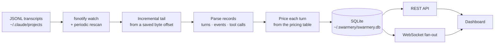

# Сесії та спостережуваність

Усе, що дашборд знає про ваших агентів, походить із файлів, які Claude Code і так уже
писав. Нічого не треба інструментувати, не треба підключати SDK і не треба проганяти
агентів через обгортку — демон читає транскрипти, а решта — облік.

## Що бачить демон



Під кожним налаштованим коренем відстежуються два шаблони: самі транскрипти сесій і
супутні файли `subagents/agent-*.jsonl`, які сесія пише для своїх субагентів. Повне
сканування завжди бере головні транскрипти раніше за їхні бічні гілки; файловий
спостерігач, який реагує в тому порядку, у якому лягають записи, цього обіцяти не може —
тож записи субагентів, що прибули раніше за батьківський хід, притримуються й
усиновлюються, щойно він з’явиться.

Читання інкрементальне. Демон пам’ятає байтовий зсув для кожного файлу й продовжує з
нього, і він ніколи не споживає останній рядок, який ще не завершено переведенням
рядка, — тож напівзаписаний запис підбирається на наступному проході, а не
розбирається як обірваний. Зсув фіксується в тій самій транзакції, що й породжені ним
рядки, — саме це не дає збою порахувати щось двічі.

Свіжість дають два механізми, що працюють разом: `fsnotify` реагує на записи майже
миттєво, а повторне сканування кожні кілька секунд покриває все, що спостерігач
пропустив. Дашборд далі отримує оновлення через WebSocket, а не опитуванням — нові
сесії, дописані події, запити дозволу, оновлення дошки й планів приходять як кадри.
Якщо з’єднання обривається, клієнт перезапитує через REST і працює далі.

## Як читати сесію

Статус сесії — часова евристика з перевизначенням за живучістю:

| Статус | Значення |
|---|---|
| `active` | Щось сталося за останні дві хвилини |
| `idle` | Остання активність — протягом тридцяти хвилин |
| `completed` | Старша за це, **і** живого процесу немає |
| `waiting_approval` | Очікує на запит дозволу |
| `killed` | Зупинена з дашборду |

Перевизначення важливе: поки демон досі бачить живий процес, тиха сесія не піднімається
вище `idle` і ніколи не оголошується завершеною. Сам лише годинник збрехав би про
агента, який просто думає.

Вигляд сесії має три вкладки — **Чат**, **Хронологія** та **Диффи** — під закріпленим
заголовком зі статусом, моделлю, тривалістю, сумою токенів, вартістю та кількістю
помилок. На широкому екрані права рейка додає те, що сесія насправді використала:
моделі за часткою токенів, агентів за запусками й тривалістю, скіли за кількістю
використань, рекурсивне дерево викликів скіли → інструменти → субагенти і кожен файл,
якого сесія торкнулася. Більшість цього виводиться з даних, які сторінка вже
завантажила; винятки — картки передачі та пожирачів контексту, і вони підвантажуються,
лише коли ви їх розгорнете.

## Вартість і використання

Вартість обчислюється на кожен хід із чотирьох видів токенів — вхідні, вихідні,
читання кешу та запис кешу — за таблицею цін із ключем за моделлю, у доларах за
мільйон токенів.

Усією підсистемою керує одне правило: **невідома модель не дає жодної вартості, а не
нуль.** Відсутня ціна записується як невідома, щоб не могла прикинутися безплатною
роботою. Звіт з економіки проєкту йде на крок далі й несе показник покриття для кожної
метрики, яку могли б спотворити неоцінені ходи, тож сума, побудована на часткових
даних, сама про це повідомляє — цей звіт дає команда `swarmery economics`, а не
сторінка дашборду.

Які види вимірювань доступні — без жодних датованих цифр:

```stats
4 | token kinds priced per turn | hot
5 | breakdown dimensions — project, model, account, agent, skill
4 | timeseries metrics — cost, tokens, runs, cache
5 | economics audits — cost per task, cache efficiency, delegation, waste, model mix
```

**Використання** за підпискою — інше запитання, ніж вартість, і відповідь на нього
інша. Вартість виводиться з ваших проіндексованих транскриптів; використання запитує в
Anthropic напряму, скільки квоти вашого плану лишилося. Відстежуються кілька вікон —
п’ятигодинне вікно сесії, тижневе вікно й тижневі вікна на кожну модель — і до кожного
додається вердикт про темп: ви спалюєте квоту швидше за годинник, ідете за графіком чи
відстаєте. Це корисніше за голий відсоток, бо «використано 60%» означає одне в перший
день вікна й зовсім інше на шостий.

> [!NOTE]
> Чип у заголовку — підсумок, а не сигнал тривоги про найгірший випадок: він показує
> вікно сесії першого справного провайдера. Тижневе вікно може бути значно ближчим до
> ліміту, ніж натякає чип, тож відкрийте модальне вікно «Використання», щоб побачити
> кожне вікно.

## Акаунти

Якщо у вас більше ніж один акаунт Claude, swarmery наслідує механізм, яким
користується сам Claude Code: акаунт **є** текою конфігурації. `~/.claude` — типовий
акаунт; `~/.claude-work` — акаунт із назвою `work`. Перемикання — це задати
`CLAUDE_CONFIG_DIR` під час запуску процесу, і більше нічого.

swarmery ніколи не пише файли з обліковими даними. Він не може вас залогінити й не
намагається — прохання додати акаунт повертає точну команду, яку ви виконуєте самі.

«Під’єднано» відтак означає *для цього акаунта вдалося знайти обліковий запис*, а не
*файл існує* — на macOS облікові дані типового акаунта живуть у в’язці ключів для
входу й файлу не мають узагалі. Відповідь тризначна: під’єднано, не під’єднано або
невідомо, коли запитання не вдалося поставити.

Проєкт прив’язується до акаунта через свій `.claude/settings.local.json`, який
локальний для машини й у gitignore — чекаут вашого колеги не зачіпається. Файл
прив’язки, який git **відстежує**, ігнорується: проєкт працює під типовим акаунтом, а
вибирач показує під собою, чому. На машині з одним акаунтом вибирач не з’являється
взагалі.

## Погодження

Коли агентові потрібен дозвіл, цей запит може прийти до вас замість того, щоб висіти в
терміналі, на який ви не дивитеся. Хук `PermissionRequest` у Claude Code пересилає
його демону, демон тримає запит відкритим, поки хук чекає в довгому опитуванні, а ви
погоджуєте чи відхиляєте з **Вхідних** дашборду (вкладка *погодження* або список
*усі* поруч із кожним іншим рішенням, що чекає на вас) — або з телефона.

Запити в списку прив’язані до проєкту, дедуплікуються, щоб повторений ідентичний
виклик не громадився, і обмежені на сесію, щоб агент, який пішов урозніс, не залив
чергу. Кожне рішення зберігає свій рядок, зокрема й автоматичні, тож завжди є слід
аудиту того, що було дозволено й чому. Правила та ця історія живуть за одне посилання
від Вхідних, за адресою `/approvals/manage`.

Типове вікно — десять хвилин. Важливо те, що стається після нього: прострочений запит
**ні погоджено, ні відхилено** — він спливає, хук не повертає рішення, і Claude Code
відкочується до власного запиту в терміналі. Те саме, якщо демон вимкнений,
недосяжний або заплутався. Канал при збої відкривається *у* звичайний запит — ніколи в
мовчазне «так».

> [!WARNING]
> Правила автопогодження зіставляють ім’я інструмента та глоб аргументу, і глоб — це
> зіставлення за префіксом сирої команди. Правило на кшталт `Bash(git *)` збігається і
> з `git status && rm -rf /`. Тримайте правила вузькими, віддавайте перевагу точним
> назвам інструментів і пам’ятайте, що правило — це постійне рішення, про яке вас
> більше не спитають.

## Цикл ретро

Демон стежить і за власною ефективністю та показує її в розділі **Здоров’я**. Детермінований радник — без
моделі в контурі — обчислює правила над ковзним вікном у чотирнадцять днів і висуває
підкріплені доказами рекомендації: відхилені інструменти, частота помилок агентів,
повторювані помилки, тертя повторних диспетчеризацій, застарілі покращення, регресії
кешу, застарілі карти архітектури, антипатерни траєкторій і дорогі роздуті сесії.

Рекомендації мають життєвий цикл — запропоновано, прийнято або відхилено, впроваджено,
а потім **підтверджено** повторним вимірюванням тієї самої метрики пізніше. Рекомендацію
підтверджують лише на реальній активності: у кожного правила є поріг, нижче якого воно
відмовляється робити будь-який висновок, тож тихі два тижні ніколи не сприймуться за
покращення.

Рекомендації з’являються на **Здоров’я → Радник** і у Вхідних. Табелі на кожного агента
лежать на **Здоров’я → Агенти**: запуски, частота помилок, частка успіху, вартість і p95
тривалості для кожного агента за те саме вікно. Там, де рекомендація стосується
агента, цикл може піти на крок далі й підготувати чернетку реальної зміни цього агента
як дифф на рев’ю, який ви погоджуєте або відхиляєте.

Те, чого цикл навчається з окремих запусків — уроки із запусків, що не вклалися у свій
прогноз, і наскільки чесні прогнози, — живе в розділі **Навчання**. Довідковий документ
«Ретро» визначає кожну метрику й правило.

## Шпаргалка

| Сторінка | На що відповідає |
|---|---|
| `/sessions` | Кожна сесія, наживо, з вартістю і статусом |
| `/sessions/{id}` | Чат, хронологія, диффи і те, що сесія використала |
| `/inbox?tab=approvals` | Запити дозволу, що очікують |
| `/approvals/manage` | Правила автопогодження та історія рішень |
| `/health?tab=cost` | Вартість, токени, запуски й кеш у часі |
| `/health?tab=agents`, `?tab=advisor` | Табелі агентів; рекомендації та запропоновані зміни |
| `/settings?tab=accounts` | Ваші акаунти Claude; решта вкладок охоплює решту машини |

| Змінна оточення | Типово | Ефект |
|---|---|---|
| `SWARMERY_PROJECTS_ROOTS` | `~/.claude/projects` | Корені транскриптів; `auto` знаходить кожен `~/.claude*/projects` |
| `SWARMERY_APPROVAL_TIMEOUT` | `10m` | Скільки запит дозволу лишається відкритим |
| `SWARMERY_PRICING` | вбудована таблиця | Шлях до JSON-файлу цін, який перевизначає вбудований |
| `SWARMERY_EXCLUDE` | `/tmp/*,/private/tmp/*` | Шляхи, сесії з яких не індексуються |
| `SWARMERY_USAGE_OAUTH` | увімк. | `0` повністю вимикає запити квоти за підпискою |

Ціни читаються один раз під час запуску. Відредагувавши ціни, перезапустіть демон і
виконайте `swarmery recost`, щоб переоцінити ходи, які вже проіндексовано.
